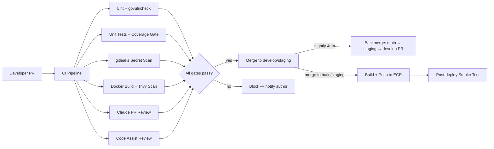

# Kalpa CI Hardening Plan

**Version:** 2.0
**Date:** 03 March 2026
**Previous Version:** 1.1 (03 March 2026) — backmerge automation only
**Maintained by:** Alex

### Key Changes v1.1 → v2.0
- Renamed from "Backmerge Automation Plan" to "CI Hardening Plan" — scope expanded significantly
- Retained all prior backmerge content (Sections 1–7) unchanged
- Added Sections 8–15: Docker/ECR, container scanning, govulncheck, gitleaks, Action SHA pinning, coverage gate, CODEOWNERS, Google Code Assist, Sentry, smoke tests, GitHub Environments
- Added Section 16: SSM secrets plan reference (separate doc)

---

# 1. Overview

This plan covers all CI automation, hardening, and quality improvements for Kalpa Health's GitHub repositories. Scope includes the Go backend (`wellmed-gateway-go`, `wellmed-backbone`), the BFF/frontend repos, and the shared bootstrap infrastructure (`bootstrap-repo.sh` + workflow templates).

The threat model is insider/compromised-workstation, not external attacker — external access to private repos is already blocked. 2FA is being enforced this week. This plan addresses accidental damage, supply chain risk, and operational drift.



---

# 2. Design Decisions

2.1 **main → staging is auto-merged** nightly. These branches are by definition identical except during active upgrade candidate testing. A merge conflict is signal, not failure — the automation opens a PR instead and flags it clearly.

2.2 **staging → develop is always a PR**, never auto-merged. Develop may contain in-progress work that requires a human to assess compatibility. The PR consolidates all delta since the last backmerge.

2.3 **One open backmerge PR at a time.** Before opening a new staging → develop PR, the action checks for an existing open one. If found, it updates the body with new commits rather than opening a duplicate.

2.4 **Claude writes the backmerge PR body** using the same API pattern as `pr-review.yml`. Separate from Code Assist — Claude provides Indonesian-language risk summary, Code Assist provides inline code correctness review. These are complementary, not redundant.

2.5 **No develop → anything automation.** Develop is protected from this workflow entirely.

2.6 **Nightly schedule: `0 21 * * 0-4` UTC** = 4am WIB (UTC+7), Sunday night through Thursday night, covering Monday–Friday mornings.

2.7 **Docker builds are automated on merge to main and staging only**, not on every PR. PRs run build verification (`go build`) but not image push. This keeps PR CI fast and reserves ECR pushes for real integration points.

2.8 **Hamzah (`hamzahnafalahkalpa`) is the required approver for all main merges** via CODEOWNERS. This replaces the soft notification in `main-approval-check.yml` with hard GitHub enforcement. `main-approval-check.yml` is retained as a secondary audit trail.

2.9 **Both Claude PR review and Google Code Assist run on every PR.** Claude provides structured risk assessment in Indonesian. Code Assist provides inline code correctness review in English. Neither replaces human review.

2.10 **All CI gates fail fast.** Secret scan, vulnerability scan, and coverage gate are blocking failures, not warnings. Trivy fails on CRITICAL CVEs only at launch; threshold tightened to HIGH after a 30-day baseline period.

---

# 3. Files Added or Modified

3.1 **New workflow files** (added to `infrastructure/templates/workflows/` and pushed via bootstrap):

| File | Purpose |
|------|---------|
| `nightly-backmerge.yml` | Nightly main → staging auto-merge + staging → develop PR |
| `docker-build.yml` | Build, scan, and push Docker images to ECR on merge |
| `govulncheck.yml` | Go dependency CVE scanning on every PR |
| `secret-scan.yml` | gitleaks secret scanning on every PR |

3.2 **Modified workflow files:**
- `ci.yml` — add coverage threshold gate to `unit-test` job
- `pr-review.yml` — no changes (Claude review retained as-is)

3.3 **New repo files** (pushed via bootstrap):
- `.github/CODEOWNERS` — Hamzah required on all main merges
- `.github/workflows/` — all templates above

3.4 **Modified infrastructure files:**
- `bootstrap-repo.sh` — add bypass allowance for Actions bot on staging, add new `push_workflow` calls, add CODEOWNERS push, add GitHub Environments setup

---

# 4. Nightly Backmerge

4.1 Objective: Build and validate `nightly-backmerge.yml`

  [ ] 4.1.1 Create `.github/workflows/nightly-backmerge.yml` with cron schedule `0 21 * * 0-4` and `workflow_dispatch` trigger for manual testing — @Alex
  [ ] 4.1.2 Implement diff-check step: `git log staging..main --oneline` — skip all subsequent steps if output is empty — @Alex
  [ ] 4.1.3 Implement auto-merge step for `main → staging` using `git merge --no-ff` — @Alex
  [ ] 4.1.4 On merge conflict: open a PR `main → staging` with `⚠️ CONFLICT — upgrade candidate may be affected` warning body instead of failing the workflow — @Alex
  [ ] 4.1.5 On successful merge: check for existing open PR `staging → develop` via GitHub API — @Alex
  [ ] 4.1.6 Build Claude summary step: call Anthropic API with commit log, produce Indonesian/English PR body (see Section 5) — @Alex
  [ ] 4.1.7 If no existing PR: create PR `staging → develop` with Claude-generated body, assign `BOOTSTRAP_REVIEWER` — @Alex
  [ ] 4.1.8 If existing PR found: update PR body to reflect accumulated commits, post a comment noting the update — @Alex
  [ ] 4.1.9 Test via `workflow_dispatch` before enabling cron — @Alex

Acceptance criteria:
- With no diff: workflow exits cleanly with skip log, no PR created
- With clean diff: staging auto-merges, staging → develop PR opens with readable Claude summary
- With conflict: no auto-merge, conflict PR opens to main → staging with warning flag
- With existing open PR: body updated, no duplicate PR created

---

# 5. Claude Backmerge PR Summary

5.1 **Model:** `claude-haiku-4-5-20251001` — fast and cheap, adequate for commit log summarization.

5.2 **Input:** `git log staging..main --pretty=format:"- %h %s (%an, %ar)"` plus commit count and branch names.

5.3 **Prompt structure** (use `jq` assembly pattern from `pr-review.yml` to avoid shell injection):

```
Kamu adalah asisten teknis yang menulis ringkasan PR untuk backmerge.

## Commits yang akan di-merge ke develop:
COMMITS_PLACEHOLDER

## Instruksi
Tulis ringkasan PR dalam Bahasa Indonesia (istilah teknis boleh Inggris). Format:

### Ringkasan
2-3 kalimat: hotfix apa saja yang masuk ke main dan perlu diintegrasikan ke develop.

### Yang Perlu Dicek Reviewer
Bullet points (max 3): area kode yang perlu perhatian khusus saat review.

### Catatan
Apakah ada perubahan yang mungkin konflik dengan work-in-progress di develop?
Jika tidak jelas dari commit log: tulis "Perlu dicek manual."

Jangan tulis apapun di luar format di atas.
```

5.4 **Fallback:** if the Anthropic API call fails, the PR is still created with a plain commit list body and a note that Claude summary was unavailable. PR creation must never depend on Claude succeeding.

---

# 6. Workflow Permissions and Staging Branch Bypass

6.1 `nightly-backmerge.yml` requires `contents: write` and `pull-requests: write` permissions.

6.2 `ANTHROPIC_API_KEY` is already a repo secret (used by `pr-review.yml`) — no new secrets required for backmerge.

6.3 `GITHUB_TOKEN` handles PR creation — no PAT needed.

6.4 **Staging branch protection requires a bypass for the Actions bot.** The bootstrap script sets 2 required reviews on staging. The auto-merge step runs as `github-actions[bot]` and cannot approve its own push without an explicit bypass. Kalpa-health is confirmed on GitHub Team plan with private repos — `bypass_pull_request_allowances` is fully supported.

6.4.1 Add this block to the staging protection payload in `bootstrap-repo.sh`:

```json
"bypass_pull_request_allowances": {
  "users": [],
  "teams": [],
  "apps": ["github-actions"]
}
```

6.4.2 The bypass is intentionally narrow — `apps: ["github-actions"]` targets only the built-in Actions bot, not third-party GitHub Apps or human users.

  [ ] 6.4.3 Add `bypass_pull_request_allowances` block to `apply_protection` for staging in `bootstrap-repo.sh` — @Alex
  [ ] 6.4.4 Re-run bootstrap against target repo after script update to apply new staging protection — @Alex

6.5 **Bootstrap script updates for backmerge:**

  [ ] 6.5.1 Add `push_workflow "nightly-backmerge.yml"` to `bootstrap-repo.sh` after existing three workflow pushes — @Alex

---

# 7. Bootstrap Placeholder Convention

7.1 All new workflow files use `BOOTSTRAP_*` placeholders consistent with existing templates. Substitutions applied by `bootstrap-repo.sh` at push time: `BOOTSTRAP_GO_VERSION`, `BOOTSTRAP_BINARY_NAME`, `BOOTSTRAP_CMD_PATH`, `BOOTSTRAP_REVIEWER`, `BOOTSTRAP_REPO_NAME`.

7.2 When adding a workflow to an already-bootstrapped repo, substitute values directly rather than re-running bootstrap — or re-run bootstrap in `--dry-run` mode first to verify.

---

# 8. Docker Build and ECR Push

8.1 **Goal:** Automate Docker image build and push to ECR on merge to `main` and `staging`. Eliminates the manual DevOps step that causes incidents under pressure and creates an audit trail of what image is running where.

8.2 **Scope by repo:**
- Go backend (`wellmed-gateway-go`, `wellmed-backbone`): single-stage build, one image per repo
- BFF/frontend: multi-stage build (Node.js compile → serve layer), one image per repo
- Postgres VM: not containerized in CI — remains separate

8.3 **Trigger:** `push` to `main` or `staging` only. PRs run `go build` verification (already in `ci.yml`) but do not push images.

8.4 **Image tagging convention:** `{ECR_REPO}:{branch}-{short_sha}` — e.g., `wellmed-gateway:main-a1b2c3d`. Latest tag also applied per branch: `wellmed-gateway:main-latest`.

8.5 **Required secrets:** `AWS_ACCESS_KEY_ID`, `AWS_SECRET_ACCESS_KEY`, `AWS_REGION`, `ECR_REGISTRY` — store at org level so all repos inherit them without per-repo setup.

  [ ] 8.5.1 Create ECR repositories in AWS for each service if not already existing — @Alex
  [ ] 8.5.2 Create IAM user with ECR push-only permissions (`ecr:GetAuthorizationToken`, `ecr:BatchCheckLayerAvailability`, `ecr:PutImage`, `ecr:InitiateLayerUpload`, `ecr:UploadLayerPart`, `ecr:CompleteLayerUpload`) — @Alex
  [ ] 8.5.3 Store AWS credentials as org-level GitHub secrets — @Alex
  [ ] 8.5.4 Create `docker-build.yml` template with: checkout, AWS auth via `aws-actions/configure-aws-credentials`, ECR login, Docker build, Trivy scan (see Section 9), push on scan pass — @Alex
  [ ] 8.5.5 Add `push_workflow "docker-build.yml"` to `bootstrap-repo.sh` — @Alex
  [ ] 8.5.6 Test against one repo (`wellmed-gateway-go`) before rolling out to others — @Alex

Acceptance criteria:
- Merge to main triggers build and push with correct tag
- Merge to staging triggers build and push with correct tag
- PR to main/staging does NOT trigger push
- Failed Trivy scan blocks push

---

# 9. Container Scanning with Trivy

9.1 **Goal:** Scan Docker images for known CVEs before pushing to ECR. Runs as a step inside `docker-build.yml` — not a separate workflow.

9.2 **Tool:** `aquasecurity/trivy-action` — free, no external service dependency, runs entirely in the CI runner.

9.3 **Initial threshold:** fail on `CRITICAL` only. After 30-day baseline (enough time to clear initial noise), tighten to `HIGH,CRITICAL`.

9.4 **Scope:** scan the built image, not the Dockerfile. Output format: `table` for logs, `sarif` uploaded as artifact for GitHub Security tab visibility.

  [ ] 9.4.1 Add Trivy scan step to `docker-build.yml` between build and push steps — @Alex
  [ ] 9.4.2 Configure `exit-code: 1` on CRITICAL to block push — @Alex
  [ ] 9.4.3 Upload SARIF output as artifact for GitHub Security tab — @Alex
  [ ] 9.4.4 After 30 days: review baseline findings and tighten threshold to HIGH,CRITICAL — @Alex

Acceptance criteria:
- Image with known CRITICAL CVE does not get pushed to ECR
- Scan results visible in workflow logs and GitHub Security tab
- Clean image proceeds to push without manual intervention

---

# 10. Go Dependency Vulnerability Scanning (govulncheck)

10.1 **Goal:** Catch known CVEs in Go module dependencies on every PR before they reach any branch.

10.2 **Tool:** `golang.org/x/vuln/cmd/govulncheck` — Google's official Go vulnerability scanner, free, uses the Go vulnerability database.

10.3 **Placement:** new job in `ci.yml` alongside existing `lint`, `unit-test`, and `build` jobs. Runs in parallel, does not block other jobs unless it fails.

10.4 **Behavior:** fails the PR if any vulnerability affecting reachable code is found. Reports that affect only test code are warnings, not failures.

  [ ] 10.4.1 Add `govulncheck` job to `ci.yml` template — install via `go install`, run `govulncheck ./...` — @Alex
  [ ] 10.4.2 Confirm behavior on first run against `wellmed-gateway-go` — resolve any existing findings before enforcing on develop — @Alex
  [ ] 10.4.3 Add `push_workflow` update to bootstrap for updated `ci.yml` — @Alex

Acceptance criteria:
- PR with a dependency containing a reachable CVE fails CI
- PR with no CVEs passes without manual intervention
- Findings clearly identify the vulnerable package and fix version

---

# 11. Secret Scanning with gitleaks

11.1 **Goal:** Automatically detect accidentally committed secrets (API keys, tokens, DSNs, .env values) in every PR diff. Enforces the SSM migration policy going forward — secrets that never land in git cannot leak from git.

11.2 **Tool:** `gitleaks/gitleaks-action` — free, runs in CI, no external service. Scans the PR diff only (not full history) for speed.

11.3 **Placement:** standalone `secret-scan.yml` workflow triggered on PR to `main`, `staging`, or `develop`.

11.4 **On finding:** fails the PR with a log identifying file, line, and secret type (value is masked). Author must remove the secret, rotate it, and rewrite the commit before merge is possible.

  [ ] 11.4.1 Create `secret-scan.yml` template using `gitleaks/gitleaks-action` — @Alex
  [ ] 11.4.2 Add a `.gitleaks.toml` config file to suppress known false positives (e.g., test fixture values, example config comments) — @Alex
  [ ] 11.4.3 Add `push_workflow "secret-scan.yml"` and `.gitleaks.toml` push to `bootstrap-repo.sh` — @Alex
  [ ] 11.4.4 Run against current open PRs / recent commit history on both active repos to check for existing leaks before enforcing — @Alex

Acceptance criteria:
- PR containing a real API key pattern fails CI with clear log output
- Known false positives suppressed via `.gitleaks.toml` without manual override per PR
- Clean PRs pass without false positive noise

---

# 12. GitHub Actions SHA Pinning

12.1 **Goal:** Eliminate supply chain risk from mutable Action version tags. `actions/checkout@v4` resolves to whatever commit that tag points to today — if the upstream repo is compromised and the tag is moved, every CI run pulls malicious code.

12.2 **Scope:** pin all `uses:` references in all workflow templates to full commit SHAs. Priority order: `actions/checkout`, `actions/setup-go`, `actions/upload-artifact`, `actions/github-script`, `golangci/golangci-lint-action`.

12.3 **Maintenance:** SHA pins require periodic manual updates when Actions release new versions. Add a quarterly calendar reminder to review and update pins. This is a conscious tradeoff — slightly more maintenance overhead for a meaningful reduction in supply chain exposure.

12.4 **How to find the SHA:** `gh api repos/{owner}/{repo}/git/ref/tags/{tag}` or check the Action's releases page on GitHub.

  [ ] 12.4.1 For each Action in all workflow templates, replace `@vX` tag with `@{full_sha}` and add an inline comment with the human-readable version — e.g., `uses: actions/checkout@11bd71901bbe5b1630ceea73d27597364c9af683 # v4.2.2` — @Alex
  [ ] 12.4.2 Update all four existing workflow templates (`ci.yml`, `pr-review.yml`, `main-approval-check.yml`, and new files) — @Alex
  [ ] 12.4.3 Add quarterly calendar reminder: "Review and update GitHub Action SHA pins" — @Alex

Acceptance criteria:
- No `@v{N}` or `@latest` tags remain in any workflow template
- Each pin has an inline comment with the human-readable version for maintainability

---

# 13. Coverage Threshold Gate (80%)

13.1 **Goal:** Enforce the 80% coverage floor already targeted by the team as a hard CI failure, not a soft artifact. Prevents silent regression as the codebase grows — coverage that was 85% should not quietly drop to 60% over a sprint.

13.2 **Implementation:** add a threshold check step to the existing `unit-test` job in `ci.yml` immediately after `go tool cover -func=coverage.out`.

13.3 **Threshold:** 80% total coverage. If current coverage on `wellmed-gateway-go` is confirmed well above 80%, set the gate at current coverage minus 5% as a floor — this prevents both regression and an artificially easy target.

13.4 **Script:**
```bash
COVERAGE=$(go tool cover -func=coverage.out | grep total | awk '{print $3}' | tr -d '%')
echo "Total coverage: ${COVERAGE}%"
if (( $(echo "$COVERAGE < 80" | bc -l) )); then
  echo "❌ Coverage ${COVERAGE}% is below the 80% threshold"
  exit 1
fi
echo "✅ Coverage gate passed"
```

  [ ] 13.4.1 Add coverage threshold step to `unit-test` job in `ci.yml` template — @Alex
  [ ] 13.4.2 Run against current codebase first to confirm actual coverage before enforcing — adjust threshold if current coverage is meaningfully above 80% — @Alex

Acceptance criteria:
- PR that drops coverage below threshold fails CI with clear message showing actual vs required coverage
- PR that maintains or improves coverage passes without intervention

---

# 14. CODEOWNERS — Hamzah Gates Main

14.1 **Goal:** Replace the soft post-merge notification in `main-approval-check.yml` with a hard GitHub-enforced approval requirement for all merges to `main`. Hamzah (`hamzahnafalahkalpa`) as CTO is the required approver.

14.2 **File:** `.github/CODEOWNERS` — one line:

```
* @hamzahnafalahkalpa
```

14.3 **Branch protection change required:** `require_code_owner_reviews: true` must be set on the `main` protection rule in `bootstrap-repo.sh`. Currently it is `false`.

14.4 `main-approval-check.yml` is **retained** as a secondary audit trail — it now serves as a post-merge log rather than the primary gate.

14.5 **Rollback path:** comment out the single line in `CODEOWNERS` to disable enforcement without touching branch protection. This is intentional — Hamzah can self-merge in an emergency by temporarily removing himself from CODEOWNERS.

  [ ] 14.5.1 Create `.github/CODEOWNERS` template with `* @BOOTSTRAP_REVIEWER` — @Alex
  [ ] 14.5.2 Update `apply_protection` for `main` in `bootstrap-repo.sh`: set `require_code_owner_reviews: true` — @Alex
  [ ] 14.5.3 Add CODEOWNERS file push to `bootstrap-repo.sh` — @Alex
  [ ] 14.5.4 Brief the team before enabling on existing repos — confirm Hamzah is aware he is now a hard gate — @Alex
  [ ] 14.5.5 Apply to `wellmed-gateway-go` and `wellmed-backbone` after team briefing — @Alex

Acceptance criteria:
- PR to main without Hamzah approval cannot be merged (GitHub blocks the merge button)
- PR to develop or staging is unaffected
- `main-approval-check.yml` still posts its audit comment after merge

## 14.6 CODEOWNERS for kalpa-docs (Notification-Only)

14.6.1 `kalpa-docs` uses a different CODEOWNERS pattern — routing for visibility, not enforcement. The goal is to track who is updating docs and ensure Alex is notified, without blocking contributors behind an approval gate.

14.6.2 **Pattern:** CODEOWNERS file routes all PRs to `@alexknecht`. Branch protection does NOT set `require_code_owner_reviews: true`. GitHub sends a review request notification to Alex but does not block the merge.

14.6.3 **Access model:**
- Admins (Alex, Hamzah): can push directly to any branch, no PR required
- All other contributors: PR required; Alex is notified automatically via CODEOWNERS

14.6.4 **CODEOWNERS file** (`.github/CODEOWNERS` in `kalpa-docs`):
```
* @alexknecht @hamzahnafalahkalpa
```

14.6.5 This gives passive tracking of team doc contribution frequency without adding friction. If team contribution increases over time, a required-review rule can be added then.

  [ ] 14.6.6 Add `.github/CODEOWNERS` to `kalpa-docs` repo with `* @alexknecht @hamzahnafalahkalpa` — @Alex
  [ ] 14.6.7 Confirm branch protection on `kalpa-docs/main` has `require_code_owner_reviews: false` (notification-only) — @Alex

---

# 15. Google Code Assist PR Review

15.1 **Goal:** Add inline code correctness review on every PR via Google Code Assist. Complements Claude's structured risk summary — Code Assist flags logic errors, anti-patterns, and correctness issues directly on diff lines in English.

15.2 **Prerequisites:**
- GCP project for Kalpa-health org (low lift — Alex has admin rights, GCP credits may be available)
- Google Code Assist GitHub App installed on `Kalpa-health` org
- App authorized for target repos

15.3 **Cost:** Code Assist is free for individuals and teams under the Google Workspace standard tier. Confirm no usage-based billing applies to the Kalpa org before enabling.

15.4 **Coexistence with Claude review:** both run on every PR. Claude posts a single top-level comment with Indonesian risk summary. Code Assist posts inline comments on diff lines. No conflict — different surfaces, different purposes.

15.5 **No new workflow file required.** Code Assist operates as a GitHub App — it receives PR webhook events and posts reviews independently of Actions workflows.

  [ ] 15.5.1 Create or confirm GCP project for Kalpa-health — @Alex
  [ ] 15.5.2 Enable Google Code Assist API in GCP project — @Alex
  [ ] 15.5.3 Install Google Code Assist GitHub App on `Kalpa-health` org via GitHub Marketplace — @Alex
  [ ] 15.5.4 Authorize app for `wellmed-gateway-go` and `wellmed-backbone` — @Alex
  [ ] 15.5.5 Open a test PR and confirm both Claude and Code Assist reviews appear — @Alex
  [ ] 15.5.6 Brief team: Code Assist comments are advisory, not blocking — @Alex

Acceptance criteria:
- Code Assist posts inline review on every new PR within 2 minutes of open
- Claude top-level summary also present on same PR
- No duplication or conflict between the two review surfaces

---

# 16. Sentry Integration

16.1 **Goal:** Trace runtime errors and panics to specific releases so that when something breaks in production or staging, the owning commit is immediately identifiable. The CI component is small — the bulk of the work is SDK integration in the app code.

16.2 **CI component:** `sentry-cli releases new` and `sentry-cli releases finalize` steps added to `docker-build.yml` after successful image push. Tags the release with the same `{branch}-{short_sha}` convention used for ECR image tags.

16.3 **Frontend:** source map upload step added to the frontend build job in `docker-build.yml` so minified JS errors resolve to original source lines in Sentry.

16.4 **Required secret:** `SENTRY_AUTH_TOKEN`, `SENTRY_ORG`, `SENTRY_PROJECT` — store at org level.

  [ ] 16.4.1 Create Sentry org and projects for each service (backend, BFF, frontend) — @Alex
  [ ] 16.4.2 Add Sentry Go SDK to `wellmed-gateway-go` and `wellmed-backbone` — capture panics and unhandled errors, tag with release version — @Hamzah
  [ ] 16.4.3 Add Sentry JS SDK to frontend repo — @Hamzah
  [ ] 16.4.4 Store Sentry secrets at org level in GitHub — @Alex
  [ ] 16.4.5 Add `sentry-cli` release tagging steps to `docker-build.yml` — @Alex
  [ ] 16.4.6 Add source map upload step to frontend build in `docker-build.yml` — @Alex
  [ ] 16.4.7 Verify: trigger a test error in staging, confirm it appears in Sentry with correct release tag — @Alex

Acceptance criteria:
- Runtime panic in Go service creates a Sentry event tagged with the correct `{branch}-{short_sha}` release
- Frontend JS error resolves to original source line in Sentry
- Release list in Sentry matches ECR image tags 1:1

---

# 17. Post-Deploy Smoke Test

17.1 **Goal:** After each deploy to the staging VM (once live), automatically verify the deployed service is responding correctly. Catches deploy failures and broken health endpoints before a human notices.

17.2 **Trigger:** runs as a follow-on job in `docker-build.yml` after the image push, gated on `staging` branch only. Does not run on `main` push (production deploy process to be defined separately).

17.3 **Implementation:** lightweight `curl` check against the service's `/healthz` endpoint. Retries 3 times with 10-second backoff to allow for container startup time.

17.4 **Script:**
```bash
for i in 1 2 3; do
  STATUS=$(curl -s -o /dev/null -w "%{http_code}" https://staging.kalpa.health/healthz)
  if [ "$STATUS" = "200" ]; then
    echo "✅ Smoke test passed (attempt $i)"
    exit 0
  fi
  echo "Attempt $i failed (HTTP $STATUS) — retrying in 10s"
  sleep 10
done
echo "❌ Smoke test failed after 3 attempts"
exit 1
```

17.5 **Prerequisite:** staging VM and deployment pipeline must be live before this job is meaningful. Tasks below are staged accordingly.

  [ ] 17.5.1 Add smoke test job skeleton to `docker-build.yml` now, gated behind `if: github.ref == 'refs/heads/staging'` — @Alex
  [ ] 17.5.2 When staging VM is live: configure `STAGING_URL` as a repo/org secret and enable the job — @Alex
  [ ] 17.5.3 Confirm `/healthz` endpoint exists on all services; add if missing — @Hamzah

Acceptance criteria:
- Successful deploy to staging triggers smoke test and passes within 3 attempts
- Failed deploy (service not responding) fails the smoke test job and notifies via GitHub Actions failure notification
- Job is a no-op on main branch pushes until production smoke test is separately configured

---

# 18. GitHub Environments for Secrets Gating

18.1 **Goal:** Gate production deploy secrets behind a required manual approval step using GitHub Environments. Prevents accidental production deploys and provides a clear audit trail of who approved what. This is the bridge pattern until the full SSM migration is complete (see Section 19).

18.2 **Environment design:**

| Environment | Branch | Required Approver | Secrets Scoped |
|-------------|--------|-------------------|----------------|
| `staging` | staging | none (auto) | Staging AWS creds, staging DB DSN |
| `production` | main | @hamzahnafalahkalpa | Production AWS creds, production DB DSN |

18.3 **Implementation:** `docker-build.yml` deploy job references `environment: production` for main branch pushes. GitHub requires the approver to manually confirm before the job can access production secrets.

18.4 **Relationship to SSM:** GitHub Environments gates who can trigger a deploy. SSM controls what secrets the running container can access at runtime. Both layers are needed — Environments prevents unauthorized deploy triggers, SSM prevents secrets from living in CI at all. See Section 19.

  [ ] 18.4.1 Create `staging` and `production` GitHub Environments in repo settings — @Alex
  [ ] 18.4.2 Set required reviewer on `production` environment to `hamzahnafalahkalpa` — @Alex
  [ ] 18.4.3 Move environment-specific secrets (AWS creds, DB DSNs) from repo-level to Environment-level secrets — @Alex
  [ ] 18.4.4 Update `docker-build.yml` to reference correct environment per branch — @Alex
  [ ] 18.4.5 Test: merge to main, confirm approval prompt appears before deploy job runs — @Alex

Acceptance criteria:
- Merge to staging deploys automatically without approval gate
- Merge to main pauses at deploy job, requires Hamzah approval before production secrets are accessible
- Approval event visible in GitHub audit log

---

# 19. SSM Secrets Migration

19.1 This section is a reference pointer only. The full migration plan — inventory of current `.env` secrets, SSM parameter naming convention, IAM policy design, and per-repo migration sequence — is tracked in a separate document.

19.2 **Dependency:** Sections 8 (Docker/ECR) and 18 (GitHub Environments) should be complete before executing the SSM migration, as they establish the deployment pipeline that SSM will integrate with.

19.3 **Current state:** secrets live as naked values in `.env` files. Migration to SSM Parameter Store is the primary task following today's team meeting.

19.4 **Reference:** `kalpa-ssm-migration-plan.md` (to be created).

---

# Edit Log

| Version | Date | Author | Changes |
|---------|------|--------|---------|
| 1.0 | 03 March 2026 | Alex | Initial version — nightly backmerge automation design |
| 1.1 | 03 March 2026 | Alex | Added staging branch protection bypass design for Actions bot. Added bootstrap script update task. |
| 2.0 | 03 March 2026 | Alex | Expanded to full CI hardening plan. Added Sections 8–19: Docker/ECR, Trivy, govulncheck, gitleaks, SHA pinning, coverage gate, CODEOWNERS, Code Assist, Sentry, smoke tests, GitHub Environments, SSM reference. |
