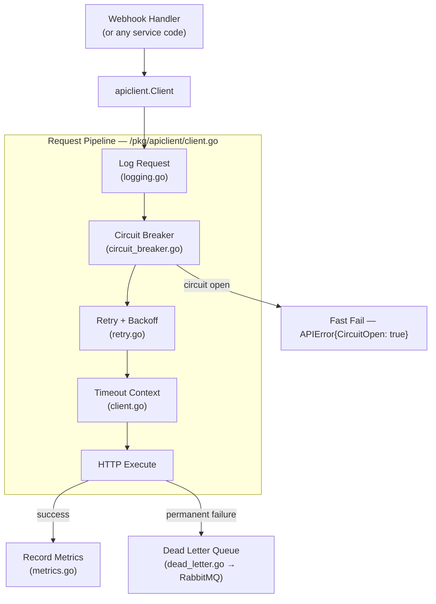
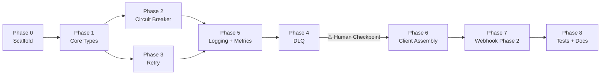

# pkg/apiclient — Implementation Plan

**Version:** 1.0
**Date:** 03 March 2026
**Status:** Draft
**Previous Version:** n/a
**Maintained by:** Alex

### Key Changes v1.0
- Initial plan. Supersedes PR6 (`feature/webhook-integration`). New delivery branch: `feature/apiclient-and-webhook-phase2`.

---

# 1. Context

1.1 This plan implements the external API client pattern defined in `wellmed-system-architecture.md §3.3` and `ADR-001`. The pattern was scoped out of the original webhook integration work (PR6) and is being addressed now as a prerequisite to webhook Phase 2.

1.2 The package lives at `/pkg/apiclient/` inside `wellmed-gateway-go` — self-contained, no commingling with existing `internal/` domain code. It is not a shared library across repos; each service that needs it will own its own copy of the pattern.

1.3 The first consumer is the Jurnal.id webhook handler (`internal/domain/webhook/handler/webhook.go`). Phase 1 of that handler (HMAC verification, 200 ack) is complete. Phase 2 — forwarding the verified payload for downstream processing — is gated on this package existing.



1.4 **Logging note.** `ADR-001` and the archive spec reference `uber-go/zap` for structured logging. The repo currently uses `logrus`. This plan uses `logrus` for consistency. Migrating the whole gateway to `zap` is a separate concern — flag it as a future item in the edit log when the time comes.

---

# 2. PR Strategy

2.1 `origin/feature/webhook-integration` is pushed and has two commits worth keeping: `7092647` (HMAC-SHA256 webhook middleware) and `9abf2ac` (x-service-key injection). There are also ~190 uncommitted working tree changes on that branch — unrelated domain-wide modifications that need separate handling and must not be carried into this PR.

2.2 **Starting point:** branch from `origin/main`. Cherry-pick `7092647` and `9abf2ac` onto the new branch. The new branch is `feature/apiclient-and-webhook-phase2`. Do not carry the uncommitted 190-file diff — leave it on `feature/webhook-integration` for separate triage.

```
git checkout -b feature/apiclient-and-webhook-phase2 origin/main
git cherry-pick 7092647   # webhook HMAC middleware
git cherry-pick 9abf2ac   # x-service-key injection
```

2.3 This PR is a **Red-level merge** per the branch governance policy — it introduces a new shared package and a new infrastructure dependency (RabbitMQ). CTO review required before merging to `main`.

---

# 3. Dependencies

3.1 `github.com/rabbitmq/amqp091-go` — RabbitMQ client for the DLQ publisher. Add to `go.mod` in Phase 0. This is the only new direct dependency.

3.2 `github.com/google/uuid` is already in `go.mod` as an indirect dependency (via Fiber). Promote to direct by importing in `logging.go` for correlation ID generation.

3.3 **Human checkpoint after Phase 4 (DLQ).** RabbitMQ connection config and queue naming must be confirmed with Hamzah before the DLQ publisher is wired into the client pipeline. The `dead_letter.go` implementation can be built and unit-tested in isolation against a mock first; the checkpoint is specifically about confirming the env var names, exchange topology, and whether a dev RabbitMQ instance exists.

---

# 4. File Structure

```
/pkg/apiclient/
├── doc.go                  # package doc
├── config.go               # Config, RetryConfig, CircuitBreakerConfig, policy presets
├── config_test.go
├── errors.go               # APIError with full context
├── circuit_breaker.go      # three-state HTTP circuit breaker
├── circuit_breaker_test.go
├── retry.go                # exponential backoff with jitter (pure Go)
├── retry_test.go
├── logging.go              # structured request/response logging + correlation ID
├── metrics.go              # Metrics interface + NoopMetrics
├── dead_letter.go          # RabbitMQ DLQ publisher
├── dead_letter_test.go     # tests against mock AMQP
└── client.go               # Client struct, Do/Get/Post/Put/Delete, full pipeline
    client_test.go
```

4.1 The existing gRPC circuit breaker at `internal/infrastructure/grpc/circuit_breaker.go` is unrelated — it tracks failures per gRPC connection. The HTTP circuit breaker in `pkg/apiclient/circuit_breaker.go` tracks failures per API client instance. No code is shared between them.

---

# 5. Policy Groups

5.1 Five policy group presets must be implemented as named constructors in `config.go`. These match `wellmed-system-architecture.md §3.3.1` exactly.

| Group | APIs | Retries | CB Threshold | Timeout |
|---|---|---|---|---|
| `critical-gov` | SATU SEHAT, P-Care | 10 | 10 failures | 60s |
| `standard-gov` | Mobile JKN | 5 | 5 failures | 45s |
| `payments` | Xendit | 3 | 3 failures | 30s |
| `business` | Jurnal, Xero, Talenta | 5 | 5 failures | 30s |
| `notifications` | Zoho Desk, Kyoo | 2 | 3 failures | 15s |

5.2 The Jurnal webhook Phase 2 handler uses the `business` policy group.

---

# 6. Implementation Phases

## 6.1 Phase 0 — Scaffold and Dependencies



6.1.1 Tasks:

- [ ] 6.1.1.1 Create `feature/apiclient-and-webhook-phase2` branch from `main` — @Alex
- [ ] 6.1.1.2 Cherry-pick webhook middleware and Phase 1 handler commits from PR6 — @Alex (depends on 6.1.1.1)
- [ ] 6.1.1.3 Add `github.com/rabbitmq/amqp091-go` to `go.mod` via `go get` — @Alex
- [ ] 6.1.1.4 Create `/pkg/apiclient/` directory and empty `doc.go` with package declaration — @Alex

6.1.2 Acceptance criteria:
- `go build ./...` passes on the new branch with the new dependency resolved.
- `/pkg/apiclient/` directory exists and is importable.

## 6.2 Phase 1 — Core Types (config.go and errors.go)

6.2.1 Tasks:

- [ ] 6.2.1.1 Implement `Config`, `RetryConfig`, `CircuitBreakerConfig`, `AuthConfig`, `OAuth2Config` structs in `config.go` — @Alex
- [ ] 6.2.1.2 Implement `DefaultConfig(name, baseURL string) Config` and all five policy group constructors (`CriticalGovConfig`, `StandardGovConfig`, `PaymentsConfig`, `BusinessConfig`, `NotificationsConfig`) — @Alex (depends on 6.2.1.1)
- [ ] 6.2.1.3 Implement `Config.Validate() error` — @Alex
- [ ] 6.2.1.4 Implement `APIError` struct in `errors.go` with fields: `ClientName`, `RequestID`, `Method`, `URL`, `StatusCode`, `ResponseBody`, `Attempts`, `FirstAttempt`, `LastAttempt`, `Retryable`, `CircuitOpen`, `Timeout` — @Alex
- [ ] 6.2.1.5 Implement `APIError.Error()`, `Unwrap()`, `IsRetryable()`, `IsCircuitOpen()`, `IsTimeout()` — @Alex (depends on 6.2.1.4)
- [ ] 6.2.1.6 Write table-driven tests in `config_test.go` covering: valid config, missing name, missing base URL, invalid multiplier, each policy group preset produces correct values — @Alex

6.2.2 Acceptance criteria:
- All five policy group presets match the values in the table in §5.1 exactly.
- `go test ./pkg/apiclient/...` passes.

## 6.3 Phase 2 — HTTP Circuit Breaker

*Phase 2 and Phase 3 are independent. They can be built in parallel if two people are working.*

6.3.1 Tasks:

- [ ] 6.3.1.1 Implement `CircuitState` (Closed/Open/HalfOpen) and `HTTPCircuitBreaker` struct in `circuit_breaker.go` — @Alex
- [ ] 6.3.1.2 Implement state transition logic: Closed → Open after `FailureThreshold` consecutive failures; Open → HalfOpen after `Timeout`; HalfOpen → Closed after `SuccessThreshold` consecutive successes; HalfOpen → Open on next failure — @Alex (depends on 6.3.1.1)
- [ ] 6.3.1.3 Implement `Allow() bool` (returns false when Open), `RecordSuccess()`, `RecordFailure()` methods — @Alex (depends on 6.3.1.2)
- [ ] 6.3.1.4 Write table-driven tests covering all state transitions, concurrency safety (run with `-race`), and half-open recovery — @Alex (depends on 6.3.1.3)

6.3.2 Acceptance criteria:
- All state transitions are covered by tests.
- `go test -race ./pkg/apiclient/...` passes (mutex coverage).
- This implementation is independent of `internal/infrastructure/grpc/circuit_breaker.go` — no shared types or imports.

## 6.4 Phase 3 — Retry with Exponential Backoff

*Phase 3 is independent of Phase 2. Can be built in parallel.*

6.4.1 Tasks:

- [ ] 6.4.1.1 Implement `ExponentialBackoff` in `retry.go` — pure Go, no third-party retry library. Fields: `maxAttempts`, `initialInterval`, `maxInterval`, `multiplier`, `retryableStatuses []int` — @Alex
- [ ] 6.4.1.2 Implement jitter: add ±10% random jitter to each backoff interval to prevent thundering herd — @Alex (depends on 6.4.1.1)
- [ ] 6.4.1.3 Implement `IsRetryableStatus(code int) bool` helper — retryable statuses: 408, 429, 500, 502, 503, 504 — @Alex
- [ ] 6.4.1.4 Implement `ShouldRetry(attempt int, statusCode int, err error) bool` — returns false when max attempts reached or status is non-retryable — @Alex (depends on 6.4.1.2, 6.4.1.3)
- [ ] 6.4.1.5 Write table-driven tests covering: max attempts exhausted, non-retryable status (e.g. 400, 401, 403) stops immediately, jitter stays within bounds, context cancellation stops retry loop — @Alex

6.4.2 Acceptance criteria:
- A 500 response retries up to `maxAttempts` times with exponentially increasing delays.
- A 400 response does not retry at all.
- Context cancellation during a backoff sleep exits cleanly (no goroutine leak).

## 6.5 Phase 4 — Dead Letter Queue

6.5.1 Tasks:

- [ ] 6.5.1.1 Define `DLQMessage` struct in `dead_letter.go`: `RequestID`, `ClientName`, `Method`, `URL`, `RequestBody`, `RequestHeaders`, `Attempts`, `LastError`, `Timestamp`, `PolicyGroup` — @Alex
- [ ] 6.5.1.2 Define `DLQPublisher` interface: `Publish(ctx context.Context, msg DLQMessage) error` — @Alex (depends on 6.5.1.1)
- [ ] 6.5.1.3 Implement `RabbitMQPublisher` struct satisfying `DLQPublisher`. Connection config via env vars (names TBD — see checkpoint below). Serialises `DLQMessage` as JSON. Exchange and queue names TBD. — @Alex (depends on 6.5.1.2)
- [ ] 6.5.1.4 Implement `NoopDLQPublisher` satisfying `DLQPublisher` — logs a warning and returns nil. Used in tests and when RabbitMQ is not configured. — @Alex (depends on 6.5.1.2)
- [ ] 6.5.1.5 Write unit tests against a mock `DLQPublisher` (not a real RabbitMQ connection) verifying: message is published after all retries exhausted, noop publisher does not error, `DLQMessage` contains the full original request context — @Alex

6.5.2 **⚠ Human Checkpoint — confirm with Hamzah before Phase 6:**
- RabbitMQ env var names for connection URL (e.g. `RABBITMQ_URL`)
- Exchange name and routing key for DLQ messages
- Whether a dev/staging RabbitMQ instance is available for integration testing
- Whether the existing queue topology (from other services) has a naming convention to follow

6.5.3 Acceptance criteria:
- `DLQPublisher` interface is defined and both `RabbitMQPublisher` and `NoopDLQPublisher` implement it.
- Unit tests pass without a real RabbitMQ connection.
- `RabbitMQPublisher` is not wired into the client pipeline until the checkpoint in 6.5.2 is resolved.

## 6.6 Phase 5 — Logging and Metrics

6.6.1 Tasks:

- [ ] 6.6.1.1 Implement correlation ID generation in `logging.go` using `github.com/google/uuid`. Generate on `Client.Do()` if not present in context — @Alex
- [ ] 6.6.1.2 Implement `logRequest(logger *logrus.Logger, requestID, method, url string, body []byte)` — logs at INFO level with fields: `request_id`, `client_name`, `method`, `url`, `body_bytes` — @Alex
- [ ] 6.6.1.3 Implement `logResponse(...)` — logs at INFO on success, WARN on retryable failure, ERROR on permanent failure. Fields: `request_id`, `status_code`, `attempt`, `duration_ms` — @Alex (depends on 6.6.1.2)
- [ ] 6.6.1.4 Define `Metrics` interface in `metrics.go`: `RecordRequest(clientName, method string)`, `RecordSuccess(clientName, method string, durationMs int64)`, `RecordFailure(clientName, method, reason string)`, `RecordDLQ(clientName string)` — @Alex
- [ ] 6.6.1.5 Implement `NoopMetrics` satisfying `Metrics` — all methods are empty. This is the default. A CloudWatch implementation is a future item. — @Alex (depends on 6.6.1.4)

6.6.2 Acceptance criteria:
- Every `Do()` call produces at minimum one request log and one response log, each containing `request_id`.
- `Metrics` interface is clean enough to implement a CloudWatch adapter without changing `client.go`.

## 6.7 Phase 6 — Client Assembly

*Depends on Phases 2, 3, 4 (checkpoint resolved), and 5.*

6.7.1 Tasks:

- [ ] 6.7.1.1 Implement `Client` struct in `client.go`: holds `Config`, `httpClient *http.Client`, `cb *HTTPCircuitBreaker`, `retry *ExponentialBackoff`, `dlq DLQPublisher`, `metrics Metrics`, `logger *logrus.Logger` — @Alex
- [ ] 6.7.1.2 Implement `New(cfg Config, opts ...Option) (*Client, error)` constructor. Validate config. Wire all components. Accept functional options for DLQ publisher and metrics (defaults to noop implementations). — @Alex (depends on 6.7.1.1)
- [ ] 6.7.1.3 Implement `Do(ctx context.Context, req *http.Request) (*http.Response, error)` — orchestrates the full pipeline: log request → CB check → retry loop (timeout context → HTTP execute → check retryable) → on permanent failure: publish to DLQ → return `APIError` — @Alex (depends on 6.7.1.2)
- [ ] 6.7.1.4 Implement convenience methods `Get`, `Post`, `Put`, `Delete` wrapping `Do()` — @Alex (depends on 6.7.1.3)
- [ ] 6.7.1.5 Write integration-style unit tests in `client_test.go` using `httptest.Server` as the target: success path, retry on 503 then success, circuit breaker opens after threshold, DLQ called on permanent failure — @Alex (depends on 6.7.1.4)

6.7.2 Acceptance criteria:
- `go test ./pkg/apiclient/...` passes with no real external dependencies.
- A 503 response retries, records metrics, and on exhaustion publishes to the mock DLQ.
- Circuit open state returns `APIError{CircuitOpen: true}` immediately without an HTTP call.

## 6.8 Phase 7 — Webhook Phase 2 Integration

6.8.1 Tasks:

- [ ] 6.8.1.1 Add `apiclient.Client` to `WebhookHandler` struct — injected at construction time — @Alex
- [ ] 6.8.1.2 Update `NewWebhookHandler()` to accept a `*apiclient.Client` parameter. Construct using `BusinessConfig("jurnal", JURNAL_FORWARD_URL)` policy group — @Alex (depends on 6.8.1.1)
- [ ] 6.8.1.3 Implement the `Jurnal` handler body for Phase 2: read `rawBody` from Fiber locals, build a `POST` request to backbone endpoint, call `client.Post()`, handle errors (log + return 500 on permanent failure, return 200 on success) — @Alex (depends on 6.8.1.2)
- [ ] 6.8.1.4 Add `JURNAL_FORWARD_URL` to `internal/config/env.go` and `.env.example` — @Alex
- [ ] 6.8.1.5 Update `WebhookHandler` wiring in the domain `wires.go` to inject the client — @Alex (depends on 6.8.1.3, 6.8.1.4)
- [ ] 6.8.1.6 Update webhook handler tests — @Alex (depends on 6.8.1.5)

6.8.2 Acceptance criteria:
- A verified Jurnal webhook payload is forwarded to `JURNAL_FORWARD_URL` using the `business` policy group (5 retries, 30s timeout).
- If forwarding fails after all retries, the gateway still returns 200 to Jurnal (ack the webhook receipt) but logs an error and publishes to DLQ. Jurnal must not retry due to a 500.
- Handler tests cover success, forwarding failure (DLQ path), and circuit open.

## 6.9 Phase 8 — Tests and Documentation

6.9.1 Tasks:

- [ ] 6.9.1.1 Run full test suite: `go test ./...` — fix any failures — @Alex
- [ ] 6.9.1.2 Run `go test -race ./pkg/apiclient/...` — fix any data races — @Alex
- [ ] 6.9.1.3 Run `golangci-lint run ./pkg/apiclient/...` — fix lint issues — @Alex
- [ ] 6.9.1.4 Update `docs/gateway-integrations.md` to document the `pkg/apiclient` package: add a §1.7 covering the HTTP client pipeline, policy groups, and DLQ — @Alex
- [ ] 6.9.1.5 Update `kalpa-docs/adrs/ADR-001-api-client-circuit-breaker.md` — mark status as **Implemented** and link to the gateway repo implementation — @Alex
- [ ] 6.9.1.6 Open PR `feature/apiclient-and-webhook-phase2` → `main`. Tag as Red-level merge. Request CTO review. — @Alex

6.9.2 Acceptance criteria:
- `go test ./...` passes.
- `go test -race ./pkg/apiclient/...` passes.
- `golangci-lint run` passes with no new warnings.
- ADR-001 status updated to Implemented.

---

# 7. Out of Scope

7.1 OAuth2 token refresh (`AuthConfig.OAuth2` is defined in config but the token refresh loop is not implemented in this plan — deferred to SATU SEHAT integration work).

7.2 CloudWatch metrics adapter — `NoopMetrics` ships now; the CloudWatch adapter is a follow-on PR.

7.3 Rate limiting — the architecture mentions it as a future composable capability. Not in this plan.

7.4 Migrating existing `logrus` usage to `zap` — flagged as a future refactor, not a blocker.

---

# Edit Log

| Version | Date | Author | Changes |
|---------|------|--------|---------|
| 1.0 | 03 March 2026 | Alex + Claude | Initial plan. Supersedes PR6. Implements `wellmed-system-architecture.md §3.3` and ADR-001 as `/pkg/apiclient/` in wellmed-gateway-go. |
