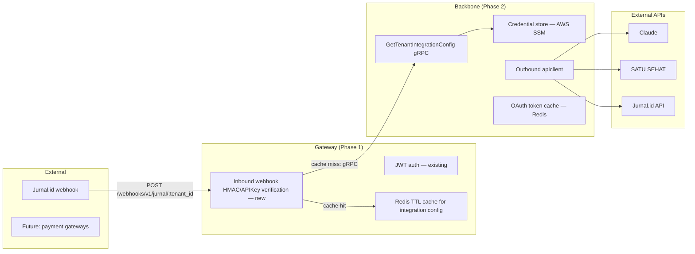

# Integration Auth Layer — Gateway Phase 1 / Backbone Phase 2 Spec

**Version:** 1.0
**Date:** 01 March 2026
**Status:** Ready to Implement — Phase 1
**Maintained by:** @Alex

### Key Changes v1.0
- Initial plan. Gateway Phase 1 scoped to inbound webhook HMAC/APIKey verification. Backbone Phase 2 spec included to preserve full scope between sessions.

---

# 1. Service Boundary

The gateway handles auth and routing only. It never touches SSM, never calls external APIs, and never stores credentials. All of that is backbone's domain.



1.1 **Gateway responsibility** — verify inbound requests are legitimate (JWT for user sessions, HMAC/APIKey for external webhooks) and route to backbone. No credential storage, no SSM access, no outbound external API calls.

1.2 **Backbone responsibility** — own all integration credentials in AWS SSM (accessed directly via ECS task IAM role, not through gateway), expose `GetTenantIntegrationConfig` for gateway to fetch verification keys, and make all outbound calls to Claude, SATU SEHAT, and Jurnal using the `apiclient` package.

1.3 **Admin credential ingestion** — when a tenant configures an integration via the admin panel, the frontend calls gateway (JWT-authenticated), gateway proxies to backbone via existing gRPC, and backbone writes to SSM. This flow is already scoped in the frontend admin panel work and uses no new gateway routes.

---

# 2. SSM Credential Path Convention

Documented here for both phases. Backbone owns these paths.

```
/wellmed/{env}/tenant/{tenant_id}/integrations/{service}/{field}
```

2.1 The path segments `{env}` and `{service}` are lowercase and hyphenated. Examples:

| SSM Path | Purpose |
|---|---|
| `/wellmed/prod/tenant/abc123/integrations/jurnal/client_id` | Jurnal HMAC username |
| `/wellmed/prod/tenant/abc123/integrations/jurnal/client_secret` | Jurnal HMAC signing key |
| `/wellmed/prod/tenant/abc123/integrations/satu-sehat/client_id` | SATU SEHAT OAuth client |
| `/wellmed/prod/tenant/abc123/integrations/satu-sehat/client_secret` | SATU SEHAT OAuth secret |
| `/wellmed/prod/tenant/abc123/integrations/claude/api_key` | Claude API key |

2.2 Redis cache key for gateway (inbound verification only): `integration:config:{tenant_id}:{service}`, TTL 15 minutes. This key is separate from the session key namespace (`auth:session:...`) and the OAuth token namespace (`integration:oauth_token:...` — backbone only).

---

# 3. Phase 1: Gateway — Inbound Webhook Verification

## 3.1 Context

External systems post payloads to the gateway. The gateway must verify the caller is legitimate before forwarding to backbone. The HMAC secret or API key needed for verification lives in backbone — gateway asks for it via gRPC and caches the result in Redis.

## 3.2 New Proto Contract

The following proto method is **defined in the gateway** (as the caller spec) and **implemented in backbone**. It is the only interface coupling between the two phases.

```protobuf
service IntegrationService {
  rpc GetTenantIntegrationConfig(GetTenantIntegrationConfigRequest)
      returns (TenantIntegrationConfig);
}

message GetTenantIntegrationConfigRequest {
  string tenant_id = 1;
  string service   = 2;  // "jurnal", "satu-sehat", "claude"
}

message TenantIntegrationConfig {
  string service              = 1;
  string auth_type            = 2;  // "hmac", "apikey", "oauth"
  bool   enabled              = 3;
  map<string, string> credentials = 4;  // minimum fields for inbound verification
}
```

3.2.1 Gateway only receives the fields needed for inbound verification (e.g., `client_id`, `hmac_secret`). Backbone never sends full outbound auth credentials over this call.

## 3.3 Inbound Webhook Auth — Jurnal.id (Mekari) HMAC Spec

The following is the canonical Mekari HMAC spec. The gateway middleware must implement this exactly.

3.3.1 **Signing string** — two lines, newline-separated:

```
date: <RFC7231 UTC datetime>
<METHOD> <path+querystring> HTTP/1.1
```

3.3.2 **Inbound Authorization header** from Jurnal:

```
Authorization: hmac username="<client_id>", algorithm="hmac-sha256", headers="date request-line", signature="<base64>"
```

3.3.3 **Digest header** (present on POST/PUT/PATCH/DELETE only):

```
Digest: SHA-256=<base64(sha256(raw_body))>
```

3.3.4 Gateway verification steps: parse `client_id` from Authorization header → fetch `client_secret` from cache or backbone → recompute HMAC-SHA256 over signing string → constant-time compare against incoming signature. If `Digest` header is present, also verify body hash before HMAC check.

## 3.4 File Changes

```
wellmed-gateway-go/
├── proto/
│   └── integration.proto                    # new
├── internal/
│   ├── rpc/
│   │   └── integration.go                   # new — gRPC client wrapper
│   ├── middleware/
│   │   └── webhook.go                       # new — WebhookHMAC + WebhookAPIKey
│   └── domain/
│       └── webhook/
│           └── handler/
│               └── webhook.go               # new — Jurnal handler stub
└── internal/route/api.go                    # modified — add /webhooks/v1 group
```

No changes to `go.mod`, `internal/config/env.go`, or any existing middleware.

## 3.5 Objectives and Tasks

### 3.5.1 Objective: Define and generate integration proto

[ ] 3.5.1.1 Create `proto/integration.proto` with `IntegrationService` and `GetTenantIntegrationConfig` — @Alex

[ ] 3.5.1.2 Run protoc to generate `integration_pb.go` and `integration_grpc.pb.go` — @Alex (depends on 3.5.1.1)

**Acceptance criteria for 3.5.1:** Proto compiles without errors. Generated files exist in `proto/`. Backbone team has received the proto file as the interface contract.

### 3.5.2 Objective: Implement integration gRPC client wrapper with Redis cache

[ ] 3.5.2.1 Implement `internal/rpc/integration.go` — thin wrapper following pattern in `internal/rpc/` — @Alex (depends on 3.5.1.2)

[ ] 3.5.2.2 Add Redis TTL cache around the gRPC call, key `integration:config:{tenant_id}:{service}`, TTL 15 min — @Alex (depends on 3.5.2.1)

**Acceptance criteria for 3.5.2:** Second call for the same tenant+service returns from Redis without triggering a gRPC call. Confirmed via log output.

### 3.5.3 Objective: Implement inbound webhook verification middleware

[ ] 3.5.3.1 Implement `WebhookHMAC` in `internal/middleware/webhook.go` per spec in 3.3 — @Alex (depends on 3.5.2.2)

[ ] 3.5.3.2 Implement `WebhookAPIKey` in same file — @Alex (depends on 3.5.2.2)

[ ] 3.5.3.3 Both middleware store raw body bytes in Fiber locals (`rawBody`) after reading, so downstream handlers can access the payload — @Alex

[ ] 3.5.3.4 Both use `crypto/subtle.ConstantTimeCompare` — @Alex

**Acceptance criteria for 3.5.3:** Valid HMAC signature passes. Tampered body returns 401. Missing signature header returns 401.

### 3.5.4 Objective: Register webhook routes and add Jurnal handler stub

[ ] 3.5.4.1 Implement `internal/domain/webhook/handler/webhook.go` with `Jurnal()` — logs payload, returns 200 — @Alex

[ ] 3.5.4.2 Add `/webhooks/v1/jurnal/:tenant_id` route to `internal/route/api.go` using `WebhookHMAC` middleware — @Alex (depends on 3.5.3.1, 3.5.4.1)

**Acceptance criteria for 3.5.4:** `POST /webhooks/v1/jurnal/{tenant_id}` with valid HMAC returns 200. Invalid HMAC returns 401 before handler is reached.

### 3.5.5 Objective: Write dry tests for webhook middleware

[ ] 3.5.5.1 `TestWebhookHMAC_ValidSignature` — passes, calls Next() — @Alex

[ ] 3.5.5.2 `TestWebhookHMAC_TamperedBody` — returns 401 — @Alex

[ ] 3.5.5.3 `TestWebhookHMAC_MissingSignature` — returns 401 — @Alex

[ ] 3.5.5.4 `TestWebhookHMAC_CacheHit` — second request hits Redis, no gRPC call — @Alex

[ ] 3.5.5.5 `TestWebhookAPIKey_Valid` and `TestWebhookAPIKey_Invalid` — @Alex

**Acceptance criteria for 3.5.5:** All tests pass with `go test ./internal/middleware/...`. No real network calls. No real credentials required.

## 3.6 Build Gate

```bash
go build ./...
go test ./internal/middleware/... ./internal/rpc/...
golangci-lint run
```

---

# 4. Phase 2 Spec: Backbone — Credentials + Outbound Integrations

> This section is the written contract for the backbone plan. Do not implement in this session. It is here so nothing is lost between sessions.

## 4.1 What Backbone Must Deliver for Phase 1 to Go Live

4.1.1 Implement `GetTenantIntegrationConfig` gRPC endpoint per the proto defined in 3.2. Gateway cannot go to production without this.

4.1.2 Read tenant credentials from SSM using AWS SDK v2 (dependency goes in backbone `go.mod`, not gateway). Backbone authenticates to SSM via ECS task IAM role — no additional auth configuration needed.

## 4.2 Outbound `apiclient` Package

The `apiclient` package lives in backbone. All three auth strategies below are for backbone's outbound calls — gateway never uses these.

### 4.2.1 Auth Strategy Interface

```go
type AuthStrategy interface {
    Apply(ctx context.Context, req *http.Request, creds map[string]string) error
    Type() string
}
```

### 4.2.2 API Key Strategy — Claude

4.2.2.1 Header: `x-api-key: <creds["api_key"]>`.

4.2.2.2 Static header on every request: `anthropic-version: 2023-06-01`.

4.2.2.3 No `Authorization` header — Claude uses `x-api-key`, not Bearer.

4.2.2.4 SSM fields required: `api_key`.

### 4.2.3 OAuth Strategy — SATU SEHAT

4.2.3.1 Token URL staging: `https://api-satusehat-stg.dto.kemkes.go.id/oauth2/v1/accesstoken?grant_type=client_credentials`. Production: `https://api-satusehat.kemkes.go.id/oauth2/v1/accesstoken?grant_type=client_credentials`.

4.2.3.2 Token POST is `Content-Type: application/x-www-form-urlencoded` with body `client_id=X&client_secret=Y`. Not Basic Auth.

4.2.3.3 Response field `expires_in` is a **string** (`"3599"`), not an integer — parse with `strconv.Atoi()` before computing Redis TTL.

4.2.3.4 Cache token in Redis: key `integration:oauth_token:{tenant_id}:satu-sehat`, TTL = `expires_in - 60s`.

4.2.3.5 Do not retry a failed token fetch without backoff — SATU SEHAT enforces a 1 request/minute limit after auth failure.

4.2.3.6 SSM fields required: `client_id`, `client_secret`.

### 4.2.4 HMAC Strategy — Jurnal.id (Mekari) Outbound

4.2.4.1 Signing string identical to inbound spec (3.3.1) — the same algorithm is used in both directions, only the role (sign vs verify) differs.

4.2.4.2 Authorization header: `hmac username="<client_id>", algorithm="hmac-sha256", headers="date request-line", signature="<base64>"`.

4.2.4.3 Digest header (POST/PUT/PATCH/DELETE): `SHA-256=<base64(sha256(raw_body))>`. Not present on GET.

4.2.4.4 SSM fields required: `client_id`, `client_secret`.

## 4.3 Service Configurations

| Service | Auth type | Base URL (staging) | SSM fields |
|---|---|---|---|
| `claude` | APIKey | `https://api.anthropic.com` | `api_key` |
| `satu-sehat` | OAuth | `https://api-satusehat-stg.dto.kemkes.go.id` | `client_id`, `client_secret` |
| `jurnal` | HMAC | `https://api.mekari.com` | `client_id`, `client_secret` |

4.3.1 Base URL switches between staging and production based on `APP_ENV` — this env var belongs in backbone, not gateway.

## 4.4 Credential Store

4.4.1 Interface:

```go
type CredentialStore interface {
    Get(ctx context.Context, tenantID, service, field string) (string, error)
    GetAll(ctx context.Context, tenantID, service string) (map[string]string, error)
}
```

4.4.2 SSM implementation: check Redis first → miss → call `ssm.GetParametersByPath` with the service prefix → cache each field individually with 15-minute TTL → return.

4.4.3 SSM path builder: `/{prefix}/{env}/tenant/{tenantID}/integrations/{service}/{field}`.

4.4.4 AWS SDK v2 dependency (`github.com/aws/aws-sdk-go-v2/config` + `github.com/aws/aws-sdk-go-v2/service/ssm`) goes in backbone `go.mod`.

## 4.5 Dry Tests for Backbone Outbound Auth

4.5.1 `claude_drytest_test.go` — `x-api-key` header set from store, `anthropic-version` present, no `Authorization` header present.

4.5.2 `satusehat_drytest_test.go` — token POST is form-encoded (not Basic Auth), `expires_in` parsed from string correctly, second request uses Redis cache without re-fetching token.

4.5.3 `jurnal_drytest_test.go` — signing string correct, `Digest` header present on POST and absent on GET, signature recomputes correctly against known test vector.

---

# Edit Log

| Version | Date | Author | Changes |
|---------|------|--------|---------|
| 1.0 | 01 March 2026 | @Alex | Initial plan. Scoped Phase 1 to gateway inbound webhook verification only. Phase 2 backbone spec captured in full to preserve outbound auth strategy details (Claude, SATU SEHAT, Jurnal) between sessions. AWS SDK removed from gateway — backbone owns SSM access via ECS task IAM role. |
