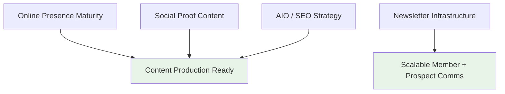

# Kezia Sinaga — Work Plan: Padma Care Marketing Execution

**Version:** 2.2
**Date:** 27 February 2026
**Previous Version:** 2.1 (27 February 2026) — removed Video Session 1 from workstreams
**Maintained by:** Kezia Sinaga
**Reference:** Padma Care Marketing Plan v2.1 (25 Feb 2026), Padma Care AIO Action Plan v1.1 (27 Feb 2026)
**Status:** Draft — pending Alex review before March execution

### Key Changes v2.1 → v2.2
- Added reference to shared markdown-style skill in output standards

---

# 1. Orientation

## 1.1 How This Document Works

1.1.1 This work plan governs Kezia's execution of Marketing Plan v2.1 Section 11.3 deliverables plus the AIO Action Plan v1.1 implementation. The Marketing Plan provides strategy and priorities. The AIO plan provides the quality bar and implementation detail for content/SEO work. This document is the execution layer.

1.1.2 The AIO Action Plan (Section 5 of this document) was written by Alex to tackle the most strategically complex piece — the content strategy, consumer psychology, and AI optimization framework. It is not expected that Kezia would produce this from scratch. What is expected: that Kezia deeply understands it, can operationalize it, can identify gaps she's equipped to fill, and flags the ones she's not.

1.1.3 When working on any workstream in this plan, open a separate Claude context window and load both this document and the Marketing Plan v2.1. Tell Claude which workstream you're focusing on and ask it to help you think through strategic ramifications, prioritize by impact, identify what needs a decision vs. what needs execution, and build a detailed workplan for that area. This produces better output than working from checklists alone — it forces strategic thinking about *why* each task matters and *what* the highest-leverage moves are.

1.1.4 The AIO plan contains specific language, tone, and content guidelines (Sections 1.3, 4, 5, 6.4, 8, and 11) that define how Padma Care should sound to consumers and how content should be structured for AI citation. These guidelines must inform all content work — social posts, GBP descriptions, FAQ drafts, vignettes. When drafting any consumer-facing content, include the AIO plan in your Claude context so the output reflects these standards.

## 1.2 Decision Framework

1.2.1 **Execute without check-in:** GBP completion, social media profile maturation, social posting cadence, social proof vignette creation and posting. These are defined, low-risk, and should just get done.

1.2.2 **Research, form an opinion, and recommend:** Newsletter/list management tool selection, SEO/AIO operational planning. Output should include: your recommendation, options considered and why they were discarded, implementation steps, and blockers or open questions. Brief is better — a tight 1-page recommendation beats a 10-page comparison.

1.2.3 **Draft and check in before executing:** Any consumer-facing content that goes beyond social posts (FAQ drafts, blog outlines, GBP description copy). Alex reviews for clinical accuracy and brand voice.

1.2.4 **Escalate, don't attempt:** Anything touching advocacy messaging (this is being validated through real cases — see Marketing Plan Section 2.1), schema markup implementation (developer task — flag it as a dependency), and clinical content accuracy.

## 1.3 Output Standards

1.3.1 All deliverables in markdown format. The team markdown style guide is available as a shared skill in Claude. Any time you say "Make a plan" "Create a PRD" ".md or MD" - these should all trigger the skill - watch the console to see if the working display says 'let me read the markdown-styleguide skill.' Claude will then do all this work for you.

1.3.2 Numbered headings (1, 1.1, 1.1.1) — not bullets — for anything that might be referenced later.

1.3.3 No arbitrary timelines. If you assign a date or duration, state the reasoning. "By March 14" is acceptable if there's a reason. "2-3 weeks" with no reasoning is not.

1.3.4 Every recommendation document includes: options considered, why the recommended option wins, what it trades off, and what you need from Alex to proceed.

---

# 2. Workstream Overview and Target States

## 2.1 Context

2.1.1 The Marketing Plan v2.1 priority stack governs all work allocation. Advocacy program validation (Priority 1) is led by Alex and Gita. Kezia's workstreams (Priority 3) run in parallel and are not dependent on advocacy validation — with one exception: Track B (hospital/advocacy) content production should wait until advocacy messaging is validated through real cases. Track A (concierge/navigation) content can proceed now.

2.1.2 The 2026 target is 100 members / 1B+ IDR revenue. Everything in this plan should connect back to that number — if a task doesn't plausibly contribute to member acquisition, retention, or revenue, question whether it belongs here.

## 2.2 Workstream Summary



| # | Workstream | Target State (check-in ready) | Dependency |
|---|-----------|-------------------------------|------------|
| 1 | Online Presence (GBP, IG, FB) | All profiles complete, professional, actively posting. GBP description reflects AIO plan language. | AIO plan Section 6.1 (GBP detail) |
| 2 | Social Proof Vignettes | First 3-4 vignettes created and posted. Ongoing cadence established. | Google reviews collected |
| 3 | Newsletter / List Management | Tool selected with recommendation doc. Ready for implementation on Alex approval. | None |
| 4 | AIO / SEO Operational Plan | Operational plan that takes the AIO Action Plan and turns it into sequenced, assigned, executable work — with Track A content ready to draft and Track B content flagged as waiting on advocacy validation. | AIO plan (Section 5 of this document) |

---

# 3. Workstream Detail: Online Presence and Social Proof

## 3.1 Google Business Profile

3.1.1 **Outcome:** GBP is fully complete, professional, and actively managed. Description and service listings use the language and framing from AIO plan Sections 4.3, 5.3, and 6.1 — not generic healthcare copy.

3.1.2 **Specific tasks (reference AIO plan Section 6.1 for full detail):**

- [ ] 3.1.2.1 Claim or verify Padma Care GBP listing — @Kezia
- [ ] 3.1.2.2 Set primary category (test "Medical Group" vs. "Health Consultant" — note which is selected and why) — @Kezia
- [ ] 3.1.2.3 Write 750-character business description including: healthcare concierge, healthcare advocacy, hospital navigation, expats, Bali, Indonesia — @Kezia (draft → Alex review before publishing)
- [ ] 3.1.2.4 Add all services using language from AIO plan Sections 4.3 and 5.3 target query lists — @Kezia
- [ ] 3.1.2.5 Upload minimum 10 photos: team, facility, patient interactions (with consent) — @Kezia
- [ ] 3.1.2.6 Respond to all existing Google reviews — @Kezia
- [ ] 3.1.2.7 Publish first Google Post — @Kezia
- [ ] 3.1.2.8 Seed Q&A with top 5 FAQs from each service track (AIO plan Sections 4.4 and 5.4) — @Kezia (draft → Alex review)
- [ ] 3.1.2.9 Check all public Q&A questions and respond — @Kezia

## 3.2 Instagram

3.2.1 **Outcome:** Profile is professional, branded consistently, and posting at a sustainable cadence.

- [ ] 3.2.1.1 Audit and update bio — should clearly describe Padma Care in consumer language (not clinical). Reference AIO plan Section 6.4 for content standards. — @Kezia
- [ ] 3.2.1.2 Ensure link in bio is active (website or Linktree) — @Kezia
- [ ] 3.2.1.3 Update profile photo to Padma Care logo — @Kezia
- [ ] 3.2.1.4 Build weekly content calendar (minimum 3x/week) — @Kezia
- [ ] 3.2.1.5 Publish minimum 3 posts in first week — @Kezia
- [ ] 3.2.1.6 Respond to all comments and DMs within 24 hours (ongoing) — @Kezia

## 3.3 Facebook

3.3.1 **Outcome:** Page mirrors GBP information, CTA is functional, content repurposed from Instagram.

- [ ] 3.3.1.1 Complete all Page information (mirror GBP) — @Kezia
- [ ] 3.3.1.2 Set CTA button to "Send Message" or "Contact Us" — @Kezia
- [ ] 3.3.1.3 Repurpose Instagram content to Facebook — @Kezia
- [ ] 3.3.1.4 Respond to all comments and messages within 24 hours (ongoing) — @Kezia

## 3.4 Social Proof Vignettes

3.4.1 **Outcome:** Minimum 3-4 vignettes created from existing Google reviews. Posted across IG, FB, and Google Posts. Ongoing cadence of minimum 1/week established.

3.4.2 All paid social spend is paused (Marketing Plan Section 2.3.2). These vignettes replace it — real testimonials carry more credibility than paid ads at this stage.

- [ ] 3.4.2.1 Collect all 4-5 star Google reviews (especially from late-January outreach) — @Kezia
- [ ] 3.4.2.2 Select the most specific and personal reviews — avoid generic ones — @Kezia
- [ ] 3.4.2.3 Design vignettes in Canva: review quote + initials + context + Padma logo + 5-star rating (1080x1080px for IG) — @Kezia
- [ ] 3.4.2.4 Write captions: 1-2 sentences of context + soft CTA — @Kezia
- [ ] 3.4.2.5 Post first vignette across Instagram, Facebook, and Google Posts — @Kezia
- [ ] 3.4.2.6 Establish ongoing posting cadence (minimum 1/week) — @Kezia

---

# 4. Workstream Detail: Newsletter / List Management

## 4.1 Outcome

4.1.1 A recommendation document delivered to Alex with: recommended tool, options evaluated and why they were discarded, implementation steps, cost at current scale (~200 leads, ~40 members), and any blockers.

## 4.2 Requirements (from Marketing Plan Section 9.1)

4.2.1 Manage ~200 leads and ~40 members

4.2.2 Segment by: concierge interest, advocacy interest, active member, inactive/nurture, newsletter subscriber

4.2.3 Support email newsletters

4.2.4 WhatsApp broadcast capability (evaluate — may not exist in all tools)

4.2.5 Integrate or coexist with HubSpot Sales (current CRM)

4.2.6 Cost-appropriate for current scale — this is a ~250 person list, not enterprise

## 4.3 Tools to Evaluate

- [ ] 4.3.1 Sign up and test Mailchimp — @Kezia
- [ ] 4.3.2 Sign up and test Brevo — @Kezia
- [ ] 4.3.3 Sign up and test MailerLite — @Kezia
- [ ] 4.3.4 For each tool, test against all requirements in 4.2 — @Kezia
- [ ] 4.3.5 Check pricing at 500 contacts for each — @Kezia
- [ ] 4.3.6 Write recommendation document per output standards (Section 1.3) — @Kezia
- [ ] 4.3.7 Share recommendation with Alex — @Kezia

---

# 5. Workstream Detail: AIO / SEO Strategy and Implementation

## 5.0 How to Use This Section

5.0.1 This section contains the full AIO Action Plan v1.1, written by Alex. It is the strategic and implementation blueprint for all content and SEO/AIO work. Kezia's task is not to recreate this strategy from scratch — it is to operationalize it: turn the action items into a sequenced, assigned, executable plan, identify what can start now vs. what depends on advocacy validation, surface technical blockers (e.g., schema markup needs a developer), and flag questions or gaps.

5.0.2 The expected output is an operational plan at the same level of rigor and clarity as this section — not a generic "SEO best practices" document. Load this section and the Marketing Plan into Claude and work through each subsection systematically.

5.0.3 **Content production sequencing note:** Track A (Concierge — out-of-hospital) content can be drafted now. Track B (Advocacy — in-hospital) content should wait until advocacy messaging is validated through real cases (Marketing Plan Section 2.1). The operational plan should clearly mark which content is "go now" and which is "waiting on advocacy learnings."

5.0.4 **Technical dependency:** Schema markup (Section 5.6.3) requires a developer. Flag this in the operational plan as a blocker and identify what can proceed without it.

## 5.1 What We Are Doing and Why

### 5.1.1 The Shift

5.1.1.1 AI tools — ChatGPT, Google AI Overviews, Perplexity, Claude — are increasingly where people go when they have a health problem and don't know what to do next. These tools don't return a list of links; they synthesize an answer. If Padma Care is not the answer (or in the answer), we don't exist for that person.

5.1.1.2 Traditional SEO got you to the top of a list. AIO (AI Optimization, also called GEO or LLMO) gets you cited and recommended inside the answer itself. The two are related but not the same — a site can rank #1 on Google and never appear in an AI response.

5.1.1.3 The Bali/Indonesia English-language healthcare space is thin in AI training data. This is an advantage. A small number of well-structured, authoritative pages can dominate AI responses for our target queries with comparatively low effort.

### 5.1.2 Our Two Service Tracks

5.1.2.1 These are not marketing labels — they describe fundamentally different need states, search behaviors, and decision journeys. Content, keywords, and FAQ strategy differ between them.

| Track | Internal Name | What It Actually Is | When the Need Arises |
|-------|--------------|---------------------|----------------------|
| A | **Healthcare Concierge** | Out-of-hospital assistance — finding the right care, second opinions, care planning, provider selection | Patient has a health concern and doesn't yet know where to go or whether they're being steered correctly |
| B | **Healthcare Advocacy** | In-hospital assistance — navigation, translation, accompaniment, coordination with medical teams | Patient is already admitted or entering the hospital system and needs help not getting lost in it |

5.1.2.2 The language "inpatient/outpatient" is clinical and meaningless to consumers. We do not use it in any consumer-facing content. We use "getting the right care before you're in a hospital" (Concierge) and "support while you're in the hospital" (Advocacy) as plain descriptors.

### 5.1.3 The Naive Search Problem

5.1.3.1 Consumers frequently search at the wrong level of specificity. Someone searching "best shoulder surgeon Bali" or "orthopedic doctor near me" is often expressing a broader and earlier-stage need: "I have a shoulder problem and I don't know whether I need surgery, physio, or something else, and I don't know how the system here works." They over-specify because they don't know what they don't know.

5.1.3.2 Our content strategy must intercept at the **problem level**, not the solution level. Content titled "How to get the right shoulder treatment in Bali" captures that searcher better than content titled "Best orthopedic surgeons in Bali" — and positions Padma Care as the entity that helps them figure out what they actually need.

5.1.3.3 This is also where AI tools are most likely to cite us. When a user asks ChatGPT "what should I do about my shoulder in Bali?", the AI wants a comprehensive, problem-solving answer — not a directory listing. We are building that answer.

## 5.2 How AI Decides What to Cite

### 5.2.1 Core Mechanics

5.2.1.1 LLMs (ChatGPT, Claude, Gemini) have a base knowledge layer from training data — web crawls, books, articles. For Padma Care to appear in that layer, our content needs to be crawlable, authoritative, and substantial. This is a long-term play.

5.2.1.2 For real-time AI search tools (ChatGPT Search, Perplexity, Google AI Overviews), the model retrieves live web results at query time and synthesizes from them. This is where near-term wins happen — good content on a crawlable site can surface quickly.

5.2.1.3 AI models do not prioritize domain authority or backlinks the way Google does. Content depth, directness, and readability matter more. A newer site with genuinely comprehensive answers can outrank a well-established site with thin content in AI responses.

### 5.2.2 What AI Looks For

5.2.2.1 **Direct answers at the top.** The first 1–2 sentences of any piece of content should directly answer the question the page targets. AI extracts these "answer blocks" verbatim or near-verbatim.

5.2.2.2 **FAQ sections.** Structured question-and-answer formatting is the single highest-leverage content format for AI citation. Each FAQ entry is a discrete, extractable unit.

5.2.2.3 **Structured data (schema markup).** Machine-readable tags tell AI systems what your page is about, what your business is, and which content blocks are FAQs, reviews, services, or locations. This is a developer task.

5.2.2.4 **Consistent entity identity.** "Padma Care" needs to appear consistently — same name, same description, same services — across our website, Google Business Profile, third-party directories, and any press or partner mentions. Inconsistency confuses AI about what the entity actually is.

## 5.3 Priority Stack (AIO-Specific)

5.3.1 Items are ordered by impact-to-effort ratio, not by team function.

5.3.2 **P1 — Do first, unblocks everything else:** Google Business Profile optimization, website FAQ pages for each service track, schema markup on key pages.

5.3.3 **P2 — Do in parallel once P1 is underway:** Third-party citation building (expat directories, crew welfare resources, Bali health guides), blog content targeting problem-level queries.

5.3.4 **P3 — Ongoing maintenance:** Content refresh cycle, monitoring for AI citation, Google Knowledge Panel claim.

## 5.4 Track A: Healthcare Concierge (Out-of-Hospital)

### 5.4.1 Consumer Profile

5.4.1.1 Someone who has a health concern — symptoms, a chronic condition, a recent diagnosis, or an upcoming need — and is trying to figure out what to do before they enter the hospital system. Also: someone who has already been through the system and suspects their care pathway was not optimal.

5.4.1.2 The emotional state is **uncertainty before commitment**. They haven't decided anything yet. They want someone trustworthy to help them understand their options and point them in the right direction without selling them something.

### 5.4.2 How They Search

5.4.2.1 Problem-level searches dominate: "chronic back pain Bali what to do", "feeling unwell in Bali don't know where to go", "is my diagnosis correct Bali", "how to find a good doctor in Bali".

5.4.2.2 The naive specificity problem is most acute here: "best cardiologist Bali", "top dermatologist Ubud", "best specialist for knee in Bali". The underlying question is usually "I have a health issue and I don't know who to see or whether I'm being steered correctly."

5.4.2.3 Expat-specific searches: "GP for expats Bali", "how does healthcare work in Bali for foreigners", "health insurance Bali expat", "managed care Bali".

### 5.4.3 Target Queries We Want to Own

5.4.3.1 "How to find the right doctor in Bali"
5.4.3.2 "Healthcare for expats in Bali"
5.4.3.3 "Second opinion on diagnosis Bali"
5.4.3.4 "Medical advice for foreigners in Bali"
5.4.3.5 "Managed care Bali Indonesia"
5.4.3.6 "Healthcare concierge Bali"
5.4.3.7 "What to do if you get sick in Bali"
5.4.3.8 "Chronic condition management Bali expat"
5.4.3.9 "How does health insurance work in Bali"
5.4.3.10 "I feel unwell in Bali what should I do"

### 5.4.4 FAQ Content to Create

5.4.4.1 Each FAQ below should be a standalone page section or a dedicated FAQ page on the Padma Care website. Every answer should be 40–80 words and directly state the answer in the first sentence.

- What is a healthcare concierge and how is it different from a doctor?
- How do I know if I'm seeing the right specialist for my condition in Bali?
- What does "managed care" mean and how does Padma Care provide it?
- How do I get a second opinion in Bali without insulting my current doctor?
- I feel unwell in Bali — what should I actually do first?
- How does healthcare work for long-stay foreigners in Indonesia?
- What's the difference between a clinic, a hospital, and a specialist in Bali?
- How do I know if a Bali doctor's recommendation is right for me?
- Can Padma Care help me understand my diagnosis or treatment plan?
- What health preparations should I make before moving to Bali long-term?

## 5.5 Track B: Healthcare Advocacy (In-Hospital)

### 5.5.1 Consumer Profile

5.5.1.1 Someone already admitted to a hospital, referred to a specialist, or accompanying a family member through a procedure — who is feeling overwhelmed, confused, or underserved by the process. Often an expat or long-stay visitor who doesn't speak Indonesian fluently, doesn't know how the local system works, or doesn't trust that they're receiving complete information.

5.5.1.2 The emotional state is **anxiety during an active situation**. They are not browsing — they are looking for immediate help, reassurance, and someone who can act on their behalf.

5.5.1.3 Searches also come from companions and family, not just the patient themselves. "My partner is in hospital in Bali" is a common entry point.

### 5.5.2 How They Search

5.5.2.1 Crisis searches: "hospital in Bali doesn't speak English", "how to navigate Bali hospital", "what to do if hospitalized in Bali", "hospital interpreter Bali".

5.5.2.2 Companion searches are significant: "my partner is in hospital in Bali what do I do", "helping family member in Indonesian hospital", "how do I speak to doctors in Bali hospital".

5.5.2.3 Specificity errors: "best hospital in Bali", "BIMC vs Siloam", "private room hospital Bali". These are often expressing "can I trust the care here and will someone help me navigate it."

### 5.5.3 Target Queries We Want to Own

5.5.3.1 "How does hospital admission work in Bali for foreigners"
5.5.3.2 "English-speaking hospital support Bali"
5.5.3.3 "Healthcare advocacy Bali"
5.5.3.4 "Hospital navigator Indonesia"
5.5.3.5 "Help with Indonesian hospital system"
5.5.3.6 "Medical interpretation Bali"
5.5.3.7 "Someone to accompany me to hospital Bali"
5.5.3.8 "What to expect at a Bali hospital as a foreigner"
5.5.3.9 "My family member is hospitalized in Bali what do I do"
5.5.3.10 "Patient advocate Bali Indonesia"

### 5.5.4 FAQ Content to Create

5.5.4.1 Same format rules as Track A: 40–80 words, direct answer first.

- What is a healthcare advocate and what do they do in a hospital setting?
- What happens when a foreigner is admitted to a hospital in Indonesia?
- Will my doctors and nurses speak English at a Bali hospital?
- How do I make sure I'm getting the right diagnosis and treatment?
- Can someone accompany me to medical appointments and translate?
- How does billing and insurance work at Indonesian hospitals?
- What should I bring to a hospital admission in Bali?
- What are my rights as a patient in an Indonesian private hospital?
- How do I get a second medical opinion while already in hospital care?
- Who can help me communicate with the medical team if there's a language barrier?

## 5.6 Technical Implementation

### 5.6.1 Google Business Profile

5.6.1.1 This is the highest-leverage single action. GBP data feeds directly into Google AI Overviews and Google's Knowledge Graph, which other AI systems also pull from. Detailed tasks are in Section 3.1 of this document.

### 5.6.2 Website FAQ Pages

5.6.2.1 Create two dedicated FAQ pages — one per service track. These are the core content assets.

- [ ] 5.6.2.1.1 Create /healthcare-concierge-faq page targeting Track A queries — @TBD
- [ ] 5.6.2.1.2 Create /healthcare-advocacy-faq page targeting Track B queries — @TBD (note: advocacy FAQ content should wait for messaging validation)
- [ ] 5.6.2.1.3 Each FAQ answer: 40–80 words, direct answer in sentence 1, no jargon — @TBD
- [ ] 5.6.2.1.4 Add H2 heading for each question using the exact phrasing a person would type — @TBD

### 5.6.3 Schema Markup (Developer Dependency)

5.6.3.1 Schema is machine-readable structured data embedded in page HTML. It tells AI crawlers exactly what entities and content types a page contains. **This is a developer task — flag as dependency in operational plan.**

- [ ] 5.6.3.1.1 Add `MedicalOrganization` schema to homepage and About page — @TBD (developer)
- [ ] 5.6.3.1.2 Add `LocalBusiness` schema with NAP (Name, Address, Phone) — ensure this exactly matches GBP — @TBD (developer)
- [ ] 5.6.3.1.3 Add `FAQPage` schema to both FAQ pages — @TBD (developer)
- [ ] 5.6.3.1.4 Add `MedicalWebPage` schema to service description pages — @TBD (developer)
- [ ] 5.6.3.1.5 Validate all schema using Google's Rich Results Test tool — @TBD

### 5.6.4 On-Page Content Standards

5.6.4.1 Apply these rules to all new content and retrofit to existing service pages.

5.6.4.2 Every service page must have: a one-sentence definition of the service in plain language (first paragraph), a "Who This Is For" section, a "What We Do" section, and a FAQ section with minimum 5 questions.

5.6.4.3 Do not use clinical or B2B language on consumer pages. "Inpatient," "outpatient," "managed care programs," "care pathway" — these are internal terms. Replace with plain descriptions.

5.6.4.4 Every page must have a clear answer to "what do I do right now?" — a CTA that is specific, not generic ("Call us for a free 15-minute consultation" beats "Contact us").

## 5.7 Third-Party Citation Building

### 5.7.1 Why This Matters

5.7.1.1 AI tools that use real-time retrieval (Perplexity, ChatGPT Search, Google AI Overviews) pull from third-party sources heavily. If authoritative Bali expat resources, crew welfare sites, and health directories mention Padma Care, we get cited when those sources are retrieved.

5.7.1.2 This is also the mechanism by which we build entity recognition in base LLM training data over time — the more places our name and consistent description appears, the more likely we are to be "known" by AI models.

### 5.7.2 Target Directories and Publications

5.7.2.1 **Expat directories and forums:** InterNations Bali, Expat.com Indonesia, Bali Expat Society, Seminyak Expats Facebook group (post, don't just list). Priority — High.

5.7.2.2 **Crew welfare resources:** Crew welfare organizations, maritime crew health publications, superyacht crew health directories. This is specialized but high-fit for Padma Care's history. Priority — High.

5.7.2.3 **Bali health and lifestyle publications:** Now Bali, The Bali Sun, Bali Advertiser. Pitch a contributed article, not just a listing. Priority — Medium.

5.7.2.4 **Google Maps reviews:** Actively collect reviews mentioning specific services (concierge, advocacy, navigation, expat care). Reviews are indexed and cited. Priority — High.

5.7.2.5 **Medical tourism platforms:** Medical Tourism Corporation, Patients Beyond Borders. Priority — Medium.

- [ ] 5.7.2.5.1 Audit current third-party listings — identify gaps and inconsistencies in name/description — @TBD
- [ ] 5.7.2.5.2 Standardize NAP and 2-sentence business description across all platforms — @TBD
- [ ] 5.7.2.5.3 Pitch one contributed article to Now Bali or The Bali Sun on "how foreigners can navigate Bali's healthcare system" — @TBD
- [ ] 5.7.2.5.4 Submit to top 3 expat directories — @TBD

## 5.8 Blog Content Strategy

### 5.8.1 Content Principles

5.8.1.1 Every article targets a problem-level query, not a solution-level query. We are writing for the person who doesn't yet know what they need.

5.8.1.2 Articles should be 800–1500 words, structured with H2 subheadings that are themselves answerable questions. This maximizes the number of extractable FAQ-style units per page.

5.8.1.3 Include a "Bottom Line" summary paragraph of 40–60 words at the top of every article. This is the block AI tools are most likely to cite directly.

### 5.8.2 Priority Articles — Track A (Concierge — Out-of-Hospital) — CAN DRAFT NOW

5.8.2.1 "I feel unwell in Bali — a practical guide to getting the right care" — the broadest-possible entry point for any health concern.

5.8.2.2 "How to find a good doctor in Bali: what to look for and what questions to ask" — intercepts the naive "best doctor" search.

5.8.2.3 "When to get a second opinion in Bali — and how to do it without awkwardness."

5.8.2.4 "Healthcare as an expat in Bali: what you need to set up before you actually need it."

5.8.2.5 "Understanding health insurance in Bali: what your policy actually covers (and what it doesn't)."

### 5.8.3 Priority Articles — Track B (Advocacy — In-Hospital) — WAIT FOR ADVOCACY VALIDATION

5.8.3.1 "What actually happens when you go to a hospital in Bali as a foreigner" — intercepts the overwhelming majority of naive inbound hospital queries.

5.8.3.2 "The language gap in Indonesian hospitals — and what you can do about it" — targets the communication anxiety explicitly.

5.8.3.3 "Understanding your hospital bill in Bali: what the charges mean and what to question" — high anxiety, low competition.

5.8.3.4 "How to support someone you love through a hospital stay in Bali" — targets the companion search behavior explicitly.

## 5.9 Monitoring and Measurement

### 5.9.1 What to Track

5.9.1.1 **AI citation testing (manual, weekly):** Ask ChatGPT, Perplexity, and Google AI Overview the exact queries from Sections 5.4.3 and 5.5.3. Note whether Padma Care appears, what is said, and which source is cited. Log results in a simple spreadsheet.

5.9.1.2 **Google Search Console:** Track impressions and clicks for FAQ and blog pages. Rising impressions with low clicks can indicate AI Overview is showing our content but absorbing the click — this is still a win for brand awareness.

5.9.1.3 **Google Business Profile insights:** Track search query types (direct vs. discovery), calls, direction requests, and website clicks monthly.

5.9.1.4 **Inbound lead source question:** Add "How did you find us?" to every new patient intake. Tag AI/chatbot as an explicit option alongside Google, referral, social. (Note: this needs to be operationalized — who implements this, where does it live, when does it start?)

### 5.9.2 Milestone Targets

5.9.2.1 **Month 1:** GBP fully optimized, both FAQ pages live, schema markup implemented.
5.9.2.2 **Month 2:** Top 5 third-party directories updated, first 2 blog articles published.
5.9.2.3 **Month 3:** First AI citation observed for at least 2 target queries. All 9 blog articles published or in draft.

## 5.10 Assignments Summary (AIO-Specific)

5.10.1 This plan requires three capability types: content writing (FAQ and blog), technical web (schema markup, page creation), and outreach (directories, publications). @TBD assignments should be resolved in Kezia's operational plan — assign to self where capable, flag as dependency where not.

- [ ] 5.10.1.1 Assign content owner for FAQ writing — @TBD
- [ ] 5.10.1.2 Assign technical owner for schema markup and page creation — @TBD (developer dependency)
- [ ] 5.10.1.3 Assign outreach owner for directories and third-party listings — @TBD
- [ ] 5.10.1.4 Alex to review all FAQ content before publishing for clinical accuracy and brand voice — @Alex
- [ ] 5.10.1.5 Weekly 15-minute check-in on progress against Section 5.9.2 milestones — @Alex

## 5.11 Using AI to Draft Content (Staff Guide)

### 5.11.1 What AI Can and Cannot Do Here

5.11.1.1 AI tools (ChatGPT, Claude) can produce solid first drafts of FAQ answers and blog articles when given a precise prompt. They will not produce final publishable content without human review. The output quality depends almost entirely on prompt quality — a vague prompt produces vague content.

5.11.1.2 The two failure modes to watch for: (1) answers that are too generic ("consult a doctor for medical advice") and add no value, and (2) answers written in clinical or formal language that doesn't match how a worried expat actually thinks. Both require human correction before publishing.

5.11.1.3 All AI-drafted content must be reviewed by Alex before publishing. The check is for clinical accuracy, brand voice, and whether the answer actually addresses the question a real person would ask.

### 5.11.2 FAQ Answer Prompt Template

5.11.2.1 Use this prompt template for drafting individual FAQ answers. Fill in the bracketed fields.

```
You are writing a FAQ answer for Padma Care, a healthcare concierge and advocacy service
based in Bali, Indonesia. Padma Care helps foreigners — expats, long-stay visitors, and
tourists — navigate the Indonesian healthcare system.

The FAQ question is: [PASTE QUESTION HERE]

This question is for the [Healthcare Concierge / Healthcare Advocacy] service.
- Healthcare Concierge = helping people find the right care BEFORE they are in hospital
  (choosing a doctor, understanding a diagnosis, care planning, second opinions)
- Healthcare Advocacy = supporting people WHILE they are in hospital
  (translation, accompanying to appointments, communicating with medical teams,
  understanding bills and treatment plans)

Write the answer following these rules:
1. First sentence directly answers the question. No preamble.
2. Total length: 50–80 words.
3. Plain English only. No medical jargon. No "inpatient" or "outpatient."
4. Tone: calm, knowledgeable, and reassuring — like advice from a trusted friend who
   knows the system.
5. End with one sentence that implies Padma Care can help, without being salesy.
6. Do not start with "At Padma Care..." — that reads as marketing.

Return only the answer text. No headings, no notes.
```

### 5.11.3 Blog Article Prompt Template

5.11.3.1 Use this prompt to draft a blog article. This produces a full draft that will need editing — plan for 30–60 minutes of human review and rewriting per article.

```
You are writing a blog article for Padma Care, a healthcare concierge and advocacy
service in Bali, Indonesia serving English-speaking expats, long-stay visitors,
and tourists.

Article title: [PASTE TITLE HERE]

This article is for the [Concierge / Advocacy] service track:
- Concierge = out-of-hospital: finding the right care, doctor selection, care planning
- Advocacy = in-hospital: navigation, translation, accompanying patients, bills

Target reader: An English-speaking foreigner who is worried about a health situation
in Bali and doesn't fully understand how the Indonesian healthcare system works. They
are not medically trained. They may be alone or helping a family member.

Write the article following these rules:
1. Start with a "Bottom Line" paragraph of 40–60 words that summarizes the entire
   article. This goes before the introduction, under a bold "Bottom Line:" label.
2. Total length: 900–1200 words.
3. Use H2 subheadings that are themselves complete questions (e.g., "What should you
   do first if you feel unwell in Bali?"). Minimum 4 H2 sections.
4. Each section should answer its heading question directly in the first sentence.
5. Plain English. No jargon. No lists of bullet points — write in paragraphs.
6. Tone: practical, warm, direct. Like advice from a knowledgeable friend, not a
   corporate brochure.
7. Do not mention specific doctors or hospitals by name.
8. End with a section titled "How Padma Care Can Help" — 2 short paragraphs,
   not salesy, focused on what we actually do.

Return the article in clean text with H2 headers marked as ## headings.
```

### 5.11.4 Reviewing AI Output — Checklist

5.11.4.1 Before sending any AI-drafted content to Alex for final review, the staff member should check:

- [ ] Does the first sentence directly answer the question? (If not, rewrite it.)
- [ ] Is the length correct? FAQ: 50–80 words. Blog: 900–1200 words.
- [ ] Are there any clinical terms a non-medical person wouldn't understand?
- [ ] Does it sound like it was written by a human who knows Bali? (Generic advice = rewrite.)
- [ ] Does it accurately describe what Padma Care actually does? (If unsure, flag for Alex.)
- [ ] Is the tone warm and calm, or does it sound corporate/robotic? (Rewrite if robotic.)

5.11.4.2 When sending to Alex for review, include: the original question/title, the AI prompt used, and the draft. This allows Alex to understand the context and give targeted feedback rather than rewriting from scratch.

---

# 6. Timeline — March 2026

## 6.1 Week 1 (March 2–7): Foundation

| Workstream | Target |
|-----------|--------|
| GBP | All info fields complete. Photos uploaded. Reviews responded to. First Google Post published. |
| Instagram | Bio updated. Profile photo set. Link active. First 3 posts published. |
| Facebook | Page info mirrors GBP. CTA button set. Content repurposed from IG. |

## 6.2 Week 2 (March 8–14): Content and Research Launch

| Workstream | Target |
|-----------|--------|
| GBP | Q&A seeded (draft to Alex for review). Description finalized (draft to Alex for review). |
| Social Proof | First 2 vignettes designed and posted. |
| Newsletter Research | All 3 tools signed up and testing underway. |
| AIO/SEO | Research underway. Working through AIO plan sections with Claude. |

## 6.3 Weeks 3–4 (March 15–28): Deliverables

| Workstream | Target |
|-----------|--------|
| Social Proof | 3-4 total vignettes posted. Weekly cadence running. |
| Newsletter | Recommendation document complete. Ready for Alex review. |
| AIO/SEO | Operational plan complete — sequenced, assigned, blockers identified, Track A vs Track B content clearly separated. Ready for Alex review. |

---

# Edit Log

| Version | Date | Author | Changes |
|---------|------|--------|---------|
| 1.0 | 26 Feb 2026 | Kezia | Initial work plan — task-based structure in docx format, derived from Marketing Plan v2.1 Section 11.3 |
| 2.0 | 27 Feb 2026 | Alex | Converted to markdown. Added orientation section with decision framework and output standards. Integrated AIO Action Plan v1.1 as Section 5. Restructured around outcomes. Added content production sequencing (Track A go / Track B wait). Clarified schema markup as developer dependency. Added timeline with target states per week. |
| 2.1 | 27 Feb 2026 | Alex | Removed Video Session 1 from workstreams — filming completed before March, not a workplan item. |
| 2.2 | 27 Feb 2026 | Alex | Added reference to shared markdown-style skill in output standards. |
