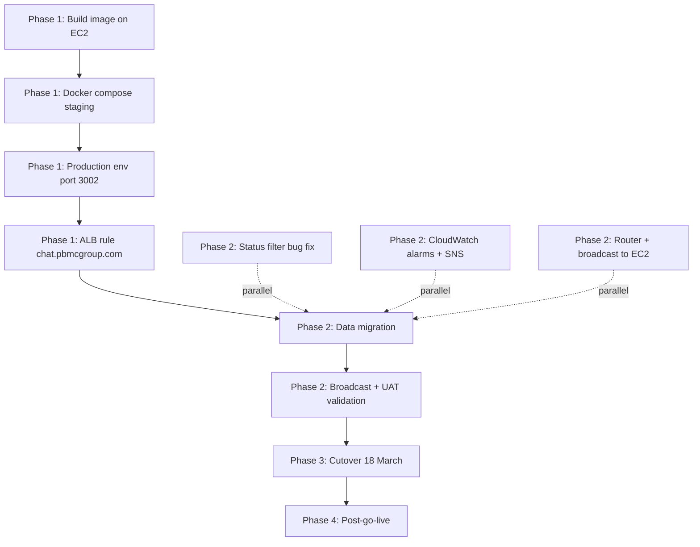

# Chatwoot Go-Live Plan — chat.pbmcgroup.com

**Version:** 1.4
**Date:** 13 March 2026
**Previous Version:** 1.3 (13 March 2026) — image build task, services migration phase added
**Maintained by:** Alex Knecht
**Status:** In Progress
**ADR:** N/A

### Key Changes v1.3 → v1.4
- Integration user: added task to create a dedicated Chatwoot integration user on both staging and production (API tokens are per-user; integration user provides a stable, non-personal token for all service integrations)
- Services architecture decision: router + broadcast to move into `pmg-chatwoot/chatwoot-services/` subdirectory (same repo, same CI, separate process) rather than standalone — upstream Chatwoot merges are unaffected; services gain CI coverage; extraction to `padma-integrations` is a post-go-live option if scope grows
- Phase 3.5 updated: services migration now includes repo move step

---

## Related Docs
- `pmg-docs/development/prds/chatwoot-platform-PRD-v5.md`

---

## 1. Situation

1.1 Staging (`staging-chat.pbmcgroup.com`) is deployed, validated, and running the full PMG customisation set (bug fixes, broadcast access control, sidebar layout, all 12 user accounts). The Chatwoot app (web + Sidekiq) runs natively via systemd. Redis and Postgres are already running as Docker containers (`chatwoot_redis`, `chatwoot_postgres`). Backup/restore tested.

1.2 Production go-live target is **18 March**. The critical path is: Docker → Production env + ALB → Data migration → UAT → Cutover. Status filter bug fix and observability setup run in parallel and do not block Docker work.

1.3 `app.chatwoot.com` remains live until 10 April as fallback and conversation archive. The router currently dual-delivers to both instances.



---

## 2. Phase 1 — Docker + Production Environment

**This is the hard blocker. Nothing in Phase 2 that touches production can start until 2.5 is done.**

2.0 **Confirmed EC2 state (13 March):** Redis (`chatwoot_redis`) and Postgres (`chatwoot_postgres`) are already running as standalone Docker containers. Chatwoot app (web + Sidekiq) still runs as native systemd services. Docker scope is app + Sidekiq only — DB containers are not touched.

### 2.1 Docker Compose

- [ ] 2.1.1 Create a Docker bridge network (`pmg_net`) and attach the existing `chatwoot_redis` and `chatwoot_postgres` containers to it. — @Alex

```bash
docker network create pmg_net
docker network connect pmg_net chatwoot_redis
docker network connect pmg_net chatwoot_postgres
```

- [ ] 2.1.2 Write `docker-compose.yml` in `pmg-chatwoot` repo with two profiles: `staging` (port 3001) and `production` (port 3002). Each profile defines a `chatwoot-web` and `chatwoot-sidekiq` service. Both profiles connect to `pmg_net` (declared as `external: true`). Image tag: `pmg-chatwoot:staging` and `pmg-chatwoot:production` respectively. No Postgres or Redis services in compose — they are pre-existing. — @Dev

- [ ] 2.1.3 First-time image build on the EC2 host. The build runs on the server (ARM64) — do not cross-compile. Takes ~20–30 min on a t4g.medium (pnpm install + Vite asset compilation). — @Alex

```bash
# On EC2, in the pmg-chatwoot repo directory
git pull origin staging
docker build -f docker/Dockerfile -t pmg-chatwoot:latest .
docker tag pmg-chatwoot:latest pmg-chatwoot:staging
docker tag pmg-chatwoot:latest pmg-chatwoot:production
```

Note: `NODE_OPTIONS=--max-old-space-size=4096` is already set in the Dockerfile. The 2GB swap on this host provides buffer if Vite compilation peaks. Watch `free -h` during the build — if it's OOMing, the build will fail with a cryptic JS error, not a memory message.

- [ ] 2.1.4 Confirm `fetch-secrets.sh` populates env vars correctly for both profiles. Staging reads from `chatwoot/staging`, production reads from `chatwoot/production` in Secrets Manager. — @Alex
- [ ] 2.1.5 Test staging Docker stack: stop native `chatwoot-web` and `chatwoot-sidekiq` systemd services, start `docker compose --profile staging up -d`, confirm `staging-chat.pbmcgroup.com` still responds. — @Alex
- [ ] 2.1.6 Replace systemd unit files to start the Docker stacks instead of native processes. — @Dev
- [ ] 2.1.7 Update `DEPLOYMENT.md` with Docker-based deploy steps. — @Dev
- [ ] 2.1.8 Commit `docker-compose.yml` and updated systemd unit files to `pmg-chatwoot` repo. — @Dev

**Acceptance criteria:** `docker compose --profile staging up -d` starts cleanly; staging URL responds; native Chatwoot systemd services are stopped; Redis and Postgres containers unaffected.

### 2.2 Production Environment

- [ ] 2.2.1 Start production Docker stack (port 3002) with `FRONTEND_URL=https://chat.pbmcgroup.com` and a fresh Postgres database. — @Alex
- [ ] 2.2.2 Open UFW port 3002 on the EC2 host (`sudo ufw allow 3002`). Currently only 22, 3000, 3001 are open. — @Alex
- [ ] 2.2.3 Create or verify the production S3 attachment bucket. Rename `chatwoot-staging-attachments` or create `chatwoot-production-attachments` and update the production env. — @Alex
- [ ] 2.2.4 Run `bundle exec rails db:migrate` (via Docker exec) against the production database. — @Alex
- [ ] 2.2.5 Confirm production Rails console is accessible (`docker exec -it chatwoot-web-prod bundle exec rails console`). — @Alex

**Acceptance criteria:** Production container running; Rails console accessible; production database schema migrated; S3 bucket configured and writable.

### 2.3 ALB Rules

- [ ] 2.3.1 Create production target group in AWS (port 3002, health check on `/`). — @Alex
- [ ] 2.3.2 Add ALB listener rule: `chat.pbmcgroup.com` → production target group. DNS record already exists and resolves to the ALB; the rule routes it to WordPress today — this fix is a 5-minute console task. — @Alex
- [ ] 2.3.3 Verify `https://chat.pbmcgroup.com` reaches the production Chatwoot login screen (before any data is loaded). — @Alex

**Acceptance criteria:** `https://chat.pbmcgroup.com` returns the Chatwoot login screen; staging URL still works independently.

---

## 3. Phase 2 — Pre-Go-Live (parallel workstreams)

**All of Section 3 must be complete before CS UAT. 3.1 and 3.2 can start immediately — they do not depend on Phase 1. 3.3 and 3.4 require Phase 1 complete.**

### 3.1 Status Filter Bug Fix (start now, parallel)

3.1.1 The bug: resolved conversations disappear from all views (Mine, Unassigned, All). The status filter defaults to `open`; selecting multiple statuses returns zero results. Root cause is in the components-next conversation list filter logic. CS team cannot use the Resolve function until this is fixed.

- [ ] 3.1.2 Identify the failing filter logic in `app/javascript/dashboard/components-next/` — @Dev
- [ ] 3.1.3 Fix status filter: multi-select must return results; resolved conversations must be retrievable without searching by contact. — @Dev
- [ ] 3.1.4 Verify fix on staging before promoting to production. — @Alex

**Acceptance criteria:** Agent can select "Resolved" status and see resolved conversations; selecting multiple statuses (e.g., Open + Resolved) returns correct results.

### 3.2 Observability (start now, parallel)

3.2.1 Confirmed 13 March: CloudWatch agent active since 17 Feb, shipping logs to `/aws/chatwoot/staging/*` (syslog, fail2ban confirmed in agent log). No further agent setup needed. Once app moves to Docker (Phase 1), update the agent config to tail Docker container logs in addition to systemd journal — production logs should ship to `/aws/chatwoot/production/*`.

- [x] 3.2.2 ~~Verify CloudWatch agent state on EC2~~ — confirmed running ✓
- [x] 3.2.3 ~~Configure CloudWatch agent if not running~~ — not needed ✓
- [ ] 3.2.4 After Docker stack is live: update CloudWatch agent config to tail `chatwoot-web` and `chatwoot-sidekiq` container logs for both profiles and ship to `/aws/chatwoot/staging/*` and `/aws/chatwoot/production/*`. — @Alex
- [ ] 3.2.5 Create the minimum CloudWatch alarms before go-live:

| Alarm | Metric | Threshold |
|-------|--------|-----------|
| Puma down | EC2 status check or HTTP health | Not responding 2 min |
| Sidekiq queue depth | Custom metric | >500 jobs |
| High CPU | `CPUUtilization` | >80% for 5 min |
| Disk full | `disk_used_percent` | >85% |

- [ ] 3.2.6 Create SNS topic `pmg-chatwoot-alerts` routing to Alex and Okto email. — @Alex

**Acceptance criteria:** At least one test alarm fires and delivers to email; production log group visible in CloudWatch console.

### 3.3 Integration User (start now, parallel)

3.3.1 Chatwoot API tokens are per-user. All integrations (router, broadcast CLI, data migration scripts, future Zoho sync) must authenticate against the Chatwoot API using a dedicated integration user — not a personal admin account. This avoids token invalidation when a person changes their password or leaves, and gives a clear audit trail for API activity.

- [ ] 3.3.2 Store the `app.chatwoot.com` API token in Secrets Manager at `/pmg/chatwoot/cloud/api_token` (account 152163). Currently using Alex's personal token temporarily — replace with integration user token once created. — @Alex
- [ ] 3.3.3 Create the same integration user on the staging Chatwoot instance. Store token at `/pmg/chatwoot/staging/integration_api_token`. — @Alex
- [ ] 3.3.4 Create the same integration user on the production Chatwoot instance (after Phase 1 is complete). Store token at `/pmg/chatwoot/production/integration_api_token`. — @Alex
- [ ] 3.3.5 Update the data migration scripts (§3.4) and router config to reference the integration user token from Secrets Manager rather than any personal token. — @Dev

**Acceptance criteria:** Integration user exists on all three instances; tokens stored in Secrets Manager; no personal access tokens used in any automated script.

### 3.4 Data Migration (requires Phase 1 complete)

3.4.1 API access confirmed 13 March (account 152163): token works, full payloads return. 2,144 conversations, 27,875 contacts via API.

3.4.2 Status: Okto has already begun migrating conversations to staging. A full re-migration is not needed. What remains is a **diff import** — pull conversations created after the migration cutoff and import only the delta. This runs as a final step immediately before or on cutover day.

- [x] 3.4.3 ~~Test API token~~ — confirmed working ✓
3.4.4 Timestamp limitation: the Chatwoot API does not support setting `created_at` on imported messages — they post with the current timestamp. Migrated message history will show today's date, not the original dates. Accepted trade-off; app.chatwoot.com stays live until 10 April for date-accurate lookups.

- [ ] 3.4.5 Okto to provide the diff script from his migration plan, using the unique key he established during the initial migration. Diff boundary: conversations not yet imported into production. — @Okto
- [ ] 3.4.6 Alex to confirm with Okto what the unique key is and that the diff script targets production (not staging). — @Alex
- [ ] 3.4.7 Run diff script against production immediately before cutover. — @Okto
- [ ] 3.4.8 Post-import validation: spot-check 10–20 recent conversations in production match source records on app.chatwoot.com. — @Alex
- [ ] 3.4.7 Recreate canned responses on production. CS leads to provide the list. — @Gita / @Pebri / @Santhi

**Acceptance criteria:** All conversations after the cutoff timestamp present in production; no duplicates; spot-check passes.

### 3.4 Broadcast Module Validation on Production (requires Phase 1 complete)

3.4.1 Broadcast is an MVC requirement for go-live (PRD §1.4). It has been tested on staging. Must be confirmed working on the production instance before UAT.

- [ ] 3.4.2 Confirm broadcast sidebar is accessible on production for admin and manager users. — @Alex
- [ ] 3.4.3 Run a test broadcast on production (to a test number, not a live audience) using the Clinics inbox and an approved template. — @Alex / @Okto
- [ ] 3.4.4 Confirm broadcast.sh on the webhost: is it still being called independently, or has all broadcast sending moved to the Chatwoot module? This determines whether there is a separate service to migrate. — @Okto

**Acceptance criteria:** Broadcast send completes successfully on production; test recipient receives the message; history entry recorded.

### 3.5 Services Migration — Router + Broadcast CLI (start now, parallel)

3.5.1 Context: `router.js` is an Express server (port 3000) that receives Meta webhooks and forwards to Chatwoot. It also handles the Kyoo integration endpoint (`/api/v1/sendTemplateMessages`). It imports `../broadcast/lib/meta` and `../broadcast/config/` — router and broadcast must be co-located. `broadcast.sh` runs independently on the webhost for standalone sends AND is called by the staging Chatwoot application. Both paths must work after migration — the production Chatwoot instance must be pointed at the EC2 broadcast service, not the webhost. Port 3000 is already open on the EC2.

3.5.2 Architecture decision: `chatwoot-services/` moves into `pmg-chatwoot/chatwoot-services/` — same repo, same CI pipeline, deployed as a separate process. Upstream Chatwoot merges never touch `chatwoot-services/` so merge complexity is unaffected. Services gain CI coverage and version history alongside the app without muddying the Rails codebase. Post-go-live option: extract to `padma-integrations` repo if scope grows beyond this host.

3.5.3 Migration approach: move code into repo, deploy to EC2, run router as a systemd service. The router continues dual-delivering to both `app.chatwoot.com` and `staging-chat.pbmcgroup.com` until cutover day. Webhost versions left running as cold backup.

- [ ] 3.5.4 Move `chatwoot-services/` into the `pmg-chatwoot` repo as `pmg-chatwoot/chatwoot-services/`. Update any paths that break (relative imports between router and broadcast should survive). Commit to `develop`. — @Dev
- [ ] 3.5.5 Deploy `chatwoot-services/` to EC2 at `/var/www/chatwoot-services/` (pull from the `pmg-chatwoot` repo). Run `npm install` in both `router/` and `broadcast/` directories. The EC2 IAM role already has SSM access for credential fetch. — @Alex

```bash
# On EC2 — pull from pmg-chatwoot repo
cd /home/chatwoot/pmg-chatwoot  # or wherever the repo is cloned
git pull origin develop
sudo mkdir -p /var/www/chatwoot-services
sudo chown chatwoot:chatwoot /var/www/chatwoot-services
cp -r chatwoot-services/* /var/www/chatwoot-services/
cd /var/www/chatwoot-services/router && npm install
cd /var/www/chatwoot-services/broadcast && npm install
```

- [ ] 3.5.6 Create systemd unit file `pmg-router.service` to run `node /var/www/chatwoot-services/router/router.js` as the `chatwoot` user on port 3000. — @Dev

```ini
[Unit]
Description=PMG WhatsApp Webhook Router
After=network.target

[Service]
User=chatwoot
WorkingDirectory=/var/www/chatwoot-services/router
ExecStart=/usr/bin/node router.js
Restart=always
RestartSec=5
Environment=PORT=3000
Environment=AWS_REGION=ap-southeast-1

[Install]
WantedBy=multi-user.target
```

- [ ] 3.5.7 Enable and start `pmg-router.service`. Confirm it is running and `/health` responds. — @Alex

```bash
sudo systemctl enable pmg-router
sudo systemctl start pmg-router
curl http://localhost:3000/health
```

- [ ] 3.5.8 Test end-to-end: update ALB listener rule for `chatwoot.pbmcgroup.com` to target the EC2 at port 3000 (new target group). Send a test WhatsApp message and confirm the EC2 router receives and dual-delivers it (staging + app.chatwoot.com both receive the message). — @Alex
- [ ] 3.5.9 Test broadcast CLI: run `./broadcast.sh --dry-run` from `/var/www/chatwoot-services/broadcast/` on the EC2 to confirm SSM credentials load and Google Sheets access works. — @Alex / @Okto
- [ ] 3.5.10 Update the production Chatwoot configuration to call broadcast.sh on the EC2 host (not the webhost). Confirm staging and production both resolve the broadcast service at the EC2 path. — @Dev / @Okto

**Acceptance criteria:** EC2 router running, `/health` returns 200; test message dual-delivered via EC2 router; `chatwoot.pbmcgroup.com` ALB rule points to EC2; broadcast.sh reachable from production Chatwoot; webhost router still running as backup.

---

## 4. Phase 3 — Cutover (18 March)

**Run in sequence. Do not skip steps.**

- [ ] 4.1 Confirm UAT sign-off: CS team (minimum Gita + Pebri + Santhi) has validated the production instance. At least one resolved-conversation retrieval tested. Broadcast tested. — @Alex
- [ ] 4.2 Take pre-cutover pg_dump snapshot of production database before touching any routing. — @Alex

```bash
docker exec chatwoot_postgres_prod pg_dump -U chatwoot chatwoot_production | gzip > /tmp/pre_cutover_$(date +%Y%m%d_%H%M).sql.gz
aws s3 cp /tmp/pre_cutover_*.sql.gz s3://pmg-chatwoot-backups/cutover/
```

- [ ] 4.3 Update `WEBHOOK_ROUTES` in the EC2 router (`/var/www/chatwoot-services/router/router.js`): remove `staging-chat.pbmcgroup.com` from all `urls` arrays, replace `app.chatwoot.com` with `https://chat.pbmcgroup.com`. Restart `pmg-router.service`. — @Dev / @Alex
- [ ] 4.4 Stop the webhost router (do not delete yet — leave as cold backup). — @Alex
- [ ] 4.5 Verify inbound message arrives in production Chatwoot by sending a test WhatsApp message to all three inboxes. — @Alex
- [ ] 4.6 Verify broadcast send still works post-cutover (Meta webhook URL has changed to production). — @Alex
- [ ] 4.7 Kezia notifies all 12 agents of the new URL (`chat.pbmcgroup.com`), confirms login credentials work, and confirms they do not need to re-authenticate WhatsApp sessions. — @Kezia

**Acceptance criteria:** Inbound messages appear in production; broadcast send succeeds; all agents confirmed on new URL; no traffic flowing to staging from production router.

---

## 5. Phase 4 — Post-Go-Live (within 2 weeks of cutover)

**Priority order. None of these block go-live.**

### 5.1 Router Resilience — ALB + Lambda DLQ (within 1 week)

5.1.1 Meta only retries webhooks for ~15 minutes. The webhost router serves as the temporary resilience layer until this is built. Design: ALB health check failover → Lambda → S3 (`s3://pmg-webhook-dlq/{date}/{timestamp}.json`). Manual replay script re-delivers in chronological order with deduplication by Meta message ID. No SQS, no auto-replay.

- [ ] 5.1.2 Write Lambda function to receive raw webhook payload and write to S3. — @Dev
- [ ] 5.1.3 Configure ALB failover rule: when production target group is unhealthy, route to Lambda. — @Alex
- [ ] 5.1.4 Write replay script: reads S3 bucket in order, deduplicates by Meta message ID, re-posts to production webhook endpoint. — @Dev
- [ ] - [ ] 5.1.5 Decommission webhost router and broadcast service once DLQ is live and tested and EC2 router has been stable for 1 week. — @Alex

### 5.2 GitHub Actions CI Pipeline (within 1 week)

- [ ] 5.2.1 Create PMG-specific `.github/workflows/ci.yml`: RuboCop + ESLint on changed files, RSpec suite, skip known-flaky upstream tests (TikTok JWT spec), gate merges to `develop`. — @Dev
- [ ] 5.2.2 Fix TikTok JWT flaky spec with `freeze_time`. — @Dev
- [ ] 5.2.3 Submit upstream PRs: `fix/resolve-conversation-reopen` and `fix/data-import-synchronize`. Both are clean `v4.11.1` branches with no PMG-specific code. — @Dev

### 5.3 Broadcast Module Enhancements

5.3.1 The broadcast module is functional at MVP. Post-go-live targets:
- Delivery and read receipt tracking per recipient
- Response linking (recipient replies → linked conversation)
- Scheduled broadcasts (admin only, cron-based)
- Template CRUD in-app (replaces Meta Business Manager workflow)

### 5.4 Backup and DR Maturation

- [ ] 5.4.1 Add pre-deploy pg_dump to the deployment script so every merge to `main` produces a point-in-time snapshot before containers restart. — @Dev
- [ ] 5.4.2 Document the full restore runbook (stop services → restore Postgres → flush Redis → restart → verify). Test it. — @Dev / @Alex

---

## 6. Open Questions

| # | Question | Owner | Status |
|---|----------|-------|--------|
| 1 | ~~Is the CloudWatch agent actually running and shipping logs?~~ | @Alex | Closed — confirmed running since 17 Feb, logs shipping to `/aws/chatwoot/staging/*` |
| 2 | ~~API token scope on app.chatwoot.com~~ | @Alex | Closed — token confirmed working 13 March. 2,144 conversations (~86 pages), 27,875 contacts via API. Full message payloads return. Conversation migration is viable. |
| 3 | ~~broadcast.sh webhost usage~~ | @Okto | Closed — broadcast.sh runs independently on webhost AND is called by staging Chatwoot. Both paths must work after migration to EC2 (§3.5). Production Chatwoot must be configured to call broadcast.sh on the EC2 host, not the webhost. |
| 4 | Canned response list per business unit — CS leads to provide before UAT. | @Gita / @Pebri / @Santhi | Open |

---

## Edit Log

| Version | Date | Author | Changes |
|---------|------|--------|---------|
| 1.0 | 12 March 2026 | Alex + Claude | Initial scope document consolidating all outstanding work from selfhost-prep closeout, PRD v5, and cutover checklist. Work stream format. |
| 1.1 | 13 March 2026 | Alex + Claude | Restructured as sequential execution plan. Docker confirmed as Phase 1 blocker (native, not yet containerised). Status filter bug moved to pre-go-live. CloudWatch state flagged for verification. Added missing tasks: UFW port 3002, S3 prod bucket, fetch-secrets.sh validation, broadcast production validation, pre-cutover pg_dump. Owner tags throughout. |
| 1.2 | 13 March 2026 | Alex + Claude | EC2 state verified via SSH. Redis + Postgres already in Docker (standalone). App still native. Docker scope narrowed to app + Sidekiq only; DB containers joined via shared network. CloudWatch agent confirmed running since 17 Feb — verification task closed, alarms + SNS remain. UFW port 3002 confirmed not open. |
| 1.3 | 13 March 2026 | Alex + Claude | Added first-time image build task (2.1.3) with OOM warning. Added Phase 2 workstream 3.5 for router + broadcast migration to EC2 (router.js is Express + depends on broadcast/lib, runs on port 3000 already open). Phase 3 cutover updated: router WEBHOOK_ROUTES update instead of webhost edit; webhost stopped as cold backup. |
| 1.4 | 13 March 2026 | Alex + Claude | Added §3.3 integration user (per-user API tokens, dedicated integrations account, tokens in Secrets Manager). Architecture decision: chatwoot-services/ moves into pmg-chatwoot repo subdirectory for CI coverage; import paths unaffected; padma-integrations extraction as post-go-live option. Data migration section renumbered to 3.4. |
| 1.5 | 13 March 2026 | Alex + Claude | Renamed Docker network from `chatwoot_net` → `pmg_net` in §2.1.1 and §2.1.2. |
