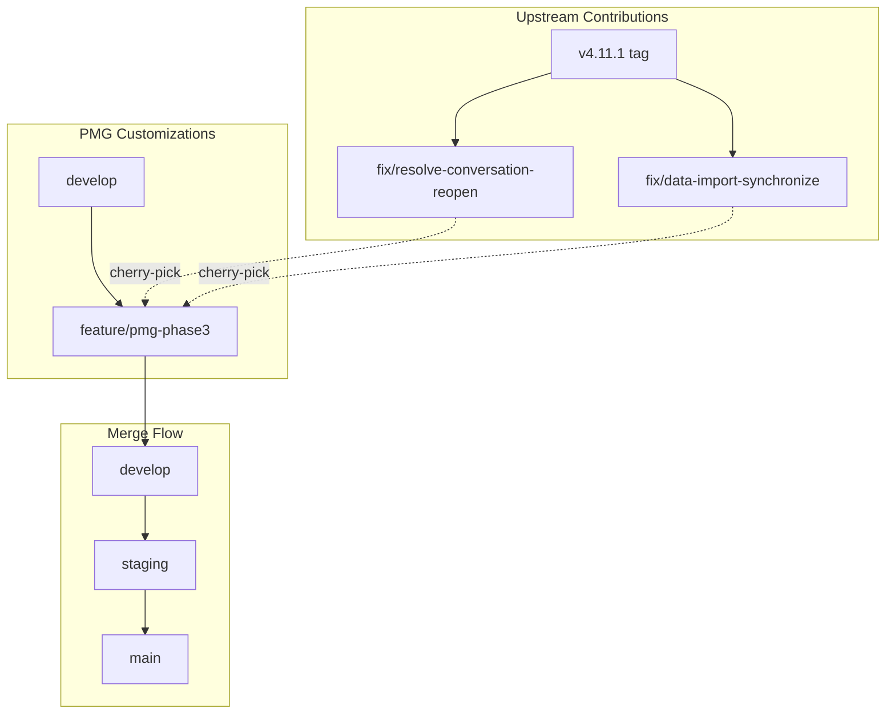

# Plan: Chatwoot Self-Hosted — Ready to Cutover

**Version:** 1.0
**Date:** 11 March 2026
**Author:** Alex Knecht
**ADR:** `pmg-docs/adrs/ADR-001-chatwoot-migration.md`
**Status:** Ready to execute
**Branch:** `feature/pmg-phase3`

## Related Docs

- `pmg-docs/development/prds/chatwoot-platform-PRD-v5.md`
- `pmg-docs/development/chatwoot-status-march-2026.md`
- `pmg-docs/adrs/ADR-001-chatwoot-migration.md`
- `pmg-chatwoot/CLAUDE.md`
- `pmg-chatwoot/DEPLOYMENT.md`

---

## 1. Scope

1.1 This plan covers everything needed to reach "ready to cutover" for the self-hosted Chatwoot instance at `chat.pbmcgroup.com`. Two upstream bug fixes (contributed back to the community), PMG UI customizations, broadcast access control, infrastructure configuration, and cutover preparation.

1.2 **Out of scope** (carved out deliberately, not forgotten):

| Item | Reason |
|------|--------|
| Data migration from app.chatwoot.com | Staff-managed, separate workflow |
| Broadcast module buildout | Separate plan after this one — avoids oversized context |
| Zoho CRM sync, Kyoo relay, Jotform flows | Phase 7+ per PRD |
| SLA monitoring, response dashboards | Phase 7+ per PRD |
| AI/Captain evaluation | Phase 7+ per PRD |
| CI pipeline | Separate plan per PRD Phase 5 |
| Upstream tracking automation | Separate plan per PRD Phase 6 |

1.3 **Branch strategy.** Bug fixes are branched from the upstream tag so they can be submitted as clean PRs to `chatwoot/chatwoot`. PMG customizations live on a feature branch from `develop`. If upstream accepts the fixes, they vanish from PMG's diff on the next merge — reducing long-term maintenance burden.



1.4 **Upstream-safety principle.** Every code change in this plan is evaluated against merge-conflict risk. The hierarchy: configuration toggle > i18n override > minimal conditional > component edit. Core Chatwoot files are modified only when no toggle mechanism exists, and those changes are kept to the smallest possible diff.

---

## Phase 1: Codebase Reconnaissance

### Task 1.1: Map Sidebar Components and Feature Flags
- **Type**: AI
- **Input**: `pmg-chatwoot/app/javascript/dashboard/components-next/sidebar/Sidebar.vue`, `pmg-chatwoot/app/javascript/dashboard/featureFlags.js`, `pmg-chatwoot/app/javascript/dashboard/helper/featureHelper.js`, `pmg-chatwoot/app/models/installation_config.rb`, `pmg-chatwoot/enterprise/app/fields/account_features_field.rb`
- **Action**: Read and trace the sidebar rendering pipeline. For each item to hide or modify (All Conversations, Mentions, Campaigns, Help Center, Captain, Unattended), document: (a) which component renders it, (b) whether it is controlled by a feature flag, account setting, or hardcoded, (c) the i18n key used for its label. Record findings as a structured reference block in PROGRESS.md for use by subsequent tasks.
- **Output**: File path map and feature flag inventory in PROGRESS.md
- **Acceptance**: Every sidebar item from PRD §5.1 has a documented file path and toggle mechanism (or "hardcoded — needs change")
- **Notes**: Prioritize discovering existing toggle mechanisms. The goal is zero or minimal changes to core Chatwoot components. Check both OSS and enterprise paths.

### Task 1.2: Map Conversation State Machine
- **Type**: AI
- **Input**: `pmg-chatwoot/app/models/conversation.rb`, `pmg-chatwoot/enterprise/app/models/enterprise/conversation.rb`, related Vue components for conversation list rendering
- **Action**: Trace the full conversation lifecycle: Open > Pending > Resolved > Reopened. Identify: (a) the state transition that fires when a customer sends a new message to a resolved conversation, (b) the frontend subscription/reactivity that should update the conversation list when state changes, (c) any WebSocket or ActionCable channels involved in pushing state changes to the UI. Document the flow with file paths and line numbers. Identify the suspected breakpoint where the "resolved conversations disappear" bug occurs.
- **Output**: State machine flow documented in PROGRESS.md with file paths, line numbers, and suspected root cause
- **Acceptance**: The reopen trigger path is fully traced from inbound message through state change to frontend update, with the suspected breakpoint identified
- **Notes**: PRD §5.2.1 confirms data is intact in the database — this is a display/state issue, not data loss. The CS team has stopped using Resolve because of this bug.

### Task 1.3: Map Data Import Synchronize Logic
- **Type**: AI
- **Input**: `pmg-chatwoot/app/models/data_import.rb`, `pmg-chatwoot/app/jobs/data_import_job.rb`, `pmg-chatwoot/app/services/data_import/contact_manager.rb`
- **Action**: Trace the `synchronize` code path in the contact import flow. Identify: (a) how records are read into memory as a batch, (b) the skip logic for records that already exist, (c) where the mismatch occurs — when skipped records cause the index/offset of remaining records to drift, resulting in names mapping to wrong phone numbers. Document the root cause with file paths, line numbers, and a proposed fix approach.
- **Output**: Bug analysis documented in PROGRESS.md with root cause, affected lines, and proposed fix
- **Acceptance**: Root cause is identified with specific line(s) where the index drift occurs. The mechanism that causes name-to-phone-number misalignment is clearly explained.
- **Notes**: The bug manifests when importing a batch where some contacts already exist. The skip logic doesn't properly adjust the index for subsequent records, so field values shift.

### Task 1.4: Map Broadcast Access Control
- **Type**: AI
- **Input**: `pmg-chatwoot/app/policies/broadcast_policy.rb`, broadcast controller and Vue component files
- **Action**: Identify: (a) the current Pundit policy rules (currently admin-only per status doc), (b) the Chatwoot user model fields available for adding a broadcast access flag, (c) the frontend components that gate "Create New Broadcast" and "Send Now" actions. Document file paths and the minimal implementation approach — prefer an allowlist or config-driven check over a database migration.
- **Output**: Access control file map and implementation approach in PROGRESS.md
- **Acceptance**: Clear implementation plan: which files to modify, what to add, and how it integrates without touching Chatwoot's core role system
- **Notes**: PRD §4.4 specifies Pundit policy with either user ID allowlist or custom flag. Only 3 users (Gita, Pebri, Santhi) need elevated access beyond the 3 admins.

---

## Phase 2: Bug Fix — Resolve Conversation Reopen

### Task 2.1: Create Fix Branch and Implement
- **Type**: AI
- **Input**: Findings from Task 1.2, upstream tag `v4.11.1`
- **Action**: (a) Create branch `fix/resolve-conversation-reopen` from tag `v4.11.1`. (b) Implement the fix for conversations not reappearing in the UI when a customer sends a new message to a resolved conversation. (c) Follow Chatwoot code style (RuboCop, ESLint). (d) Keep the change minimal and self-contained — this is intended for upstream contribution.
- **Output**: Fix committed on `fix/resolve-conversation-reopen`
- **Acceptance**: The fix addresses the root cause identified in Task 1.2, is isolated to the minimum necessary files, and contains no PMG-specific code
- **Notes**: If investigation in Task 1.2 reveals this is already fixed in a newer upstream version, document which version/commit resolved it, skip this task, and note it as SKIPPED in progress.

### Task 2.2: Write Regression Spec
- **Type**: AI
- **Input**: Fix from Task 2.1, existing Chatwoot RSpec patterns
- **Action**: Write a regression test that: (a) creates a conversation and resolves it, (b) simulates an inbound customer message, (c) asserts the conversation transitions back to open status and appears in the expected conversation list scope/query. Follow existing Chatwoot spec conventions (file location, naming, factory usage).
- **Output**: Spec file committed on `fix/resolve-conversation-reopen`
- **Acceptance**: `bundle exec rspec` passes for the new spec. The test would fail without the fix applied.
- **Notes**: Upstream PRs require test coverage. Write the spec to stand on its own — an upstream reviewer should understand the bug and the fix from reading the test.

---

## Phase 3: Bug Fix — Data Import Synchronize

### Task 3.1: Create Fix Branch and Implement
- **Type**: AI
- **Input**: Findings from Task 1.3, upstream tag `v4.11.1`
- **Action**: (a) Create branch `fix/data-import-synchronize` from tag `v4.11.1`. (b) Fix the index/offset mismatch in the synchronize path so that skipped records do not cause subsequent records to misalign. (c) Keep the change minimal and upstream-ready.
- **Output**: Fix committed on `fix/data-import-synchronize`
- **Acceptance**: The fix corrects the record alignment issue. Field values (name, phone_number, etc.) remain correctly associated across the entire batch regardless of how many records are skipped.

### Task 3.2: Write Regression Spec
- **Type**: AI
- **Input**: Fix from Task 3.1, existing import test patterns
- **Action**: Write a regression test that: (a) imports a batch of contacts (10+ records), (b) re-imports the same batch in `synchronize` mode with some records already existing, (c) asserts every non-skipped record has the correct name-to-phone-number mapping after import. Use enough records to exercise the skip/align logic across the batch.
- **Output**: Spec file committed on `fix/data-import-synchronize`
- **Acceptance**: `bundle exec rspec` passes. The test demonstrates the field misalignment without the fix.
- **Notes**: This fix is a community contribution — PMG's own data migration uses a separate workflow and is not blocked by this.

---

### CHECKPOINT: Review Bug Fix Branches
**Review**: Two branches ready for upstream contribution:
- [ ] `fix/resolve-conversation-reopen` — test the fix on local dev, review code and spec
- [ ] `fix/data-import-synchronize` — review fix logic and spec, verify alignment with a sample CSV

Both branches are based on `v4.11.1` with no PMG-specific code. Suitable for PR to `chatwoot/chatwoot`.

**Action**: Submit PRs to `chatwoot/chatwoot` from these branches.
**Resume**: "continue the cutover-ready plan"

---

## Phase 4: PMG Customizations

### Task 4.1: Set Up Feature Branch and Cherry-Pick Fixes
- **Type**: AI
- **Input**: `develop` branch, fix commits from Phases 2 and 3
- **Action**: (a) Checkout `develop` and pull latest. (b) Create `feature/pmg-phase3` from `develop`. (c) Cherry-pick all commits from `fix/resolve-conversation-reopen` into the feature branch. (d) Cherry-pick all commits from `fix/data-import-synchronize` into the feature branch. (e) Resolve any conflicts.
- **Output**: `feature/pmg-phase3` branch with both bug fixes integrated
- **Acceptance**: Branch exists, all cherry-picked commits are present, no unresolved conflicts. `git log --oneline` shows clean history.
- **Notes**: This is now the task-runner's primary working branch. All subsequent code tasks in this phase commit here.

### Task 4.2: Implement Broadcast Access Control
- **Type**: AI
- **Input**: Findings from Task 1.4, PRD §3.3 and §4.4
- **Action**: Implement manager-level broadcast access per the approach documented in Task 1.4. (a) Update the Pundit policy so administrators and designated managers can create/send broadcasts, while regular agents get read-only access to the dashboard and detail screens. (b) Update the frontend to conditionally show/hide "Create New Broadcast" and "Send Now" based on the policy response. (c) Prefer a config-driven allowlist over a database migration for the 3 manager users.
- **Output**: Updated policy file, config (if needed), and Vue component(s)
- **Acceptance**: Admins see full broadcast UI. Designated managers see full broadcast UI. Regular agents see broadcast dashboard and detail screens but no create/send controls.
- **Notes**: Only 3 manager users need this access (Gita, Pebri, Santhi). An allowlist is simpler and avoids a migration. The allowlist should be easy to update when staff changes.

### Task 4.3: UI Cleanup — Disable Unused Sidebar Items
- **Type**: AI
- **Input**: Findings from Task 1.1, PRD §5.1
- **Action**: For each item to hide (All Conversations, Mentions, Campaigns, Help Center, Captain): (a) if a feature flag or account setting already exists, disable it via configuration, (b) if no toggle exists, add a minimal conditional using Chatwoot's existing feature flag system (`InstallationConfig` or account features). Document which approach was used for each item. Do NOT delete code or components — only toggle visibility.
- **Output**: Configuration changes and/or minimal conditional additions
- **Acceptance**: All five items are hidden from the sidebar. No core Chatwoot component files are deleted or substantially rewritten. Each hidden item uses the least-invasive mechanism available.
- **Notes**: Every line changed in a core file is a potential merge conflict on the next upstream update. Prefer configuration over code changes. If an item requires a component edit, isolate the change to a single conditional check.

### Task 4.4: UI Cleanup — Rename Section and Reorder Sidebar
- **Type**: AI
- **Input**: Findings from Task 1.1, PRD §5.1, i18n file locations
- **Action**: (a) Change the "Conversations" sidebar section label to "Channels" via the `en.json` i18n key override. (b) Move "Unattended" to the bottom of the sidebar navigation. (c) Verify the resulting sidebar matches the target layout from PRD §5.1.
- **Output**: Updated i18n file and sidebar ordering
- **Acceptance**: Sidebar displays "Channels" instead of "Conversations". "Unattended" appears at the bottom. Layout matches PRD §5.1 target.
- **Notes**: The i18n rename is merge-safe — upstream is unlikely to change the English key. The reorder may touch a component file; keep the diff to a single block if possible.

---

### CHECKPOINT: Review PMG Feature Branch
**Review**: `feature/pmg-phase3` contains:
- [ ] Cherry-picked bug fixes from Phases 2 and 3
- [ ] Broadcast access control for managers (Task 4.2)
- [ ] Sidebar items hidden (Task 4.3)
- [ ] "Conversations" renamed to "Channels", "Unattended" moved to bottom (Task 4.4)

Verify on local dev (`pnpm dev` or `overmind start -f Procfile.dev`):
- [ ] Sidebar shows only: Search, My Inbox, Channels (3 WhatsApp inboxes), Contacts, Reports, Broadcasts, Settings, Unattended (bottom)
- [ ] Admin user sees full broadcast create/send UI
- [ ] Manager-flagged user sees full broadcast create/send UI
- [ ] Regular agent sees broadcast dashboard (read-only, no create/send)
- [ ] Resolving a conversation and sending a new inbound message reopens it in the list

**Resume**: "continue the cutover-ready plan"

---

## Phase 5: Infrastructure Configuration

### Task 5.1: Create User Accounts on Staging
- **Type**: HUMAN
- **Input**: PRD §3.3 user table
- **Action**: Log into `staging-chat.pbmcgroup.com` as admin. Create each user account with the correct role and inbox assignments:

| User | Chatwoot Role | Primary Inbox | Additional Inboxes |
|------|--------------|---------------|-------------------|
| Okto | Administrator | Padma Care | Crew Care, Clinics |
| Alex | Administrator | Padma Care | Crew Care, Clinics |
| Kezia | Administrator | Padma Care | Crew Care, Clinics |
| Gita | Agent | Padma Care | Crew Care |
| Pebri | Agent | Crew Care | Padma Care |
| Santhi | Agent | Clinics | — |
| Bello | Agent | Clinics | — |
| Gek_Yu | Agent | Clinics | — |
| Dewi | Agent | Clinics | — |
| Febri | Agent | Clinics | — |
| Widya | Agent | Padma Care | — |
| Puspa | Agent | Crew Care | — |

After creating accounts, flag Gita, Pebri, and Santhi for broadcast access per the mechanism implemented in Task 4.2.
- **Output**: 12 user accounts with correct inbox assignments and broadcast flags
- **Acceptance**: Each user can log in and sees only their assigned inboxes. Gita, Pebri, and Santhi can access broadcast create/send. Other agents cannot.
- **Notes**: Gita, Pebri, Santhi are operationally "managers" but use the Chatwoot agent role. Their broadcast elevation comes from Task 4.2, not their Chatwoot role.

### Task 5.2: Configure Custom Attributes
- **Type**: HUMAN
- **Input**: PRD §3.2
- **Action**: In Chatwoot Settings > Custom Attributes, create:

| Attribute | Type | Applies To |
|-----------|------|-----------|
| Membership Type | List (Padma Care, Crew Care, Clinics) | Contact |
| Vessel Name | Text | Contact |
| Zoho Contact Link | Text | Contact |
| Last Visit Date | Date | Contact |

Verify each attribute appears in both: (a) the contact card right panel, (b) the conversation sidebar right panel.
- **Output**: 4 custom attributes created and visible
- **Acceptance**: Attributes are visible and editable on contact cards and conversation sidebars

### Task 5.3: Configure Labels
- **Type**: HUMAN
- **Input**: PRD §3.2.3
- **Action**: In Chatwoot Settings > Labels, create `Pending Response` with yellow color. Additional labels can be added post-launch based on CS team input.
- **Output**: Label created
- **Acceptance**: Label is available for manual application and automation rules

### Task 5.4: Validate S3 File Uploads
- **Type**: HUMAN
- **Input**: PRD §5.7, S3 bucket `chatwoot-staging-attachments`
- **Action**:
  (a) Send an image via WhatsApp to one of the staging inboxes.
  (b) Verify the image appears in the conversation in the Chatwoot UI.
  (c) Verify stored in S3: `aws s3 ls s3://chatwoot-staging-attachments/ --recursive | tail -5`
  (d) Click the image in the UI to verify it loads.
- **Output**: Confirmed working or issue documented
- **Acceptance**: Image appears in Chatwoot, is stored in S3, and is viewable
- **Notes**: If not working, check env vars: `ACTIVE_STORAGE_SERVICE`, `S3_BUCKET_NAME`, `AWS_REGION`, and the IAM role permissions on the EC2 instance.

### Task 5.5: Configure SES Email
- **Type**: HUMAN
- **Input**: PRD §5.6
- **Action**:

  Step 1 — SES domain verification:
  (a) In AWS SES console (ap-southeast-1), verify domain `pbmcgroup.com`.
  (b) Add DKIM and SPF DNS records to Route 53.
  (c) Create SMTP credentials in SES console.

  Step 2 — Chatwoot configuration. Add to AWS Secrets Manager (`chatwoot/production`):
  ```
  MAILER_SENDER_EMAIL=notifications@pbmcgroup.com
  SMTP_ADDRESS=email-smtp.ap-southeast-1.amazonaws.com
  SMTP_PORT=587
  SMTP_USERNAME=<SES SMTP credential>
  SMTP_PASSWORD=<SES SMTP credential>
  SMTP_AUTHENTICATION=login
  SMTP_ENABLE_STARTTLS_AUTO=true
  ```

  Step 3 — Restart and test:
  ```bash
  source ~/fetch-secrets.sh
  docker compose restart chatwoot-web chatwoot-sidekiq
  ```
  Trigger a test notification (assign a conversation to yourself) and verify email delivery.
- **Output**: SES configured, test email received
- **Acceptance**: Outbound notification emails arrive at recipient inbox
- **Notes**: If SES is in sandbox mode, request production access or verify individual recipient emails for testing.

### Task 5.6: Set Up Database Backup Cron
- **Type**: HUMAN
- **Input**: PRD §6.1
- **Action**:

  Step 1 — Create S3 bucket:
  ```bash
  aws s3 mb s3://pmg-chatwoot-backups --region ap-southeast-1
  ```

  Step 2 — Add lifecycle policy:
  ```bash
  aws s3api put-bucket-lifecycle-configuration \
    --bucket pmg-chatwoot-backups \
    --lifecycle-configuration '{
      "Rules": [
        {
          "ID": "daily-cleanup",
          "Filter": {"Prefix": "daily/"},
          "Status": "Enabled",
          "Expiration": {"Days": 30}
        },
        {
          "ID": "weekly-cleanup",
          "Filter": {"Prefix": "weekly/"},
          "Status": "Enabled",
          "Expiration": {"Days": 90}
        }
      ]
    }'
  ```

  Step 3 — SSH into server and add cron jobs:
  ```bash
  ssh -i 16_chatwoot_services.pem ubuntu@10.10.3.112
  crontab -e
  ```
  Add:
  ```
  # Daily backup at 2am WIB (19:00 UTC)
  0 19 * * * docker exec chatwoot_postgres pg_dump -U chatwoot chatwoot_production | gzip > /tmp/chatwoot_backup_$(date +\%Y\%m\%d).sql.gz && aws s3 cp /tmp/chatwoot_backup_$(date +\%Y\%m\%d).sql.gz s3://pmg-chatwoot-backups/daily/ && rm /tmp/chatwoot_backup_$(date +\%Y\%m\%d).sql.gz

  # Weekly backup on Sundays
  0 20 * * 0 docker exec chatwoot_postgres pg_dump -U chatwoot chatwoot_production | gzip > /tmp/chatwoot_weekly_$(date +\%Y\%m\%d).sql.gz && aws s3 cp /tmp/chatwoot_weekly_$(date +\%Y\%m\%d).sql.gz s3://pmg-chatwoot-backups/weekly/ && rm /tmp/chatwoot_weekly_$(date +\%Y\%m\%d).sql.gz
  ```

  Step 4 — Test the cycle:
  (a) Run the daily backup command manually.
  (b) Verify the file appears in S3: `aws s3 ls s3://pmg-chatwoot-backups/daily/`
  (c) Test restore: `gunzip < backup.sql.gz | docker exec -i chatwoot_postgres psql -U chatwoot chatwoot_test`
  (d) Verify data integrity in the restored database.
- **Output**: Automated daily/weekly backups to S3, restore tested
- **Acceptance**: Backup file in S3. Restore produces a valid database.
- **Notes**: PRD §6.1 — hard pre-go-live requirement. Do not proceed to cutover without a tested backup/restore cycle.

---

### Task 5.7: Create Dedicated Service User
- **Type**: HUMAN
- **Input**: Active systemd services `chatwoot-web.service` and `chatwoot-sidekiq.service` (currently running as root)
- **Action**:

  Step 1 — Create the user:
  ```bash
  sudo useradd --system --shell /bin/bash --home /home/chatwoot --create-home chatwoot
  ```

  Step 2 — Transfer ownership of the app directory:
  ```bash
  sudo chown -R chatwoot:chatwoot /home/ubuntu/chatwoot
  # Adjust path if app lives elsewhere — confirm with: systemctl cat chatwoot-web | grep WorkingDirectory
  ```

  Step 3 — Update both systemd unit files to run as the new user:
  ```bash
  sudo systemctl edit chatwoot-web
  sudo systemctl edit chatwoot-sidekiq
  ```
  Add to each override file:
  ```ini
  [Service]
  User=chatwoot
  Group=chatwoot
  ```

  Step 4 — Transfer any secrets/env sourcing the app depends on:
  ```bash
  # If using ~/fetch-secrets.sh, copy to chatwoot home and update ExecStartPre in unit file
  sudo cp /root/fetch-secrets.sh /home/chatwoot/fetch-secrets.sh
  sudo chown chatwoot:chatwoot /home/chatwoot/fetch-secrets.sh
  ```

  Step 5 — Reload and restart:
  ```bash
  sudo systemctl daemon-reload
  sudo systemctl restart chatwoot-web chatwoot-sidekiq
  sudo systemctl status chatwoot-web chatwoot-sidekiq
  ```

  Step 6 — Verify app is running as `chatwoot`, not root:
  ```bash
  ps aux | grep -E "puma|sidekiq" | grep -v grep
  ```
- **Output**: Both services running as `chatwoot` user, not root
- **Acceptance**: `ps aux` shows `chatwoot` as process owner. App responds normally at staging URL.
- **Notes**: Security prerequisite. Running production web processes as root is a significant risk — any RCE vulnerability would give full server access. This should be done before cutover.

---

### CHECKPOINT: Infrastructure Complete
**Review**:
- [ ] 12 user accounts created with correct roles and inbox assignments
- [ ] Gita, Pebri, Santhi flagged for broadcast access
- [ ] 4 custom attributes visible in contact cards and conversation sidebars
- [ ] Labels created
- [ ] S3 file uploads working end-to-end
- [ ] SES email notifications delivered
- [ ] Database backup cron running, restore procedure tested
- [ ] Chatwoot services running as dedicated `chatwoot` user (not root)

**Resume**: "continue the cutover-ready plan"

---

## Phase 6: Cutover Preparation

### Task 6.1: Merge Feature Branch to Develop
- **Type**: AI+HUMAN_REVIEW
- **Input**: `feature/pmg-phase3` branch
- **Action**: (a) Rebase `feature/pmg-phase3` onto latest `develop`. (b) Run linters: `bundle exec rubocop -a` and `pnpm eslint`. (c) Run test suite: `bundle exec rspec` and `pnpm test`. (d) Push the branch and create a PR to `develop`. Report the PR URL.
- **Output**: PR to `develop` ready for review
- **Acceptance**: Linters pass, tests pass, PR created with a summary of all changes
- **Notes**: Do not merge — human reviews and merges.

### Task 6.2: Deploy to Staging
- **Type**: HUMAN
- **Input**: Merged `develop` branch
- **Action**:
  (a) Merge `develop` into `staging`:
  ```bash
  git checkout staging && git merge develop && git push origin staging
  ```
  (b) Deploy to staging server:
  ```bash
  ssh -i 16_chatwoot_services.pem ubuntu@10.10.3.112
  cd /home/ubuntu/chatwoot
  git pull origin staging
  docker compose build chatwoot-web chatwoot-sidekiq
  docker compose restart chatwoot-web chatwoot-sidekiq
  ```
  (c) Verify on `staging-chat.pbmcgroup.com` — sidebar layout, broadcast access, conversation reopen behavior.
- **Output**: Staging environment running latest code
- **Acceptance**: All Phase 4 customizations visible and functional on staging

### Task 6.3: DNS Pre-Configuration
- **Type**: HUMAN
- **Input**: PRD §1.6
- **Action**:
  (a) In Route 53, create A-record (alias) for `chat.pbmcgroup.com` pointing to the ALB. Set TTL to 60 seconds.
  (b) Verify: `dig chat.pbmcgroup.com`
  (c) Verify HTTPS: `curl -I https://chat.pbmcgroup.com`

  This can be done days before cutover. The domain serves the same instance as staging until the `FRONTEND_URL` env var is updated.
- **Output**: DNS record created and resolving
- **Acceptance**: `chat.pbmcgroup.com` resolves to the ALB and returns HTTPS response

### Task 6.4: Generate Cutover Day Checklist
- **Type**: AI+HUMAN_REVIEW
- **Input**: PRD §1.5, §1.6, §1.7, §3.5, all previous task outputs
- **Action**: Generate a self-contained cutover day checklist covering: (a) pre-cutover verification (infrastructure confirmed, backup taken), (b) merge `staging` to `main` and deploy production image, (c) update `FRONTEND_URL=https://chat.pbmcgroup.com` and restart, (d) router switch (update Meta webhook URLs), (e) per-inbox verification (inbound + outbound message test), (f) broadcast send test, (g) agent communication (Kezia notifies team of new URL and credentials), (h) rollback triggers and procedure per PRD §1.5. Write as a standalone document at `pmg-docs/operations/cutover-checklist.md`.
- **Output**: `pmg-docs/operations/cutover-checklist.md`
- **Acceptance**: Checklist covers all cutover steps from PRD §1.6 with rollback procedure from §1.5. Self-contained — anyone with server access can follow it.

### Task 6.5: Production Deploy
- **Type**: HUMAN
- **Input**: Verified staging, cutover checklist from Task 6.4
- **Action**:
  (a) Take a pre-deploy backup:
  ```bash
  docker exec chatwoot_postgres pg_dump -U chatwoot chatwoot_production \
    | gzip > /tmp/chatwoot_pre_deploy_$(date +%Y%m%d).sql.gz
  aws s3 cp /tmp/chatwoot_pre_deploy_*.sql.gz s3://pmg-chatwoot-backups/pre-deploy/
  ```
  (b) Merge and deploy:
  ```bash
  git checkout main && git merge staging && git push origin main
  ```
  ```bash
  ssh -i 16_chatwoot_services.pem ubuntu@10.10.3.112
  cd /home/ubuntu/chatwoot
  git pull origin main
  docker compose build chatwoot-web chatwoot-sidekiq
  docker compose restart chatwoot-web chatwoot-sidekiq
  ```
  (c) Update env and restart:
  Update `FRONTEND_URL=https://chat.pbmcgroup.com` in Secrets Manager, then:
  ```bash
  source ~/fetch-secrets.sh
  docker compose restart chatwoot-web chatwoot-sidekiq
  ```
  (d) Follow the cutover checklist from Task 6.4 for the remaining steps (router switch, verification, agent notification).
- **Output**: Production live at `chat.pbmcgroup.com`
- **Acceptance**: Application accessible, inbound messages flowing, agents can log in
- **Notes**: This task executes on cutover day. The cutover checklist is the authoritative sequence — this task is a summary.

---

## Edit Log

| Version | Date | Author | Changes |
|---------|------|--------|---------|
| 1.0 | 11 March 2026 | Alex + Claude | Initial plan. Covers upstream bug fixes (conversation reopen, data import synchronize), PMG UI customizations (sidebar cleanup, broadcast access control), infrastructure configuration, and cutover preparation. Scoped to "ready to cutover" — data migration and broadcast buildout carved out as separate efforts. |
