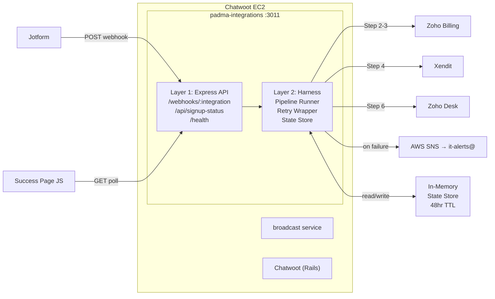

# Padma Integrations Service — Phase 1 & 2

**Version:** 1.0
**Date:** 18 March 2026
**Author:** Alex
**ADR:** N/A
**Status:** Ready to execute
**Maintained by:** Alex

## Key Changes — Initial Version

- First draft covering Phase 1 (scaffold) and Phase 2 (harness hardening)

---

## Related Docs

- `pmg-docs/development/prds/padma-integration-service-PRD.md` — approved PRD v2.2, primary spec
- `/Users/alexknecht/Projects/pmg/pmg-chatwoot/chatwoot-services/broadcast/` — reference architecture for SSM loading and deploy pattern

---

## 1. Context

1.1 The Padma Care new member signup flow is broken in production. Make.com orchestrates Jotform → Zoho Billing → Xendit → Zoho Desk but fails to await the async Xendit payment URL, causing >10% abandonment. Full problem spec in PRD §1.

1.2 This plan builds `padma-integrations`, a self-hosted Node.js Express microservice to replace Make.com. It runs on the Chatwoot EC2 on port 3011 managed by PM2.

1.3 **Scope:** Phases 1 and 2 only — core scaffold and harness hardening. Phases 3 (Padma Care signup connector) and 4 (abandonment recovery) are the next session.

1.4 **Git strategy:** GitHub repo with `develop` and `main` branches. All work in this plan commits and pushes to `develop`. No staging environment — `develop` is used for integration testing.

---

## 2. System Architecture



---

## 3. Pre-Session: Node.js Upgrade

3.1 The Chatwoot EC2 is on Node v20 (EOL April 2026). Upgrade to v22 LTS before first deploy. Node-based services affected: broadcast service, padma-integrations (new). Chatwoot (Ruby) is unaffected.

3.2 Upgrade tasks:

- [ ] 3.2.1 SSH to EC2 and verify current version: `node --version` — @Alex
- [ ] 3.2.2 Install nvm if absent: `curl -o- https://raw.githubusercontent.com/nvm-sh/nvm/v0.39.7/install.sh | bash` — @Alex
- [ ] 3.2.3 `nvm install 22 && nvm alias default 22` — @Alex
- [ ] 3.2.4 Verify: `node --version` returns v22.x — @Alex
- [ ] 3.2.5 Restart broadcast service if running and confirm it still works — @Alex (depends on 3.2.3)

**Acceptance criteria:**

- `node --version` on EC2 returns v22.x
- Broadcast service responds normally after restart

---

## 4. Phase 1 — Core Service Scaffold

### 4.1 PRD Annotation

4.1.1 Update the PRD to track session progress so the next session starts at Phase 3.

- [ ] 4.1.1 In PRD `§12 Phased Build Plan`, add above Phase 1: `> **Status (2026-03-18):** Phases 1 & 2 in progress. Phases 3 & 4 are the next session.` — @Alex

### 4.2 Repo Init (local)

- [ ] 4.2.1 `mkdir /Users/alexknecht/Projects/pmg/padma-integrations` — @Alex
- [ ] 4.2.2 `cd padma-integrations && git init && git checkout -b develop` — @Alex
- [ ] 4.2.3 `npm init -y` — @Alex
- [ ] 4.2.4 Create `.nvmrc` containing `22` — @Alex
- [ ] 4.2.5 Create `.gitignore`: node_modules, .env, logs/, *.log — @Alex
- [ ] 4.2.6 Create `.env.example` (see §4.4 env vars) — @Alex
- [ ] 4.2.7 `git add . && git commit -m "chore: init repo"` — @Alex

### 4.3 GitHub Setup

- [ ] 4.3.1 Create repo `padma-integrations` in PMG GitHub org (private) — @Alex
- [ ] 4.3.2 `git remote add origin <github-url> && git push -u origin develop` — @Alex
- [ ] 4.3.3 Create `main` branch on GitHub from `develop` — @Alex

### 4.4 Install Dependencies

- [ ] 4.4.1 `npm install express winston winston-cloudwatch @aws-sdk/client-ssm @aws-sdk/client-sns axios` — @Alex
- [ ] 4.4.2 `npm install --save-dev nodemon` — @Alex

4.4.3 Environment variables for `.env.example`:

```text
NODE_ENV=production
PORT=3011
AWS_REGION=ap-southeast-1
LOG_LEVEL=info
CLOUDWATCH_LOG_GROUP=/padma/integrations

SSM_ZOHO_CLIENT_ID=/padma/integrations/zoho_client_id
SSM_ZOHO_CLIENT_SECRET=/padma/integrations/zoho_client_secret
SSM_ZOHO_REFRESH_TOKEN=/padma/integrations/zoho_refresh_token
SSM_JOTFORM_HMAC_KEY=/padma/integrations/jotform_hmac_key
SSM_SNS_TOPIC_ARN=/padma/integrations/sns_topic_arn
```

### 4.5 Directory Structure and Core Files

4.5.1 Target layout:

```text
padma-integrations/
├── server.js               — Express entry; loads SSM, registers connectors, starts on PORT
├── package.json
├── ecosystem.config.js     — PM2 config (single app, port 3011)
├── .env.example
├── .nvmrc                  — 22
├── .gitignore
├── lib/
│   ├── logger.js           — Winston JSON + CloudWatch transport
│   ├── ssm.js              — Bulk SSM loader; WithDecryption: true
│   ├── state-store.js      — In-memory map; 48hr TTL; lazy eviction
│   └── sns.js              — SNS alert publisher (Phase 2)
├── middleware/
│   └── hmac-auth.js        — HMAC-SHA256 verification (Phase 2)
├── harness/
│   ├── pipeline.js         — Sequential ctx-based step runner (Phase 2)
│   └── retry.js            — Exponential backoff + jitter (Phase 2)
├── routes/
│   ├── health.js           — GET /health
│   ├── status.js           — GET /api/signup-status?email=X
│   └── webhooks.js         — POST /webhooks/:integration
└── integrations/
    └── .gitkeep            — Phase 3 adds padmacare-signup/ here
```

4.5.2 `server.js`: load SSM secrets at startup (hard fail on missing critical secrets); auto-scan `integrations/` subdirs for `index.js` and register connectors; mount routes; listen on `PORT`; graceful shutdown on SIGTERM/SIGINT.

4.5.3 `lib/state-store.js`: Map keyed by email; TTL 48hr enforced on reads. API: `set(email, state)`, `get(email)`, `del(email)`. State shape per PRD §4.3: `{ status, name, phone, plan, xenditUrl, xenditStatus, subscriptionId, deskContactId, createdAt, error }`.

4.5.4 `lib/ssm.js`: accepts `{ paramKey: ssmPath }` map; returns resolved `{ paramKey: value }`. Pattern mirrors broadcast service `lib/chatwoot.js`. Uses `WithDecryption: true`.

4.5.5 `lib/logger.js`: Winston with console transport and CloudWatch JSON transport. Log group from `CLOUDWATCH_LOG_GROUP` env var. Log stream: `{hostname}`. No PII in messages.

4.5.6 `routes/health.js`: returns `{ status: "ok", uptime, nodeVersion, registeredIntegrations: [...] }`.

4.5.7 `routes/status.js`: reads state store by email; returns shape per PRD §8. Returns `{ status: "not_found" }` for unknown emails.

4.5.8 `routes/webhooks.js`: ACK 200 immediately; run pipeline async; return 404 if integration name not registered.

- [ ] 4.5.9 Implement all files listed in §4.5.1 — @Alex

### 4.6 Commit & Push Phase 1

- [ ] 4.6.1 `git add . && git commit -m "feat: phase 1 — core service scaffold"` — @Alex
- [ ] 4.6.2 `git push origin develop` — @Alex

**Acceptance criteria:**

- `node server.js` starts without error
- `GET /health` returns 200 with `registeredIntegrations: []`
- `GET /api/signup-status?email=test@example.com` returns `{"status":"not_found"}`

---

## 5. Phase 2 — Harness Hardening

### 5.1 Retry Wrapper (`harness/retry.js`)

5.1.1 Config shape: `{ maxAttempts: 3, backoffMs: 500, factor: 2, jitter: true }`.

5.1.2 Non-retryable: 4xx responses except 429. Retryable: 5xx, network errors, timeouts, 429.

5.1.3 Log per attempt: attempt number, error type, next delay ms.

- [ ] 5.1.4 Implement `harness/retry.js` per §5.1.1–5.1.3 — @Alex

### 5.2 SNS Alert Publisher (`lib/sns.js`)

5.2.1 `publish(subject, message)` sends to SNS topic ARN loaded from SSM at startup.

5.2.2 Called on: final step failure, Xendit timeout, payload validation rejection.

5.2.3 Alert body includes: integration name, step name, attempt count, timestamp. No PII.

- [ ] 5.2.4 Implement `lib/sns.js` per §5.2.1–5.2.3 — @Alex

### 5.3 HMAC Auth Middleware (`middleware/hmac-auth.js`)

5.3.1 Verifies `X-Jotform-Signature` header (HMAC-SHA256 of raw body; key from SSM).

5.3.2 Connectors opt-in by applying middleware to their route. Not applied globally.

5.3.3 Returns 401 on failure; logs rejection without body content in log message.

- [ ] 5.3.4 Implement `middleware/hmac-auth.js` per §5.3.1–5.3.3 — @Alex

### 5.4 Pipeline Runner (`harness/pipeline.js`)

5.4.1 `ctx` shape: `{ payload, result: {}, meta: { integration, startedAt, steps: [] } }`.

5.4.2 Each step entry: `{ name, startedAt, durationMs, status: "ok"|"failed", error }`.

5.4.3 On step failure: log structured error → publish SNS alert → set signup store `status: "error"`.

- [ ] 5.4.4 Implement `harness/pipeline.js` per §5.4.1–5.4.3 — @Alex

### 5.5 PM2 Config (`ecosystem.config.js`)

5.5.1 Single app entry; `PORT` and `NODE_ENV` set via env block.

```js
module.exports = {
  apps: [{
    name: 'padma-integrations',
    script: 'server.js',
    instances: 1,
    max_memory_restart: '256M',
    log_date_format: 'YYYY-MM-DD HH:mm:ss',
    env: { NODE_ENV: 'production', PORT: 3011, AWS_REGION: 'ap-southeast-1' }
  }]
};
```

- [ ] 5.5.2 Create `ecosystem.config.js` per §5.5.1 — @Alex

### 5.6 Deploy Script (`deploy-to-ec2.sh`)

5.6.1 Mirrors broadcast service `deploy-to-ec2.sh` pattern.

5.6.2 Deploy steps: `rsync` source to `/var/www/services/padma-integrations/` (exclude `node_modules`, `.env`, `logs/`); `ssh ec2` → `npm ci --omit=dev` → `pm2 reload ecosystem.config.js --update-env`.

5.6.3 Ownership: `chatwoot:chatwoot`, permissions 775.

- [ ] 5.6.4 Create `deploy-to-ec2.sh` per §5.6.1–5.6.3 — @Alex

### 5.7 Commit & Push Phase 2

- [ ] 5.7.1 `git add . && git commit -m "feat: phase 2 — harness hardening"` — @Alex
- [ ] 5.7.2 `git push origin develop` — @Alex

**Acceptance criteria:**

- Retry wrapper: mock a 500 response and confirm 3 attempts with backoff delays logged
- PM2: `pm2 start ecosystem.config.js` starts process on port 3011
- CloudWatch: log entries appear in `/padma/integrations` log group

---

## 6. Verification Checklist

- [ ] 6.1 `node server.js` starts cleanly — @Alex
- [ ] 6.2 `GET /health` → 200 `{ status: "ok", registeredIntegrations: [] }` — @Alex
- [ ] 6.3 `GET /api/signup-status?email=x` → `{ "status": "not_found" }` — @Alex
- [ ] 6.4 Retry wrapper: mock 500 response, confirm 3 attempts + backoff in logs — @Alex
- [ ] 6.5 PM2: `pm2 start ecosystem.config.js` — process running on port 3011 — @Alex
- [ ] 6.6 CloudWatch: entries visible in `/padma/integrations` after startup — @Alex

---

## 7. Phase 3 Prerequisites (Next Session Blockers)

7.1 These must be resolved before Phase 3 (Padma Care signup connector) can begin:

- [ ] 7.1.1 Create `cf_place_of_birth` custom field in Zoho Desk — @Alex
- [ ] 7.1.2 Extract Zoho OAuth2 credentials from WordPress `wp_options` table (do not re-register) — @Alex
- [ ] 7.1.3 Get Jotform HMAC webhook secret from Jotform form settings — @Alex
- [ ] 7.1.4 Confirm what each of the 4 Make.com webhook URLs does — @web-dev
- [ ] 7.1.5 Web dev confirms `/process-subscription` is relay-only and safe to deprecate — @web-dev
- [ ] 7.1.6 Web dev builds polling JS for `/new-subscription-success/` success page — @web-dev

---

## Edit Log

| Version | Date        | Author | Changes                                                                                             |
|---------|-------------|--------|-----------------------------------------------------------------------------------------------------|
| 1.0     | 18 Mar 2026 | Alex   | Initial draft — Phase 1 & 2 scope, Node.js v22 upgrade, core scaffold and harness hardening tasks. |
