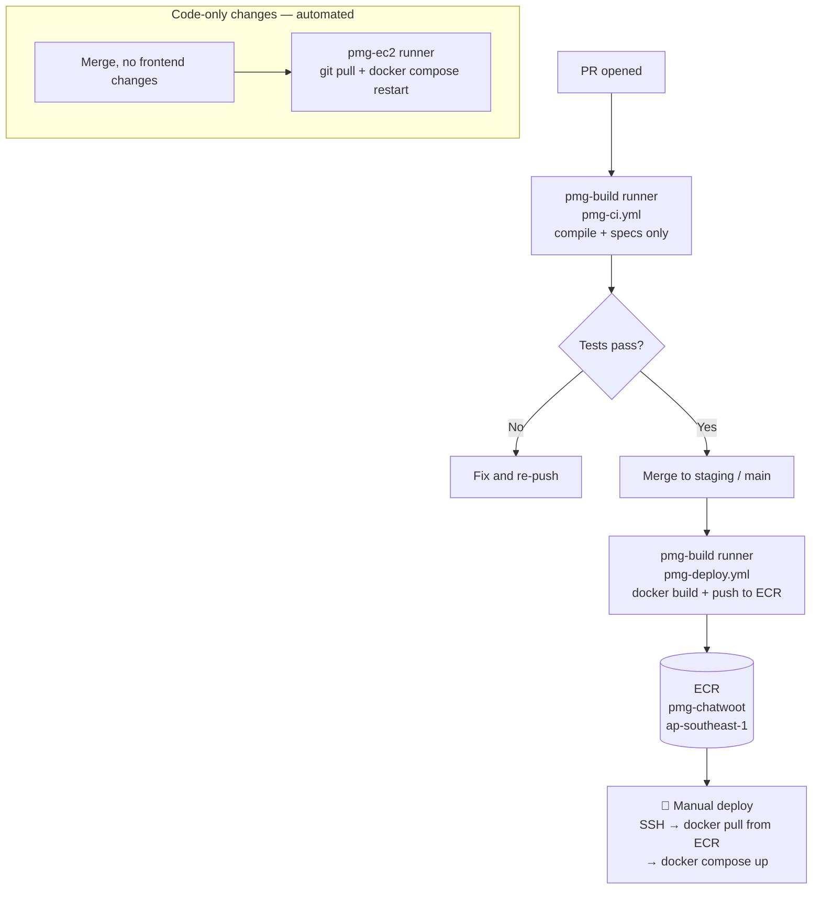
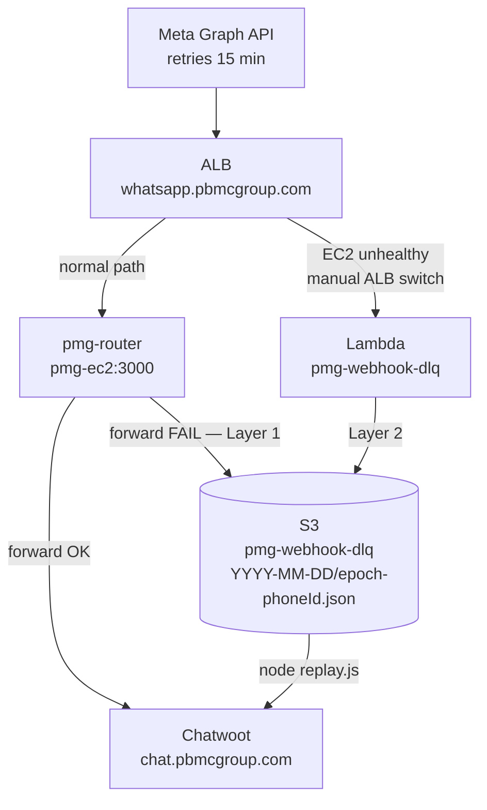

# PMG Chatwoot Post Go-Live Plan

**Version:** 1.3
**Date:** 17 March 2026
**Previous Version:** 1.2 (17 March 2026) — promoted CI build runner migration to §2 after production RAM incident
**Author:** Alex Knecht
**Status:** In Progress
**Go-live:** 17 March 2026 (chat.pbmcgroup.com)

### Key Changes v1.2 → v1.3
- §2 rewritten: runner on r5.xlarge (corrected from t3.xlarge), ECR as image transport, manual deploy gate for all Docker rebuilds, added `pmg-ci.yml` update task
- §3.4 expanded into two concrete tasks: WABA override startup check with SES alert to it-alerts, and migration of health alarm from webhost to chatwoot EC2
- §4 rewritten as full two-layer DLQ with AWS resource specs, code sketches, and verification steps for each deliverable
- §3.3 and §5.4 marked complete — moved to Appendix A
- §6, §8, §9 replaced with reference to Okto's separate plan

---

## 1. Related Docs

- `pmg-docs/postmortems/2026-03-17-whatsapp-webhook-override.md` — WhatsApp webhook override incident
- `pmg-docs/plans/archive/pmg-chatwoot-cutover/prod_migration_runbook_16march.md` — production migration runbook
- `pmg-docs/plans/archive/chatwoot-go-live-scope/chatwoot-go-live-scope-PLAN.md` — full go-live scope history
- `pmg-chatwoot/.github/workflows/pmg-deploy.yml` — current CI deploy workflow
- `pmg-chatwoot/.github/workflows/pmg-ci.yml` — current CI test workflow
- `pmg-chatwoot/docs/runbook.md` — operations runbook

---

## 2. CI Build Runner Migration (highest priority)

2.0 The current self-hosted GitHub Actions runner runs on the same EC2 instance as production (`[self-hosted, pmg-ec2]`). Docker image builds max out the 3.7GB RAM, exhaust swap, and cause production 500 errors for active users. Confirmed incident: 17 March 2026, ~90 min build killed manually.

2.1 **Solution:** install a second self-hosted runner on the idle **r5.xlarge** (TM Staging App instance), labeled `pmg-build`. ECR (`ap-southeast-1`) is the image transport layer — the r5.xlarge builds and pushes; the chatwoot VM only ever pulls and restarts. The `deploy-restart` fast path (code-only changes, no Docker) stays fully automated on `pmg-ec2`. This runner pattern is reusable for any future service that needs a build step.

2.2 **Two uses of `pmg-build`:**

2.2.1 **CI (PR open):** `pmg-ci.yml` runs on `pmg-build` — compiles assets, runs Ruby/JS specs. No Docker build. Fast verification only.

2.2.2 **CD (merge to `staging` or `main`):** `pmg-deploy.yml` build job runs on `pmg-build` — builds the Docker image, tags it, and pushes to ECR. No automated deploy follows. Once the image is in ECR, deployment is a deliberate manual step: SSH to chatwoot VM → `docker pull` from ECR → `docker compose up`.



- [ ] 2.3 Install GitHub Actions self-hosted runner on r5.xlarge (TM Staging App), labeled `pmg-build`. — @Alex
- [ ] 2.4 Create ECR repository `pmg-chatwoot` in `ap-southeast-1`. — @Alex
- [ ] 2.5 Update `pmg-ci.yml`: change runner label from `[self-hosted, pmg-ec2]` to `[self-hosted, pmg-build]`. — @Dev
- [ ] 2.6 Update `pmg-deploy.yml`: in the `deploy-rebuild` job change runner to `[self-hosted, pmg-build]`; add `aws-actions/amazon-ecr-login` step; replace `docker build` + `docker tag` with build → tag as `{ECR_URI}/pmg-chatwoot:{branch}-{sha}` → `docker push`; remove the automated restart/deploy step entirely (deploy is manual). — @Dev
- [ ] 2.7 Test end-to-end: merge a frontend change to `staging`, verify build runs on r5.xlarge, image appears in ECR, no memory events on chatwoot VM. Manually pull and restart staging to confirm the full deploy flow. — @Alex

**Acceptance:**
- `pmg-ci.yml` passes on r5.xlarge with zero memory incidents on the chatwoot EC2 during build.
- After a frontend merge, a tagged image appears in the ECR repository `pmg-chatwoot`.
- Staging containers restart cleanly after a manual `docker pull {ECR_URI}/pmg-chatwoot:{tag}` + `docker compose up`.

---

## 3. Immediate Follow-ups (from Post-Mortem)

3.0 From the WhatsApp webhook override incident (17 March 2026). Full context: `pmg-docs/postmortems/2026-03-17-whatsapp-webhook-override.md`.

### 3.1 Rebuild staging Docker image with env guard

3.1.0 Rebuild and redeploy the staging Docker image now that `DISABLE_WHATSAPP_WEBHOOK_SETUP=true` is in the staging `.env`. The env var must be baked in at build/deploy time — future inbox creation on staging must not re-register a Meta `override_callback_uri`. Do off-hours, after §2 is complete.

- [ ] 3.1.1 After §2 complete, trigger a staging rebuild via `pmg-deploy.yml`. Confirm staging containers are running an image built after the env guard was added to `.env.staging`. — @Alex (depends on §2)

**Acceptance:** Staging containers running an image with build timestamp after `DISABLE_WHATSAPP_WEBHOOK_SETUP=true` was added.

### 3.2 Recreate staging inboxes to verify guard works

3.2.0 After §3.1, recreate staging WhatsApp inboxes using test phone numbers. Confirm `WebhookSetupService` does NOT call the Meta Graph API.

- [ ] 3.2.1 Recreate staging inboxes, check staging container logs, verify via `GET https://graph.facebook.com/v22.0/1853014602084429/subscribed_apps`. — @Alex (depends on §3.1)

**Acceptance:** Staging inbox created; `GET /1853014602084429/subscribed_apps` shows no `override_callback_uri`; staging logs confirm webhook setup was skipped.

### 3.3 Document `override_callback_uri` risk in runbook

~~3.3.1 Add detection, removal, and prevention section to `pmg-chatwoot/docs/runbook.md`.~~ **Done** — committed 17 March 2026 (`feature/chatwoot-post-golive-infra`). See `pmg-chatwoot/docs/runbook.md §1.11`.

### 3.4 Startup override check + health alarm

3.4.0 Two defensive additions: (a) the router checks WABA subscription state on every startup and alerts via SES if an override is detected; (b) the existing health alarm, currently pointing at the decommissioned webhost, is moved to the chatwoot EC2 router. Both alert to `it-alerts` via SES (already configured). The `sendAlert()` function implemented in §3.4.1 is shared with the §4 DLQ.

- [ ] 3.4.1 Add startup check to `pmg-chatwoot/chatwoot-services/router/router.js`: on launch, fetch token from SSM `/pmg/meta/access_token` and query `GET https://graph.facebook.com/v22.0/1853014602084429/subscribed_apps`. If `override_callback_uri` is present in the response data, call shared `sendAlert('WABA Override Detected', message)`. Warning only — router starts regardless. Wrap in `.catch()` in the `app.listen` callback so a Meta API timeout never blocks the server. Implement `sendAlert(subject, message)` using `@aws-sdk/client-ses` with `SES_SENDER` and `SES_ALERTS_EMAIL` env vars. This task lands in the same PR as §4.8.2. — @Dev
- [ ] 3.4.2 Move the existing router health alarm from `webhost:3000` to chatwoot EC2 `:3000/health` endpoint. Alert target: `it-alerts` via SES (already configured). — @Alex

**Acceptance:**
- Router logs `[WabaCheck] WABA 1853014602084429: no override_callback_uri detected. ✓` on clean startup.
- If override is present: SES alert arrives at `it-alerts` within 30 seconds of router start.
- Health alarm fires within 2 minutes when `pmg-router` is stopped manually on the chatwoot EC2.

---

## 4. Router Resilience — Two-Layer DLQ

4.0 The router (`pmg-router` systemd service on `pmg-ec2`) is a single point of failure. Meta retries webhooks for only **15 minutes** — after that, messages are permanently lost. Two distinct failure modes require two solutions.

4.1 **Failure modes:**

| Mode | Current resilience | DLQ solution |
|---|---|---|
| Chatwoot containers down, router running | None — forward fails silently, message lost | Layer 1: router writes raw payload to S3 on forward failure |
| EC2 or router process down | Webhost router (being decommissioned) | Layer 2: Lambda ALB target — manual switch, writes to same S3 |

4.2 Both layers share one S3 bucket (`pmg-webhook-dlq`) and one replay script. Human-in-the-loop for Layer 2 is acceptable — the SES health alarm (§3.4.2) fires within 2 minutes, and the 15-minute Meta retry window provides enough time to switch the ALB rule and keep draining messages into S3.



### 4.3 AWS Resources

4.3.0 All resources below are provisioned by @Alex before code tasks §4.4–§4.7 begin.

- [ ] 4.3.1 Create S3 bucket `pmg-webhook-dlq` — `ap-southeast-1`, private, no versioning, lifecycle rule: expire objects after 30 days. — @Alex
- [ ] 4.3.2 Add inline policy to the EC2 instance role: `s3:PutObject` on `arn:aws:s3:::pmg-webhook-dlq/*` + `s3:GetObject` + `s3:ListBucket` on `arn:aws:s3:::pmg-webhook-dlq` (the latter two are needed by `replay.js`). — @Alex
- [ ] 4.3.3 Create Lambda IAM role for `pmg-webhook-dlq`: `s3:PutObject` on `arn:aws:s3:::pmg-webhook-dlq/*`. — @Alex
- [ ] 4.3.4 In the ALB (`whatsapp.pbmcgroup.com` listener): create a Lambda target group pointing at `pmg-webhook-dlq`; add a listener rule for `POST /webhook` at **lower priority** than the existing EC2 rule. The rule is inactive by default. Switching to DLQ mode = raise this rule's priority above the EC2 rule in the AWS console (one action). — @Alex

### 4.4 Layer 1: Router DLQ

4.4.0 S3 key format: `{YYYY-MM-DD}/{epoch_ms}-{phone_number_id}.json`. Payload stored: raw `req.body` JSON. Fires when `results[0].status === 'rejected'` after `Promise.allSettled()` in the webhook POST handler (`results[0]` is always the production URL — staging is commented out).

4.4.1 `writeToDlq(body, phoneNumberId)` function sketch (add to `router.js`):

```javascript
async function writeToDlq(body, phoneNumberId) {
  const bucket = process.env.DLQ_BUCKET || 'pmg-webhook-dlq';
  const date = new Date().toISOString().slice(0, 10);
  const key = `${date}/${Date.now()}-${phoneNumberId || 'unknown'}.json`;
  try {
    await s3Client.send(new PutObjectCommand({
      Bucket: bucket, Key: key,
      Body: JSON.stringify(body), ContentType: 'application/json'
    }));
    console.log(`[DLQ] Wrote failed webhook to s3://${bucket}/${key}`);
  } catch (err) {
    console.error('[DLQ] S3 write failed:', err.message); // never throws
  }
}
```

### 4.5 Layer 2: Lambda Fallback

4.5.0 File: `pmg-chatwoot/chatwoot-services/lambda/webhook-dlq/index.js` (new directory and file). Receives an ALB invocation event — body may be base64-encoded. Writes to the same S3 bucket with the same key format. No dependencies beyond `@aws-sdk/client-s3` (available in the Lambda Node.js 20.x runtime — no bundling needed).

4.5.1 Lambda handler sketch:

```javascript
const { S3Client, PutObjectCommand } = require('@aws-sdk/client-s3');
const s3 = new S3Client({ region: process.env.AWS_REGION || 'ap-southeast-1' });

exports.handler = async (event) => {
  const rawBody = event.isBase64Encoded
    ? Buffer.from(event.body, 'base64').toString('utf8')
    : event.body;
  const body = JSON.parse(rawBody);
  const phoneNumberId =
    body?.entry?.[0]?.changes?.[0]?.value?.metadata?.phone_number_id || 'unknown';
  const date = new Date().toISOString().slice(0, 10);
  const key = `${date}/${Date.now()}-${phoneNumberId}.json`;
  await s3.send(new PutObjectCommand({
    Bucket: process.env.DLQ_BUCKET || 'pmg-webhook-dlq',
    Key: key, Body: rawBody, ContentType: 'application/json'
  }));
  return { statusCode: 200, body: 'ok' }; // ALB requires this response shape
};
```

4.5.2 Lambda env var: `DLQ_BUCKET=pmg-webhook-dlq`. Runtime: Node.js 20.x. Memory: 128MB. Timeout: 10s.

### 4.6 Replay Script

4.6.0 File: `pmg-chatwoot/chatwoot-services/router/replay.js` (new). CLI flags: `--dry-run` (log only, no POST), `--date YYYY-MM-DD` (default: today's date).

4.6.1 Execution flow:
1. List S3 objects under `{date}/` prefix sorted by key (chronological by epoch prefix).
2. For each object: `GetObject`, parse JSON body.
3. Extract `phone_number_id` from `entry[0].changes[0].value.metadata.phone_number_id`.
4. Look up the production Chatwoot URL from `WEBHOOK_ROUTES` (copy the constant from `router.js` or require a shared module).
5. Extract all `wamid` values from `entry[0].changes[0].value.messages[].id` for deduplication.
6. If all wamids already in the in-memory dedup set: skip and log.
7. POST body to the Chatwoot URL via axios. Log success/failure per object.

4.6.2 Deduplication is in-memory per script run. Meta wamids are globally unique — no cross-run collision risk.

### 4.7 Runbook Addition

4.7.0 Add `§1.13 DLQ Failover Procedure` to `pmg-chatwoot/docs/runbook.md`.

4.7.1 Section content to add:

```
## 1.13 DLQ Failover Procedure

### Activate DLQ mode (EC2/router down)
AWS Console → EC2 → Load Balancers → select ALB →
Listeners tab → whatsapp.pbmcgroup.com:443 →
Raise the Lambda target group rule priority above the EC2 rule.

### Restore normal mode after router recovery
Lower the Lambda rule priority back below the EC2 rule.
Then run the replay script for any dates affected:
  node chatwoot-services/router/replay.js --date YYYY-MM-DD

### Check for residual payloads
  aws s3 ls s3://pmg-webhook-dlq/ --region ap-southeast-1
  aws s3 ls s3://pmg-webhook-dlq/YYYY-MM-DD/ --region ap-southeast-1
```

### 4.8 Tasks

- [ ] 4.8.1 Provision AWS resources (§4.3.1–§4.3.4). — @Alex (prerequisite for all other §4 tasks)
- [ ] 4.8.2 Update `chatwoot-services/router/router.js` and `package.json`: add `@aws-sdk/client-s3` + `@aws-sdk/client-ses` imports and client init; implement `sendAlert(subject, message)` (SES, shared with §3.4.1); implement `writeToDlq(body, phoneNumberId)` per §4.4.1; call `writeToDlq(body, phoneNumberId)` when `results[0].status === 'rejected'` in the POST handler. Add WABA startup check per §3.4.1 in the same PR. Add `@aws-sdk/client-s3` and `@aws-sdk/client-ses` to `package.json`. — @Dev
- [ ] 4.8.3 Create `chatwoot-services/lambda/webhook-dlq/index.js` per §4.5 sketch. Deploy to Lambda function `pmg-webhook-dlq` (Node.js 20.x, ap-southeast-1). Set env var `DLQ_BUCKET=pmg-webhook-dlq`. — @Dev / @Alex
- [ ] 4.8.4 Write `chatwoot-services/router/replay.js` per §4.6 spec. — @Dev
- [ ] 4.8.5 Add §1.13 DLQ Failover Procedure to `pmg-chatwoot/docs/runbook.md` per §4.7.1. — @Dev
- [ ] 4.8.6 Decommission webhost router once DLQ is live, tested, and EC2 router stable for 1 week. — @Alex

**Acceptance:**
- Layer 1: stop staging Chatwoot container, send test webhook to router via curl, confirm object appears in `s3://pmg-webhook-dlq/{today}/`.
- Layer 2: switch ALB to Lambda rule, send test webhook via curl, confirm object appears in S3, switch ALB rule back.
- Replay dry-run: `node replay.js --dry-run --date {today}` logs the correct Chatwoot target URL for each S3 object, sends no POSTs.
- Replay live: `node replay.js --date {today}` delivers test payload to Chatwoot successfully.

---

## 5. GitHub Actions CI Pipeline

5.0 All CI pipeline tasks are complete. `pmg-ci.yml` and `pmg-deploy.yml` are live and running. Runner migration to `pmg-build` is handled by §2.

~~5.1 Create PMG-specific CI workflow~~ — done (`pmg-ci.yml`, `pmg-deploy.yml`)

~~5.2 Fix TikTok JWT flaky spec with `freeze_time`~~ — done

~~5.3 Submit upstream PRs: `fix/resolve-conversation-reopen` and `fix/data-import-synchronize`~~ — done

~~5.4 Clean up feature branches~~ — done 17 March 2026. See Appendix A.

---

## 6. Broadcast Module

6.0 The broadcast module is functional at MVP. This section covers the remaining wiring and feature work.

### 6.1 Fetch template wiring from Meta

- [x] 6.1.1 Wire the template list to pull live from the Meta Graph API on page load. Replace any static or hardcoded template data. — @Dev

### 6.2 Template CRUD dialogues

6.2.0 Meta requires retyping the full template name to confirm deletion — cumbersome given that template names use underscores/dashes. Use `delete` as the confirmation string instead: non-trivial but not painful.

- [x] 6.2.1 **Create** — approval dialogue. Template is submitted to Meta for approval; surface the approval status in the UI. — @Dev
- [x] 6.2.2 **Edit** — no Meta API update is available. Show a confirmation dialogue making clear the template cannot be edited via API. — @Dev
- [x] 6.2.3 **Save as draft** — local only, not pushed to Meta. — @Dev
- [x] 6.2.4 **Delete** — confirmation step requiring the user to type `delete` (not the full template name). — @Dev
- [x] 6.2.5 **Copy as new** — button that pre-fills the create form from an existing template. — @Dev

### 6.3 Broadcast detail — delivery by recipient

6.3.0 No export feature is intentional — data security is not a concern as there is no way to bulk-extract recipient data.

- [x] 6.3.1 Wire broadcast detail view to show per-recipient delivery status (includes read receipts where available). — @Dev
- [x] 6.3.2 Sort recipients with failures at the top. — @Dev
- [x] 6.3.3 Display delivery status as a styled chip (success / failure). — @Dev

### 6.4 Template config display

- [x] 6.4.1 Change the template config field from a numeric value to a human-readable string for clarity in the UI. — @Dev
  > **Resolved by §6.7** — named variables (`{{name}}`) are self-documenting; all new templates will use named variables with sheet columns named to match. Numeric display is no longer a concern.

### 6.5 Response linking

- [x] 6.5.1 Link recipient replies to the originating broadcast conversation. — @Dev

### 6.6 Scheduled broadcasts

- [ ] 6.6.1 Admin-only scheduled send (cron-based). — @Dev

### 6.7 Named Template Variables

6.7.0 Meta supports two variable formats in WhatsApp templates: numeric (`{{1}}`, `{{2}}`) and named (`{{name}}`, `{{date}}`). The current UI only handles numeric variables, which provides no context during preview or broadcast column mapping. This section covers upgrading the system to support named variables end-to-end.

6.7.1 **Current state:**
- Variable extraction regex only matches digits: `/\{\{(\d+)\}\}/g`
- Preview panel shows `{{1}}`, `{{2}}` — no context for the user
- Column mapping relies on `templates.json` to resolve position → column name
- Template creator does not guide users on variable format

6.7.2 **Desired state:**

| Scenario | Behaviour |
|----------|-----------|
| New template (creator) | User types `{{name}}`, `{{date}}` etc. directly in the body. Submitted to Meta as-is — no conversion. Numeric variables are discouraged going forward. |
| Existing named template | Variables displayed as-is (`{{name}}`). Column mapping: variable name matched to sheet column header (case-insensitive). No `templates.json` entry required. |
| Existing numeric template | Variable labels assigned by user in the template panel UI. Labels stored in `templates.json`. Preview displays label instead of `{{1}}`. Broadcast maps label → sheet column (case-insensitive). Meta is never modified. |

6.7.3 **Variable matching rule (broadcast):** for both named and labeled-numeric variables, matching to a sheet column is **case-insensitive and exact** — `Name`, `name`, `NAME` all resolve to the same column.

6.7.4 **`templates.json` schema — no breaking change.** Named templates need no entry (variable name is the column name). Numeric templates keep the existing `columns` array as the label source. A new optional `variable_type` field (`"named"` | `"numeric"`) may be added for explicitness but is not required — the system infers it from the template body.

### 6.7.5 Technical changes

**`BroadcastTemplatePanel.vue`**
- [x] Update `templateVariables` computed: change regex from `/\{\{(\d+)\}\}/g` to `/\{\{(\w+)\}\}/g` to capture both formats.
- [x] Update `variableColumnMap`: for named variables, the variable name itself is the label (no lookup needed); for numeric variables, look up label from `templates.json` as before.

**`TemplateCreatorDialog.vue`**
- [x] Remove any validation that enforces numeric-only variables in the template body.
- [x] Add UI hint guiding users to use named variables (`{{name}}`) for new templates.
- [x] Add inline preview that renders the body with variable placeholders highlighted.
- [x] Fix `insertVariable` button to only count numeric variables when computing next `{{N}}` number.
- [x] Use `body_text_named_params` example format for named-variable templates (required by Meta API).

**`BroadcastTemplatePanel.vue` — label editor for numeric templates**
- [ ] When a template has numeric variables (`{{1}}`, `{{2}}`), show an editable label field per variable in the Variables column.
- [ ] On save, write the label to `templates.json` via a new API endpoint `PUT /api/broadcast/template-config`.
- [ ] Labels persist across sessions.

**`BroadcastForm.vue`**
- [x] Update `templateVariables` regex to `/\{\{(\w+)\}\}/g`.
- [x] Auto-map named variables on template select (`variableMapping[varName] = varName`).
- [x] Named-variable templates marked as auto-mapped (`isAutoMapped`).
- [x] Column validation in preview step changed to case-insensitive comparison.

**`broadcast_from_sheet_service.rb` (Chatwoot Rails broadcast)**
- [x] Update `build_processed_params` to use case-insensitive column lookup (`row_ci`).

### 6.7.6 Tasks

- [x] 6.7.6.1 Update `templateVariables` computed in `BroadcastTemplatePanel.vue`: change regex to `/\{\{(\w+)\}\}/g`. Update `variableColumnMap` to handle both named and numeric variables. — @Dev
- [x] 6.7.6.2 Update `TemplateCreatorDialog.vue`: remove numeric-only variable validation; add named-variable hint and inline body preview. — @Dev
- [ ] 6.7.6.3 Add label editor UI in `BroadcastTemplatePanel.vue` for numeric-variable templates: editable field per `{{N}}` variable, saved to `templates.json` via new PUT endpoint. — @Dev
- [ ] 6.7.6.4 Test named variable template end-to-end: select template with `{{name}}`, map to sheet column `Nama`, confirm correct value is injected at send time. — @Dev / @Alex
- [ ] 6.7.6.5 Test numeric template with labels: assign label `"name"` to `{{1}}`, confirm preview shows `name`, confirm broadcast matches sheet column `Name` (case-insensitive). — @Dev / @Alex

**Acceptance:**
- Template preview shows variable names (named) or user-assigned labels (numeric) — never raw `{{1}}`.
- New templates created with `{{name}}` format are accepted by Meta without error.
- Broadcast with a named-variable template correctly substitutes values from a sheet column matched case-insensitively.
- Broadcast with a labeled numeric template correctly substitutes values using the assigned label.
- No regression on existing numeric templates that already have `templates.json` entries.

---

### 6.8 Inbox Identity Chip in Broadcast Display

6.8.0 There are three active WhatsApp inboxes (Padma Clinics, Padma Care, Crew Care). The broadcast list currently shows no indication of which inbox was used, making it easy for users to pick the wrong one when creating a new broadcast. An inbox chip must be visible wherever a broadcast is shown.

6.8.1 **Current state:**
- `BroadcastTable` shows broadcast title, status, sent/failed counts, and date — no inbox name.
- `BroadcastDetailPanel` shows full broadcast detail — no inbox name visible at a glance.
- `BroadcastForm` (New Broadcast) has an inbox dropdown but it is easy to overlook.

6.8.2 **Desired state:**

| Location | Change |
|----------|--------|
| `BroadcastTable` — each row | Add a colored inbox chip (pill badge) with the inbox name, e.g. `● Padma Clinics` |
| `BroadcastDetailPanel` — header | Show inbox chip prominently next to the broadcast title |
| `BroadcastForm` — inbox field | Highlight the selected inbox name with a chip after selection so it is not overlooked |

6.8.3 **Chip design:** small pill badge (`text-[10px] px-2 py-0.5 rounded-full border`). Each inbox gets a distinct color so users can distinguish at a glance without reading. Suggested mapping (can be changed):
- Padma Clinics → teal (`bg-n-teal-2 text-n-teal-11 border-n-teal-6`)
- Padma Care → blue (`bg-n-blue-2 text-n-blue-11 border-n-blue-6`)
- Crew Care → amber (`bg-n-amber-2 text-n-amber-11 border-n-amber-6`)
- Unknown / other → slate (fallback)

6.8.4 **Data availability:** `Broadcast` model already has `inbox_id`. The inbox name is available via the `inboxes` Vuex store (`inboxes/getWhatsAppInboxes`). No backend change is needed — the chip is purely a frontend lookup: `inboxId → inboxName`.

### 6.8.5 Tasks

- [x] 6.8.5.1 Add `inboxChip(inboxId)` helper (computed or composable) that returns `{ name, colorClass }` by looking up `inboxes/getWhatsAppInboxes`. — @Dev
- [x] 6.8.5.2 Add inbox chip to each row in `BroadcastTable.vue` — show between title and status columns. — @Dev
- [x] 6.8.5.3 Add inbox chip to the header of `BroadcastDetailPanel.vue` next to the broadcast title. — @Dev
- [x] 6.8.5.4 In `BroadcastForm.vue`, display the selected inbox as a chip below the inbox dropdown once an inbox is chosen. — @Dev

**Acceptance:**
- Every broadcast row in the table shows a colored inbox chip with the inbox name.
- Broadcast detail panel shows the inbox chip in the header.
- New broadcast form reinforces the selected inbox with a visible chip.
- Colors are consistent across all three locations for the same inbox.
- No regression on broadcasts that have no inbox attached (chip simply does not render).

---

### 6.9 Broadcast Manager Role

6.9.0 The broadcast module should only be accessible to agents who have been explicitly granted the Broadcast Manager role. This avoids exposing broadcast controls to all agents while keeping the assignment lightweight — no new database table or formal role system is needed.

6.9.1 **Implementation:**
- Broadcast Manager is not a formal role (like Administrator/Agent). It is a per-user flag stored in `InstallationConfig` under the key `BROADCAST_MANAGER_USER_IDS` as a comma-separated list of user IDs.
- Assignment UI: a megaphone icon toggle per agent row in **Settings → Agents**. Teal icon = is a Broadcast Manager; grey icon = not assigned.
- Only administrators can toggle the megaphone.
- API: `GET /api/v1/accounts/:id/broadcasts/broadcast_managers` returns current manager IDs. `PATCH` updates the list.
- Authorization: `BroadcastPolicy` reads `BROADCAST_MANAGER_USER_IDS` from `GlobalConfig` to determine access.

6.9.2 **Tasks:**

- [x] 6.9.2.1 Add `broadcast_managers` (GET) and `update_broadcast_managers` (PATCH) actions to `Broadcasts::TemplateManagement` concern. — @Dev
- [x] 6.9.2.2 Add routes for both endpoints under the broadcasts resource. — @Dev
- [x] 6.9.2.3 Add `getBroadcastManagers` and `updateBroadcastManagers` to `dashboard/api/broadcasts.js`. — @Dev
- [x] 6.9.2.4 Add megaphone toggle button per agent row in `Settings → Agents`. Teal = manager, grey = not assigned. Saving is immediate (no confirm step). — @Dev
- [x] 6.9.2.5 Fix `update_broadcast_managers` nil error: replace `@account_user` with `Current.account_user`. — @Dev

**Acceptance:**
- Administrator can toggle any agent as Broadcast Manager from the Agents settings page.
- Non-administrators cannot toggle the button (API returns 403).
- Broadcast Manager agents can access the broadcast module; non-managers cannot.
- Assignment persists across sessions (stored in `InstallationConfig`).

---

## 7. Backup and DR Maturation

- [ ] 7.1 Add pre-deploy `pg_dump` to the deployment script so every merge to `main` produces a point-in-time snapshot before containers restart. Store in `s3://pmg-chatwoot-backups/pre-deploy/{timestamp}.sql.gz`. — @Dev
- [ ] 7.2 Document and test the full restore runbook: stop services → restore Postgres → flush Redis → restart → verify. Test with a real restore to staging from a backup taken by §7.1. — @Dev / @Alex

**Acceptance:**
- Every `main` deploy produces a `.sql.gz` file in `s3://pmg-chatwoot-backups/pre-deploy/` timestamped to the deploy.
- Staging database successfully restored from a §7.1 backup; Chatwoot loads without error after restore.

---

## 8. Conversation Improvements

8.0 Covered in Okto's separate plan.

---

## 9. Roles and Permissions Upgrade

9.0 **Author:** Okto. Scope: open the broadcast menu to all agents while restricting template management (create, delete, copy) to a designated Broadcast Manager role.

### 9.1 Current State

- Only administrators can access the Broadcasts menu — regular agents are blocked entirely.
- The "Broadcast Manager" role concept already exists in the system (a config list of user IDs), but it has no visible effect because agents can't reach the page.
- The template action buttons (New Template, Delete, Copy as new) have no access control — anyone who reaches the page can see and use them.

### 9.2 Desired State

| Action | Agent | Broadcast Manager | Administrator |
|--------|-------|-------------------|---------------|
| Open Broadcasts menu | ✅ | ✅ | ✅ |
| Send a broadcast | ✅ | ✅ | ✅ |
| View and preview templates | ✅ | ✅ | ✅ |
| Create new template | ❌ | ✅ | ✅ |
| Delete template | ❌ | ✅ | ✅ |
| Copy template as new | ❌ | ✅ | ✅ |

**Broadcast Manager** = any administrator, or a regular agent who has been explicitly designated in the system config.

### 9.3 How It Works

No database changes are needed. Security is enforced at three layers:

1. **Menu access** — the Broadcasts page is opened to all agents (not just admins).
2. **Button visibility** — New Template, Delete, and Copy buttons are hidden for plain agents; only visible to managers and admins.
3. **Backend enforcement** — even if someone bypasses the UI (e.g. via API tools), the server still blocks any template mutations from plain agents with a 403 Forbidden response. The backend is the authoritative layer.

### 9.4 What Changed in the Code

Four files were updated — no new files created:

- **Route config** — broadcast page now allows agents in addition to administrators.
- **Backend policy** — verified that viewing templates is open to all agents; creating and deleting templates requires manager or admin.
- **Template panel** — New Template, Delete, and Copy as new buttons are now hidden for plain agents.
- **Broadcasts page** — passes the user's permission level down to the template panel so it knows what to show.

### 9.5 Security Notes

- The backend always enforces permissions regardless of what the UI shows — a plain agent cannot create or delete a template even if they call the API directly.
- The Broadcast Manager list is stored in the database and can only be changed by someone with server or database access — agents cannot add themselves.
- No new features, endpoints, or roles were introduced — this is a tightening of existing access, not an expansion.
- Template creation and deletion are covered by Chatwoot's existing activity log — no additional tracking needed.

### 9.6 Designating Broadcast Managers

Until an admin UI is built, a Broadcast Manager is designated by adding their user ID to a config entry in the database. This is done by IT on the production server — no code deployment required, and no service restart needed. The change takes effect immediately.

To find a user's ID: look them up by email in the Users section of the Chatwoot admin panel, or ask IT to look it up.

### 9.7 Tasks

- [x] 9.7.1 Open the Broadcasts menu to all agents (not just administrators). — @Dev
- [x] 9.7.2 Backend: confirm all template-viewing actions are open to all agents; confirm template creation and deletion still require manager or admin. — @Dev
- [x] 9.7.3 Hide New Template, Delete, and Copy as new buttons from plain agents in the UI. — @Dev
- [x] 9.7.4 Wire the user's permission level from the page down to the template panel. — @Dev
- [x] 9.7.5 Set the initial Broadcast Manager user IDs in the system config for production. — @Alex / @Dev
- [ ] 9.7.6 Validate as plain agent: Broadcasts menu opens, template list is visible, broadcast can be sent; New / Delete / Copy buttons are not visible. — @Alex
- [ ] 9.7.7 Validate as Broadcast Manager: all template actions (create, delete, copy) are visible and work correctly. — @Alex
- [ ] 9.7.8 Validate as administrator: no regression — existing broadcast workflow unchanged. — @Alex

**Acceptance:**
- A plain agent can open the Broadcasts page, view templates, and send a broadcast without any errors.
- New Template / Delete / Copy as new buttons are not visible to plain agents.
- A Broadcast Manager can create, copy, and delete templates successfully.
- Administrator workflow is unchanged.

---

## 10. Ongoing Monitoring

- [ ] 10.1 Confirm production receiving all inbound WhatsApp messages for all inboxes (Padma Care, Crew Care, Padma Clinics) — spot-check daily for the first week. — @Alex
- [ ] 10.2 Confirm `app.chatwoot.com` cloud instance stays live as fallback until 10 April (CS team can reference for date-accurate historical lookups). — @Alex
- [ ] 10.3 Notify CS team of any operational changes from cloud → self-hosted. — @Alex

---

## 11. Decommission (target: 10 April 2026)

- [ ] 11.1 Confirm all teams no longer referencing `app.chatwoot.com`. — @Alex
- [ ] 11.2 Decommission cloud Chatwoot account (app.chatwoot.com account 152163). — @Alex
- [ ] 11.3 Archive migration scripts from `migration_production/`. — @Alex

---

## Appendix A: Completed Tasks

| Task | Description | Completed |
|---|---|---|
| 3.3 | `override_callback_uri` risk section added to `pmg-chatwoot/docs/runbook.md §1.11` — cherry-picked onto `feature/chatwoot-post-golive-infra` | 17 March 2026 |
| 5.4 | Feature branch cleanup — all fix/* branches reviewed, upstream PRs submitted | 17 March 2026 |

---

## Edit Log

| Version | Date | Author | Changes |
|---------|------|--------|---------|
| 1.0 | 17 March 2026 | Alex + Claude | Initial plan. Incident follow-ups from WhatsApp webhook override post-mortem, plus router resilience, CI pipeline, broadcast enhancements, backup/DR, monitoring, and decommission carried over from go-live scope plan. |
| 1.1 | 17 March 2026 | Alex + Claude | Added branch cleanup. Expanded broadcast section with detailed wiring, CRUD dialogues, delivery view, template config, response linking, and scheduled sends. Added Conversation Improvements and Roles and Permissions Upgrade. |
| 1.2 | 17 March 2026 | Alex + Claude | Promoted CI build runner migration to §2 after production incident caused by Docker build exhausting RAM. Marked CI workflow tasks done. Renumbered all sections. |
| 1.3 | 17 March 2026 | Alex + Claude | §2 rewritten: runner on r5.xlarge, ECR image transport, manual deploy gate. §3.4 expanded to WABA startup check + SES alert + health alarm migration. §4 rewritten as two-layer DLQ with full AWS resource specs, code sketches, and verification. §3.3 and §5.4 marked complete (Appendix A). §6, §8, §9 replaced with Okto plan references. |
